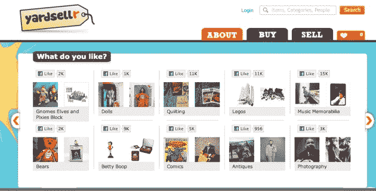

# Yardsellr 从 Accel 获得 500 万美元的 A 轮融资，成为脸书 TechCrunch 的易贝

> 原文：<https://web.archive.org/web/https://techcrunch.com/2010/11/22/yardsellr-5-million-ebay-facebook/>

# Yardsellr 从 Accel 获得 500 万美元的 A 轮融资，成为脸书的易贝

如今，将社交商务引入脸书是一个吸引大量资本的巨大机遇。Social swap meet [Yardsellr](https://web.archive.org/web/20230202213938/http://yardsellr.com/) 刚刚筹集了 500 万美元的首轮融资，由 Accel Partners 领投。哈里森金属资本(Harrison Metal Capital)此前提供了 75 万美元的种子资金，也参与了进来。

Yardsellr 是脸书的易贝，除了没有拍卖。事实上，该公司是由三位前易贝高管创建的，他们是首席执行官丹尼尔·莱费尔(易贝的前经理)、营销副总裁杰德·克莱文杰(曾在易贝负责付费搜索团队)和社区副总裁雷切尔·马库尔(曾在易贝负责社区团队)。哈里森金属公司的投资者迈克尔·迪林也是 eBay.com 的前 SVP。Yardsellr 目前在帕洛阿尔托的哈里森金属公司办公。

卖家以不同的类别或“块”列出固定价格的项目如[吉他](https://web.archive.org/web/20230202213938/http://www.facebook.com/pages/The-Guitars-Block-on-Yardsellr/127212020648865)、[乐高](https://web.archive.org/web/20230202213938/http://yardsellr.com/block/legos)、[珠宝](https://web.archive.org/web/20230202213938/http://www.facebook.com/pages/The-Jewelry-Bin-on-Yardsellr/113717678644204)、[皮包](https://web.archive.org/web/20230202213938/http://yardsellr.com/block/purses)。一般来说，这些都是人们喜爱并热衷于谈论的东西。买家也可以在 Twitter 上关注街区，但大多数活动都是在脸书进行的。Yardsellr 对 30 多岁的女性有吸引力，这对于 Twitter 来说不是一个强有力的人口统计。

买家可以通过喜欢一个街区获得任何类别的稳定的新项目流。这就像是人们订阅源中的一个自愿加入的社交营销流。“脸书基本上只有一种产品，那就是物流，”莱费尔说。“如果你不从根本上生活在社交商务中，你就不可能成为社交商务。”这项服务于 1 月份推出，但直到 4 月份才真正得到大力推动。总共有 130 万人在关注 Yardsellr 街区。大约有 100，000 人或积极地对他们提要中的项目发表评论，并且发生了成千上万的交易，这个数字每个月都在增加。

虽然 Leffel 不愿透露细节，但粗略计算一下，Yardsellr 上买卖的商品价值在数万美元到数十万美元之间。Yardsellr 不像易贝那样向卖家收取挂牌费，而是向买家收取大约 10%的费用。Yardsellr 与 Oodle 竞争，Oodle 为脸书运营官方分类广告应用。

