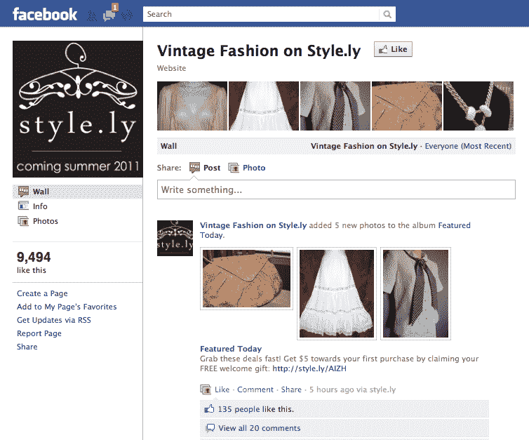

# Yardsellr，脸书的易贝，发展到 500 万强，更名；推出时尚市场 TechCrunch

> 原文：<https://web.archive.org/web/http://techcrunch.com/2011/09/20/yardsellr-the-ebay-for-facebook-grows-to-5-million-strong-rebrands-launches-marketplace-for-fashion/>

去年 11 月，TechCrunch 爆料称， [Yardsellr](https://web.archive.org/web/20230203125244/http://yardsellr.com/) 、脸书的易贝(没有拍卖)、[已经从 Accel Partners 获得了 500 万美元的首轮融资](https://web.archive.org/web/20230203125244/https://techcrunch.com/2010/11/22/yardsellr-5-million-ebay-facebook/)。当时，这笔投资似乎证明，人们对将电子商务引入脸书的价值越来越感兴趣，目的是让它暴露在你的社交网络上。

从那以后，Yardsellr 大部分时间都保持低调，建立自己的平台，悄悄地扩大用户群。今天，这家初创公司宣布了几个重大消息，首先是一个高层次的品牌重塑。动机呢？Yardsellr 创始人兼首席执行官 Danny Leffel 告诉我，他的公司希望为 eMarketplace 做一些社交游戏公司对工作室所做的事情。因此，这意味着在实践中，莱菲尔和他的公司已经开始 [YellowDog Media](https://web.archive.org/web/20230203125244/http://yellowdogmedia.com/) ，这将成为一个支配性的实体，或工作室，背后是一个多样化的基于交易的产品目录。Yardsellr 是第一个标题，今天该公司宣布他们的第二个: [Style.ly](https://web.archive.org/web/20230203125244/http://style.ly/) 。

简单来说，Style.ly 是一个新的女性时尚社交市场。Yardsellr 是一个建立在脸书的个人对个人的市场，用户可以在这里与其他人联系，出售从古董吉他到 Hello Kitty 收藏品的所有东西，Style.ly 也是一样——对时尚人士来说。(你可以在这里看到为什么 Yardsellr 与易贝进行比较——更不用说 Leffel 在易贝工作了五年，非常了解这个行业。)

有了 Yardsellr，用户可以在他们的新闻提要中关注产品，与朋友交谈，分享，当他们有兴趣购买时，搬到 Yardsellr.com 使用该网站的安全交易机制来完成销售。

自推出以来，Yardsellr 建立了超过 4000 个所谓的“blocks”——或基于特定兴趣的利基社区——用户可以在其中关注、浏览并与志同道合的人联系，这是基于他们对复古吉他的热爱，或任何情况。他们要加入其中一个街区所要做的就是在脸书“喜欢”它。相比之下，传统电子商务基于产品类别关注垂直市场。前者本质上更具有公共性、社会性，更适合与真实的人进行真实的接触。

Style.ly 诞生于这两个“板块”,以及对电子商务平台日益增长的需求，尤其是针对女性时尚的需求。因此，以 Yardsellr 为模板，Style.ly 将成为一个社交平台(基于脸书),面向那些想要购买和销售新的、不常使用的复古物品的人，从设计师品牌到精品发现。莱费尔说，声音在社交商务中至关重要，他打赌 Yardsellr 模式——有点易贝和有点 Etsy——将很好地为 Style.ly 的目标受众和其他利基受众服务。

到目前为止，这似乎是有效的。在 Style.ly 的试运行中，Leffel 和他的团队发现，在 Style.ly 上第一周售出的商品比 Yardsellr 前四个月售出的还要多。至于 Yardsellr，自 11 月以来，该平台以每月 35%的商品销售总额(交易产品的数量和价值)稳步增长。

根据 Leffel 的说法，在任何一天，都有超过 12 万件商品通过 Yardsellr 出售，每天都有 6000 件新商品上市出售。更重要的是，Yardsellr 已经发展成为一个超过 500 万人的社区，其中 17.5 万人是月活跃用户。如果这两个游戏都能保持这样的持续增长，那么它就能减轻 b 系列游戏的压力。

从这里开始，自然地，该公司计划为特定的兴趣群体增加更多的“工作室”，以便最终 Yardsellr 将成为那些随机杂物的一般商店类型的市场，并将由 Style.ly 以及第二目标社区(或标题)的未来驱动力来补充。

但是为什么是社交呢？Leffel 告诉我，过去易贝的特别之处在于，它的 eFlea 市场非常适合形成紧紧围绕特定利益的社区。这些小社区在喜欢初版小说的买家和卖家之间培养了深厚的友谊和纽带。

莱费尔告诉我，易贝团队曾经开玩笑说，有些婚姻是因为这些社区而发生的。当然，易贝已经开始更加关注商品化的商品，与亚马逊和沃尔玛等竞争，但 YellowDog 的目标是捕捉老易贝的感觉，并在传统电子商务交易的孤独和脸书可扩展的社交方面之间找到混合。

莱费尔说，当社交图与兴趣图相遇时，商业是一种自然的副产品。显然，该行业正在重新评估其对社交商务的立场及其长期可行性，如果这种模式在长期内证明是可行的，Yardsellr、Style.ly 和 YellowDog 似乎将接近领先地位。