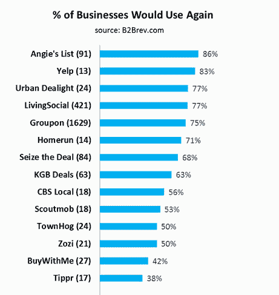
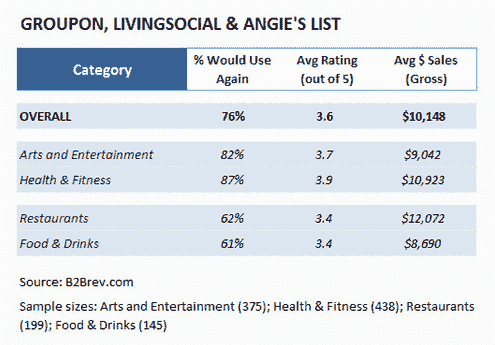

# YC 支持的 B2Brev 旨在成为 B2B 服务的 Yelp 

> 原文：<https://web.archive.org/web/http://techcrunch.com/2011/09/12/yc-backed-b2brev-aims-to-be-the-yelp-for-b2b-services/>

# YC 支持的 B2Brev 旨在成为 B2B 服务的 Yelp

Y Combinator 初创公司 [B2Brev](https://web.archive.org/web/20230203074823/http://www.b2brev.com/) 希望通过作为聚合评论的场所，帮助中小型企业确定使用哪些产品和服务。从涉足每日交易垂直领域开始，B2Brev 已经为每日交易网站收集了超过 2500 条商家评论，仅 Groupon 和 LivingSocial 就有 2000 条。

在与 ChoiceVendor(已被 LinkedIn 收购)和[最佳供应商](https://web.archive.org/web/20230203074823/http://bestvendor.com/)相同的领域，联合创始人 [Dannie Chu](https://web.archive.org/web/20230203074823/http://www.crunchbase.com/person/dannie-chu) 和 [Jay Moon](https://web.archive.org/web/20230203074823/http://www.crunchbase.com/person/jay-moon) 将 B2Brev 比作工作场所评论网站 Glassdoor，小企业在这里提交服务评论，以便获得其他评论。使用这种模式，B2Brev 通过他们的每日交易计划成功积累了 16 万字的评论。B2Brev 告诉我，他们最终希望扩展到预订系统等其他垂直领域。

“我不认为有任何一个网站可以让小企业找到他们使用过的任何产品或服务的信息，”联合创始人 Moon 说。“不仅在技术领域，在许多其他行业，创业精神都有所上升……我们只是想让他们更容易做生意。”

在对使用每日交易的商家的初步调查中，B2Brev 挖掘出了关于 Groupon 和 LivingSocial 回报的宝贵数据。尽管在 IPO 前有一系列负面报道，但对 Groupon 和 LivingSocial 的调查结果是乐观的，显示四分之三的商家愿意在最初运行一个每日交易后尝试另一个。

联合创始人 Chu 和 Moon 还发现，不同类型的企业会返回到每日交易模式的企业比例各不相同，健康和娱乐服务(如私人教练)从每日交易网站获得的效果最好，食品和饮料商家餐馆表示愿意重新进行交易的人数最少。

B2Brev 最终计划从潜在客户中赚钱，即收取会员费，将需要产品和服务的企业与提供产品和服务的其他企业联系起来。目前，他们以每份 10K 美元的价格出售研究报告，从 70 多页的“每日交易:商人视角”(目录，如下)开始。

[scribd id = 64700723 key = key-w 67 vksmil 6 e 6 VO 4 rj 7d mode = list]

