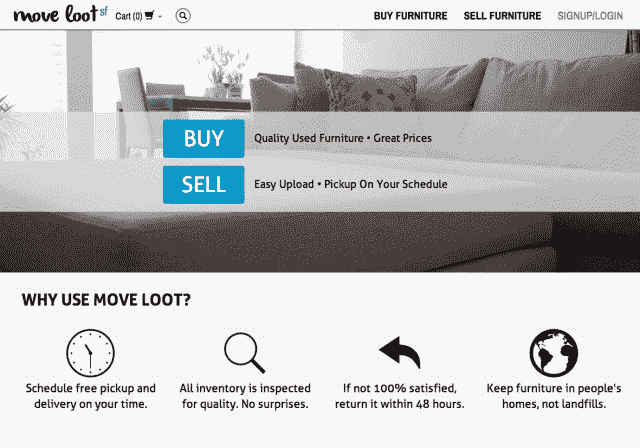

# YC 支持的 Move Loot 将家具寄售带入 21 世纪 

> 原文：<https://web.archive.org/web/https://techcrunch.com/2014/01/28/yc-backed-move-loot-brings-furniture-consignment-into-the-21st-century/>

在网上买卖任何可以用小盒子运输的东西都很容易，但是笨重的家具呢？Y Combinator 支持的初创公司 Move Loot 希望摆脱在线买卖家具的麻烦，并于今日在旧金山正式推出其服务。

转移赃物有两方:一方是买家，一方是卖家。对于买家来说，这项服务本质上是一个家具仓库，类似于任何其他在线家具网站。它具有必要的描述，高分辨率图像和其他细节。一个很酷的变化是，如果你不喜欢这个价格，你可以提供一个更低的价格。一旦你买了东西，你可以设定送货时间，公司会安排送货。超过 500 美元的商品送货是免费的，但对于较便宜的商品，用户需要为较小的商品支付 10 美元，为较大的商品支付 50 美元。

对于卖家来说，程序同样简单。他们通过网络表单提交图片和详细信息，一天之内，Move Loot 就会联系他们来取货。如果家具卖出，一半的价格归卖家，另一半必须转移赃物。30 天后，该服务可以将一件物品的价格降低 40%，60 天后，卖家可以付费将家具退还给他们，将其捐赠给慈善机构，或者请求与 Move loot 签订延期协议。出于某种原因，公司不能接受床垫、沙发床和躺椅。

正如 Move Loot 首席营销官 Jenny Morrill 告诉我的那样，该团队将 Move Loot 视为使用 Craigslist 买卖家具的替代选择。然而，与 Craigslist 不同的是，Move Loot 提供了完整的客户服务体验。

目前，包括首席执行官比尔·博比特、首席技术官瑞安·史密斯和首席运营官·施鲁蒂·沙阿在内的团队正专注于海湾地区作为其第一个测试市场，尽管计划在今年内扩展到另外四个大都市地区。这项服务自去年 10 月上线以来，Morrill 说，从那以后，它一直以每周超过 25%的速度增长。总的来说，二手家具市场价值约 30 亿美元，因此，尽管这听起来可能不是最酷的行业，但这里肯定有巨大的商机。

鉴于该公司正在处理实物商品，建立地面运营显然会增加大量成本，因此团队进展缓慢。“我们也想确保我们有能力帮助我们的客户，”Morrill 告诉我，这迫使公司非常谨慎地扩张。