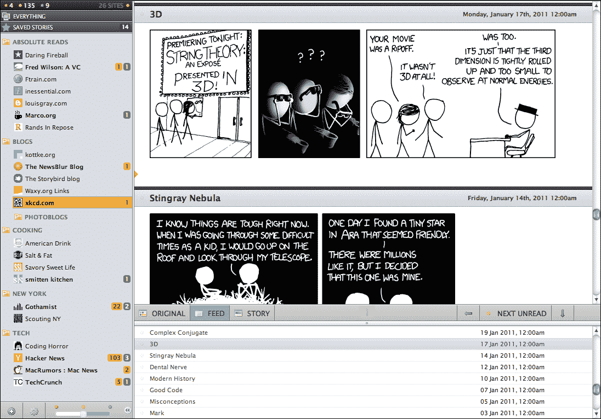
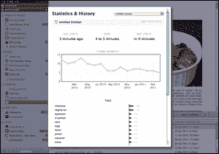
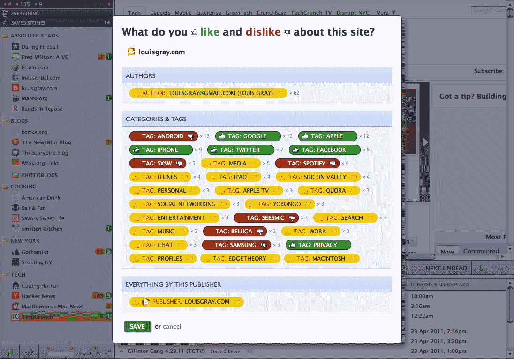

# YC 支持的 NewsBlur 让 Feed 阅读回归基础 

> 原文：<https://web.archive.org/web/https://techcrunch.com/2012/07/30/yc-backed-newsblur-takes-feed-reading-back-to-its-basics/>

每隔几个月左右，就会有人宣布 RSS 的死亡，以及像谷歌阅读器这样的老派阅读器的死亡。不过，不要把这些告诉塞缪尔·克莱，他是 Y Combinator 最新一批创业公司中基于网络的阅读器 NewsBlur 的创始人。除了纯粹的 feed 阅读体验之外，NewsBlur 还有许多有趣的功能，但乍一看，这款网络应用感觉像是回到了几年前 feed 阅读器令人兴奋的早期。然而，除了基本的 feed 阅读体验，该服务还允许你在类似 Tumblr 的“模糊博客”上整理你最喜欢的故事，这给该服务带来了强大的社交功能。

【T2

在很大程度上，网页版的 Newsblur(也有基本的 [iPhone](https://web.archive.org/web/20221007090710/http://dev.newsblur.com/iphone) 和 [Android](https://web.archive.org/web/20221007090710/https://market.android.com/details?id=bitwrit.Blar) 应用)，看起来非常像你熟悉谷歌阅读器、FeedDemon 或 NetNewsWire 时所期望的 feed 阅读器。提要和文件夹在左边，标题和文本在右边。

与标准的 RSS 阅读器不同，NewsBlur 还具有一种模式，可以显示你在原始网站及其首页上看到的帖子。该应用程序检测某个故事在网站首页的位置，并在你浏览订阅源时自动滚动到下一个标题。典型地，正如 Clay 在上周与我交谈时指出的，feeds 将一个故事从其上下文中分离出来，并使每个故事看起来都一样。然而，凭借其“原创”和“故事”观点，NewsBlur 旨在为其用户还原一些这种背景。当然，还有一个标准的以文本为中心的 feed 视图，你可以根据自己的喜好定制应用的布局。

 另一个很棒的功能是，你可以训练应用程序突出显示和隐藏某个博客上特定作者的故事，或者只查看带有特定标签或关键词的帖子。然后，该服务可以在不同的视图之间切换，让你看到每一篇帖子、你未读的帖子或者只是你训练它关注的帖子。值得注意的是，这种过滤机制不是基于类似 Zite 的机器学习。相反，过滤器一次只适用于一个博客，所以当你让 NewsBlur 在一个网站上突出显示带有特定标签的帖子时，过滤器不会应用于你订阅的任何其他订阅源。

## 从辅助项目到 Y 组合器

三年前，Clay 开始在 NewsBlur 上兼职工作。今年 3 月，他辞去了在美味实验室(T4)的工作，从那以后一直全职为《新闻模糊》工作。与克莱交谈，很快就能看出他是多么专注于尽快制作《新闻模糊》。在 NewsBlur 的主页上甚至有一个小工具可以告诉用户网站的平均加载时间。显然，NewsBlur 团队也专注于正确处理小细节。Clay 甚至开发了一个爬虫，专门确保网站的每个提要都有图标。

尽管如此，该网站的设计可能需要经验丰富的设计师的帮助，但正如 Clay 告诉我的那样，该团队正在努力进行更好的设计，并特别关注其即将推出的 iPhone 和 iPad 应用程序。

Newsblur 是一款免费增值产品。免费用户可以阅读多达 64 个订阅源，该服务每小时对这些订阅源进行一次 pings 操作。付费用户可以添加任意多的订阅源，NewsBlur 会实时更新 [PubSubHubbub](https://web.archive.org/web/20221007090710/http://en.wikipedia.org/wiki/PubSubHubbub) 启用的订阅源，根据其受欢迎程度每小时更新几次。

对于开发者来说，NewsBlur 提供了一个 [API](https://web.archive.org/web/20221007090710/http://newsblur.com/api) ，该应用的源代码也可以在 [Github](https://web.archive.org/web/20221007090710/https://github.com/samuelclay/NewsBlur) 上获得(根据非常宽松的[麻省理工学院许可](https://web.archive.org/web/20221007090710/https://github.com/samuelclay/NewsBlur/blob/master/LICENSE.md))。

