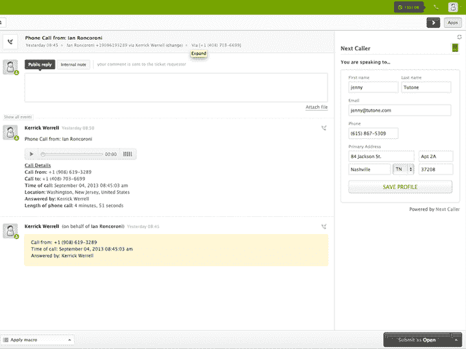

# YC 支持的 Next Caller 为企业带来了更智能的来电显示，不久还将带来基于手机的“购物”

> 原文：<https://web.archive.org/web/https://techcrunch.com/2014/03/17/yc-backed-next-caller-brings-smarter-caller-id-to-businesses-and-soon-phone-based-shopping/>

Y Combinator 支持的下一个来电者(Next Caller)公司(T1)是来电显示系统的制造商，该系统为企业提供访问包含来电者个人信息的二级数据库的途径——包括他们的姓名、电话、号码和电子邮件(如果有的话)——自从去年秋天[在 TechCrunch Disrupt](https://web.archive.org/web/20221024063045/https://beta.techcrunch.com/2013/09/10/next-caller-integrates-with-zendesk-to-cut-call-center-costs-and-reduce-customer-wait-time/) 上推出以来，已经取得了很大进展。从那时起，该公司已经从仅有的几个用户发展到 240 个付费用户，现在已经与 ZenDesk 和 Nextiva 签署了分销协议，这些公司将向他们现有的客户群提供这项服务。

该公司是一年多前由 Gianni Martire 和 Ian Roncoroni 共同创立的，他们都有金融背景；Martire 是一名计算机科学专业的毕业生，也是一名连续创业者，已经创办了几家公司。但下一个来电者的想法来自 Roncoroni，他经常因打电话给客服人员而沮丧，客服人员把他的名字写错了。

“我的姓真的很难理解，”他解释道。“我发现自己花了很多时间试图说服人们，我的姓实际上只是一个名字，而不是两个名字:‘罗恩·科罗尼。’"

他认为，如果呼叫中心代理人在与他们交谈时将他的信息放在他们面前，事情会容易得多，因此产生了下一个呼叫者的想法。

事实证明，这里确实需要解决这个问题——创始人告诉我们，如今公司 61%的呼入电话被认为是“未知的”

部分问题在于现有技术已经过时。例如，目前的来电显示系统不能处理手机号码，但 Next Caller 维护着一个将美国电话号码(手机或座机)与姓名、地址和电子邮件联系起来的数据库。该公司声称，它可以识别发送到其系统的 70%的电话，平均而言，由于它消除了企业方面的数据输入，每个电话节省了 40 秒。

企业面临的另一个问题是，当呼叫在多个呼叫中心之间路由时，它们通常会被发送到使用不同 CRM 系统的某个地方。这意味着你必须第二次向代理提供你的个人信息，这对双方来说都是令人沮丧的。如果所有公司的呼叫中心都将 Next Caller 集成到他们的系统中，那么 Next Caller 可以帮助解决这个问题，不管这些系统可能有多种多样。

今天的下一个呼叫者 API 集成了各种现有系统，包括 Cisco、Avaya、Salesforce、Genesys、Five9、SAP、Zendesk 等。现在，Nextiva 交易将为该公司在美国的 80，000 多名商业用户提供 Next Caller，他们只需一个复选框就可以打开功能。

一旦安装完毕，客服人员只需点击一下就可以保存下一个来电者提供的个人数据，并将其复制到他们自己的本地数据库中。

现在，Next Caller 已经解决了与来电显示相关的直接挫折，它正在努力看看它可以为企业和消费者提供什么其他解决方案。该团队正在研究的一件事是让“电话商务”像在网上一样简单。消费者将能够在 Next Caller 的网站上输入他们的信用卡信息，然后现有的 Next Caller 企业客户将能够在通过电话销售服务或升级时使用这些数据。消费者只需要确认他们的信息并提供一个 PIN。

在加入目前的 Y Combinator 类别后，Next Caller 决定成为一家跨海岸的公司，一名创始人在旧金山，另一名在纽约。该公司目前是一个由 9 名全职员工组成的团队，正在进行种子融资(细节即将公布)。