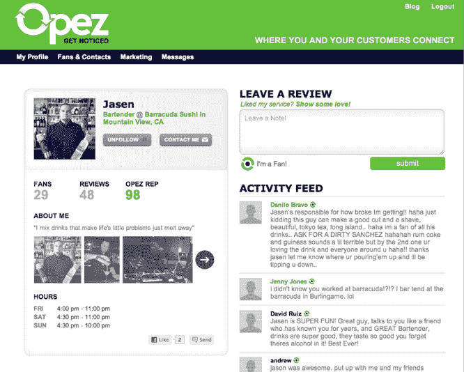

# YC 支持的 Opez 是 Yelp 会见脸书，为服务专业人士 TechCrunch

> 原文：<https://web.archive.org/web/https://techcrunch.com/2011/08/11/yc-backed-opez-is-yelp-meets-facebook-for-service-professionals/>

Yelp 为小企业提供了一个引人注目的平台，通过交易、评论、预订、信息等与消费者联系。

但像发型师、酒保和 DJ 这样的独立服务专业人士有一个问题:如果他们从一个机构跳到另一个机构(这很常见)，他们很难把客户带在身边。进入 Y Combinator 支持的 [Opez](https://web.archive.org/web/20230203042210/http://opez.com/) ，这是一个旨在帮助这些专业人士与他们的客户保持长期联系的平台，让他们随时了解任何工作变化或他们提供的热门交易。

当然，脸书已经提供了脸书网页，可以用于类似的目的。但联合创始人克里斯·谭(Chris Tam)表示，服务专业人士希望能够吸引客户，同时保持距离，这是使用脸书页面作为他们的集中业务页面的问题。Tam 补充说，这款产品是专门为某些行业的专业人士打造的，如 DJ、调酒师、模特、发型师、私人教练、厨师和服务员。

服务专业人员可以创建个人资料，上传照片库和视频，展示工作，为他们的个人资料创建一个虚荣域，等等。然后，他们可以鼓励客户访问他们的 Opez 个人资料并关注他们。专业人士还可以发布状态更新，并向他们的粉丝发送电子邮件，但任何一方都不会看到对方的电子邮件地址。

因此，如果一名专业人士跳槽，他可以通过电子邮件发送他的追随者名单，让人们了解他下一步的工作。他还可以直接从 Opez 向 Twitter 和脸书发布更新。

在客户方面，任何人都可以在 Opez 上看到专业人士的个人资料，但为了关注某人，您需要自己创建个人资料。然后你可以在专业人士的页面上发表评论。

Opez 的想法可能是强大的，因为它给服务专业人员提供了一个融合了 Twitter、脸书和 Yelp 部分的平台——而且它符合明确的需求。目前的问题是，它与脸书的网页是否有足够的不同，以至于行业专业人士愿意在另一个新的网络上创建个人资料。

最初的结果是令人鼓舞的:Tam 说，这个网站已经在调酒师、模特、发型师和其他人中间引起了注意。他补充说，一个手机应用程序正在开发中。

