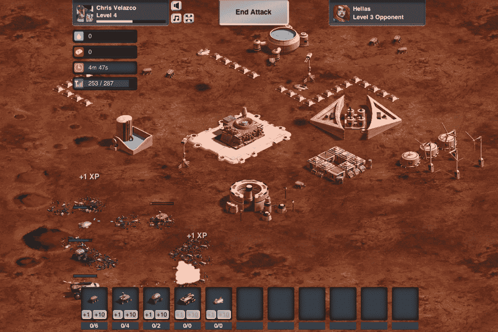

# YC 支持的 SpinPunch 旨在开发更快更漂亮的 HTML5 游戏 TechCrunch

> 原文：<https://web.archive.org/web/https://techcrunch.com/2012/08/17/yc-backed-spinpunch-aims-to-build-faster-prettier-html5-games/>

HTML5 游戏(或开发者)并不缺乏，但它们中的大多数并没有为更多图形密集型、引人入胜的本地游戏提供太多竞争。

“你可以在你的电脑上运行星际争霸，但你在浏览器上能玩的最好的游戏是，比如，FarmVille，” [SpinPunch](https://web.archive.org/web/20221115012717/http://www.spinpunch.com/) 的联合创始人伊恩·田告诉我。虽然他很快指出耕种田地和饲养牲畜没有什么错，但由 Y Combinator 支持的初创公司 HTML5 平台驱动的游戏渴望打破这种质量差异，比其他游戏节奏更快，视觉效果更丰富。

总部位于山景城的 [SpinPunch](https://web.archive.org/web/20221115012717/http://www.spinpunch.com/) 由前微软人田和丹·马斯创立，丹·马斯是一名软件开发人员和 3D 动画制作人，[因制作纪录片《火星五年》获得艾美奖奖](https://web.archive.org/web/20221115012717/http://www.imdb.com/name/nm2092758/)。两人是很长时间的朋友，后来他们最终得出结论，在网络浏览器中玩游戏可能，嗯，很糟糕。

“网上有这么多游戏，但对我们来说它们并不好玩，”田说。“无聊的网页游戏引不起我的兴趣。”

为了突出他们的“高性能”内部 HTML5 平台的力量，SpinPunch 团队决定为他们的第一款游戏提供他们自己的经典(也很难确定)类型:实时策略。这肯定是一项棘手的工作，但 SpinPunch 团队认为这是一次火的考验——毕竟，无论背后的技术多么令人印象深刻，游戏玩家都不会喜欢游戏——编写 bug。这款名为 [Mars Frontier](https://web.archive.org/web/20221115012717/http://www.marsfrontier.com/) 的 HTML5 脸书游戏拥有大约 14 万个月活跃用户(AppData 是这么告诉我的)，并将用户置于多个失调的人工智能之间的火星冲突之中。

自然地，你的任务是收获资源，增强你的基地防御，建立一支机器人军队，然后放下武器。

我，呃，不太擅长这个。

前提有点傻，但 SpinPunch 的信用火星边疆是一个令人惊讶的引人注目的游戏，而不是人们通常会等同于 HTML5 的那种东西。看到大批火星机器人和火星车用激光(有大量的爆炸和粒子效果，不多不少)决一胜负并不罕见——田告诉我，这款游戏能够监视近 200 个人工智能控制的机器人，这需要大量的后端分析来帮助消除问题，保持游戏世界的平衡。SpinPunch 平台还允许在需要时快速、周到地下载游戏资产，此外还支持快节奏的游戏和图形活力。Mars Frontier 主要由鼠标驱动的界面需要很长时间才能适应——这是为了简化 RTS 新手的体验——但进入设置可以让你切换到更像星际争霸的控制模式。

《火星边界》当然是一款令人印象深刻的游戏(尽管我有点不擅长)，但我不得不问:为什么是 HTML5？为什么是现在？Tien 认为转向构建更引人注目的基于浏览器的游戏体验是理所当然的，但他并没有看到这个领域有太多玩家真正试图挑战 HTML5 的极限。我敢肯定，一些公司不会同意这一评估——总部位于帕洛阿尔托的炮兵公司最近锁定了 250 万美元用于一项类似的任务，而新来者 T2·戈科就在昨天也加入了竞争。

“整个游戏行业转向浏览器只是一个时间问题，因为分发优势是如此强大，”田指出。尽管巨大影响力的潜力是存在的，但这种转变不会在一夜之间发生，但 SpinPunch 似乎打算在它到来之前一直处于领先地位。

至于货币化，团队认为这是未来需要担心的事情。公平地说，对于 SpinPunch 团队来说，现在还为时尚早，他们完全有信心经济会自己解决问题。也就是说，他们一直在思考一些想法，以便在他们的产品进一步增长时实施，包括使用该平台为第三方开发游戏的前景。也就是说，Tien 和 Maas 还不热衷于开始外部项目——尽管已经看到游戏工作室和发行商的兴趣，但他们希望在继续发展这个平台的同时，暂时严格地将这个平台保留在内部。