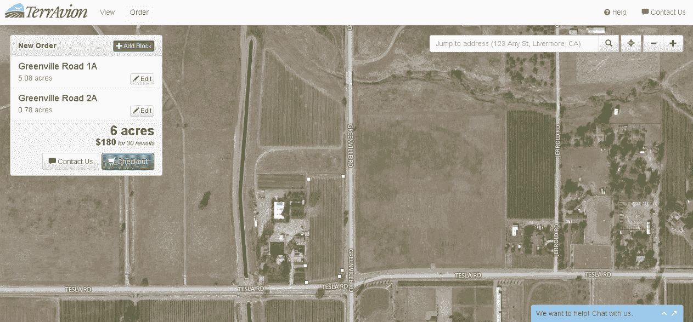
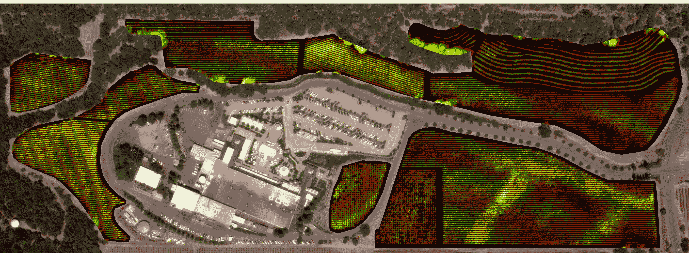

# YC 支持的 TerrAvion 推出航空影像作为农民服务 

> 原文：<https://web.archive.org/web/https://techcrunch.com/2014/02/04/yc-backed-terravion-launches-aerial-imagery-as-a-service-for-farmers/>

农民可以从最新的农作物航空影像中受益匪浅，但小型农业企业几乎不可能获得这些数据。由 YC 支持的 TerrAvion 今天正式发布，它想让小农场、葡萄园和果园在生长季节也能轻松获得航空图像。

300 英亩以下的小农场每英亩 30 美元，大农场每英亩 22 美元，TerrAvion 为农场提供每周图像。该公司称，类似的服务单程票价约为 6-15 美元。

为了做到这一点——并保持低成本——terra vion 显然采用了低技术。它没有使用无人机——无论如何，商业运营无人机都是非法的。取而代之的是，它使用老式塞斯纳 172 飞机来获取这些图像，这些飞机的腹部绑有联邦航空局批准的相机吊舱。正如 TerrAvion 的联合创始人罗伯特·莫里斯(Robert Morris)和康奈尔·赖特(Cornell Wright)告诉我的那样，这实际上比使用无人机更便宜，因为一架飞机可以覆盖比手动无人机大得多的地面。

TerrAvion 认为，随着密度的增加和更多客户的加入，它将能够降低价格，因为它可以在一次任务中拍摄更多的油田。

该相机拍摄常规照片，以及[彩色红外图像](https://web.archive.org/web/20221208071115/http://www.terravion.com/demo-imagery.html)。基于这些信息，TerrAvion 随后为农民创建了一个归一化差异植被指数图像，使他们更容易发现生长旺盛的植物。此外，该公司还提供热视图和倾斜图像，这有时有助于发现常规直下视图中不明显的问题。

与其他使用操作员操作摄像机的服务不同，TerrAvion 的系统是自主运行的。飞行员只需按设定的路线飞行，剩下的由系统处理。该公司称，一架飞机每天可以处理 10 万英亩的土地。

TerrAvion 目前与加利福尼亚州的两个飞行基地合作，在那里租赁飞机，然后由当地飞行员(主要是飞行教练)驾驶，这些飞行员想多飞几个小时，顺便赚些钱。目前，这项服务仅在加州提供，尽管该公司显然也计划扩展到其他地区。

莱特和莫里斯都有航空背景。莫里斯在军队中领导一个无人机排，莱特有私人飞行员执照。

首先，农民只需使用该公司基于网络的界面在他们的田地周围画线，然后等待图像出现。

一家 TerrAvion 公司获得图像，他们通过大量现成的软件运行数据，然后一旦图像准备好(通常是第二天早上)，就给农民发电子邮件。

科波拉酒厂的彩色红外图像

正如 Wright 指出的，该公司的方法不一定能让它诊断出某个领域的某个部分出现问题的原因。然而，它可以很容易地检测出一些树木或藤蔓在哪里得到过多或过少的水，或者在哪里应该使用更多或更少的化学物质。这使得农民在问题变得难以控制之前就注意到了问题，并将其精力集中在有问题的领域。

“我们的重点是，”赖特说，“把照片放在耕种田地的人手中。”在去年的 beta 测试中，该团队发现其服务的经济效益并不来自总部查看数据的人，而是来自了解该领域的人。“我们将我们的服务视为缩短农业决策周期的通用工具，”Wright 说。

尤其是现在，随着加州持续干旱，农民得不到他们习惯的水分配，TerrAvion 相信它的工具可以帮助农民挽救他们的永久作物。

TerrAvion 指出，对于大豆或小麦等大田作物，每英亩的价值往往明显低于葡萄树和果园等永久性作物，因此其服务目前并不面向这些农民。莱特还指出，对这些作物进行干预的选择较少。

科波拉酒厂的 NDVI 红外图像