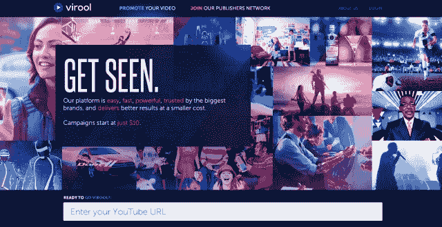
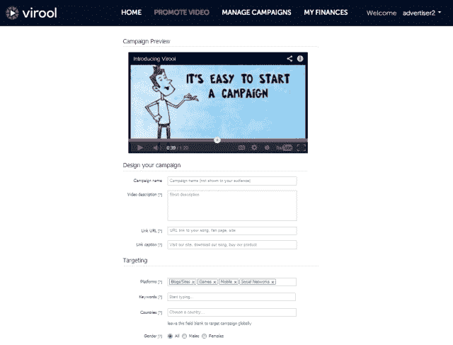
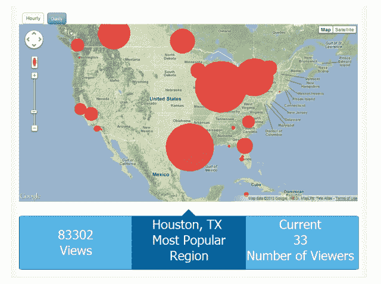

# YC 支持的 Virool 筹集了 662 万美元的“种子”资金，帮助视频传播 

> 原文：<https://web.archive.org/web/https://techcrunch.com/2013/02/14/yc-backed-virool-raises-6-62-million-seed-round-to-help-make-videos-go-viral/>

A 系列危机？谁在乎这样的种子轮？今天，Y Combinator 支持的自助式社交视频广告平台 Virool 宣布获得 662 万美元的巨额“种子”融资。据联合创始人兼首席执行官亚历克斯·德贝洛夫(Alex Debelov)称，Virool 甚至可以选择投资者，包括机构投资者和其他投资者。

没有一家风投公司领投了这笔资金，但投资者名单相当长。风投方面，有 [Thomvest Ventures](https://web.archive.org/web/20221207013156/http://www.crunchbase.com/financial-organization/thomvest-ventures) 、 [Menlo Ventures](https://web.archive.org/web/20221207013156/http://www.crunchbase.com/financial-organization/menlo-ventures) 、 [Draper Fisher Jurveston](https://web.archive.org/web/20221207013156/http://www.crunchbase.com/financial-organization/draper-fisher-jurvetson) 、 [500 Startups](https://web.archive.org/web/20221207013156/http://www.crunchbase.com/financial-organization/500-startups) 、 [Phenomen Ventures](https://web.archive.org/web/20221207013156/http://www.crunchbase.com/financial-organization/phenomen-ventures-fund) 、 [TMT Investments](https://web.archive.org/web/20221207013156/http://www.crunchbase.com/company/tmt-investments) 、 [DominateFund](https://web.archive.org/web/20221207013156/http://www.crunchbase.com/financial-organization/dominatefund) (嗯，#DominateFund？)，以及 [FundersClub](https://web.archive.org/web/20221207013156/http://www.crunchbase.com/company/fundersclub) 。

个人投资者包括 YC 合伙人[保罗·布赫海特](https://web.archive.org/web/20221207013156/http://www.crunchbase.com/person/paul-buchheit)和[加里·谭](https://web.archive.org/web/20221207013156/http://www.crunchbase.com/person/garry-tan)，Loopt 联合创始人[萨姆·奥特曼](https://web.archive.org/web/20221207013156/http://www.crunchbase.com/person/sam-altman)，尤里·米尔纳，Lady Gaga 的经理人[特洛伊·卡特](https://web.archive.org/web/20221207013156/http://www.crunchbase.com/person/troy-carter)，前雅虎首席技术官[法扎德(Zod)纳泽姆](https://web.archive.org/web/20221207013156/http://www.crunchbase.com/person/farzad-nazem)，Zappos 早期投资者[埃里克·摩尔](https://web.archive.org/web/20221207013156/http://www.crunchbase.com/person/erik-moore)，Plug and Play，Ventures，以及 Promus Ventures 创始人[迈克·科利特](https://web.archive.org/web/20221207013156/http://www.crunchbase.com/person/mike-collett)。

似乎就像 Virool 的产品为其客户的视频所做的那样，这家初创公司的种子期也像病毒一样传播开来。

在 2011 年末创立 [Virool](https://web.archive.org/web/20221207013156/http://www.virool.com/) 之前，德贝洛夫的第一家初创公司帮助品牌运营视频竞赛。当时他不断回答客户的一个问题是“你能帮我让这些视频像病毒一样传播吗？”

“我们当时的回答总是不，不，但如果有这样的服务存在，那真的很酷，”德别洛夫告诉我们。在与同样在视频领域创业的联合创始人弗拉德·古尔戈夫(Vlad Gurgov)会面后，两人决定联手打造如今的 Virool。

该公司参加了 Y Combinator 的 2012 年夏季项目，并尽职尽责地采纳了合作伙伴 Garry Tan 的建议，即在产品展示日之前保持低调。“我们把自己锁在公寓里，我们用 [Instacart](https://web.archive.org/web/20221207013156/http://www.instacart.com/) 订购食品杂货，我们用 [Exec](https://web.archive.org/web/20221207013156/https://iamexec.com/) 做家务和跑腿，”德别洛夫笑着说，给其他创业公司大声疾呼。“完全专注于建设公司是一次有趣的经历。”

最终的结果是 [Virool](https://web.archive.org/web/20221207013156/http://www.virool.com/) ，它允许任何人通过在创业公司的网络上定位来推广 YouTube 上的视频。如今，这个网络覆盖了近 2200 万人，包括网站、博客、脸书游戏和移动应用。自 3 月份推出自助服务平台以来，该平台的注册广告客户已从 200 个增长到 30，000 个，迄今已推广了 20，442 个视频。

【T2

首先，视频制作者、艺术家、工作室、代理或个人推广者来到 Virool 平台，输入关于他们的目标受众的信息，如国家、年龄、性别、兴趣和平台偏好。然后，他们提出了每次观看的最高付费和预算。点击“保存”和“存钱”后，视频开始在 Virool 的网络和手机上传播。推广者可以看到关于有多少人正在观看视频、这些观看发生在哪里以及观看者位于哪里的数据。

一些知名品牌已经使用了该平台，包括三星、大众、K-Swiss、索尼和 Orbitz。英特尔是一个特别大的支出者，在 12 月份使用 Virool 进行了一次 30 万美元的活动。另一家未具名的纽约机构在夏季和秋季开始测试该平台后，当月增长到了相同的水平。

但是你不需要花费数千美元来使用 Virool，Debelov 解释道。“我们的目标是让平台非常简单。迄今为止，你可以在 Virool 上发起的最便宜的活动是 10 美元——主要是因为我们坚信这种类型的服务应该让每个人都能享受到，”他说。

目前，音乐视频是推广视频数量最多的类别，但品牌赞助视频是最大的支出者。在 Virool 的 3 万名注册广告客户中，电影预告片和手机应用及游戏视频也占据了突出位置。德贝洛夫指出，这个数字现在正以每天 450 个新注册用户的速度增长，该网站每天也有大约 80 到 90 个活动。

**病毒视频可以买吗？**

但最大的问题是，这种方法行得通吗？Virool 真的能让视频火起来吗？

“事实是否定的，”德别洛夫说。“人们会找到他们感兴趣的、与他们相关的内容。”他认为 Virool 正在做的事情类似于深夜电视节目主持人吉米·基梅尔如何帮助现在臭名昭著的“[双彩虹](https://web.archive.org/web/20221207013156/http://www.youtube.com/watch?v=OQSNhk5ICTI)”走红网络。

“他所做的只是将这个视频展示给几亿人，他们会对这个视频感兴趣，”德别洛夫说。(实际上，[他在推特上向他的 90，000 名推特粉丝发布了这条消息](https://web.archive.org/web/20221207013156/http://articles.cnn.com/2010-07-14/tech/double.rainbows_1_double-rainbow-youtube-fighter?_s=PM:TECH))。“我们采用了这一流程，并对其进行了逆向工程。我们不能保证你的视频会像病毒一样传播，因为这完全取决于你的内容，但我们可以让它出现在 100 万、200 万、50 万人面前，无论你的预算是多少，我们都可以让你出现在观众面前。”

**下一步是什么？**

该公司表示，其 662 万美元的融资对 YC 公司来说是一项“记录”。这很难衡量，因为每个人对种子轮的定义都不一样。但我们已经证实，在 2012 年的冬季和夏季周期中，他们确实是所有公司中筹集资金最多的。

Thomvest Ventures 的董事总经理唐·巴特勒(Don Butler)在解释其公司的投资时说:“在线广告的未来是实时和程序化的竞价。“Virool 凭借其自助式视频广告平台，在利用这一趋势方面处于领先地位。”

有了额外的资金，Virool 将能够充实其团队，特别是在销售方面，这样就有人能够与在平台上花费数千美元的客户通电话，并建立关系。然而，这家初创公司更大的目标是在全球范围内推广这项服务。

*TechCrunch 的读者可以[使用优惠券代码“valentines2013”在收银台获得价值 50 美元的 Virool 积分](https://web.archive.org/web/20221207013156/http://www.virool.com/)。这仅适用于前 1000 人。*

【YouTube http://www.youtube.com/watch?v=dFBzoMPiyI8？feature=player_detailpage]

*注:Virool 原称 DST 投资。出版后，我们被告知是尤里·米尔纳。帖子已经更新以反映。*