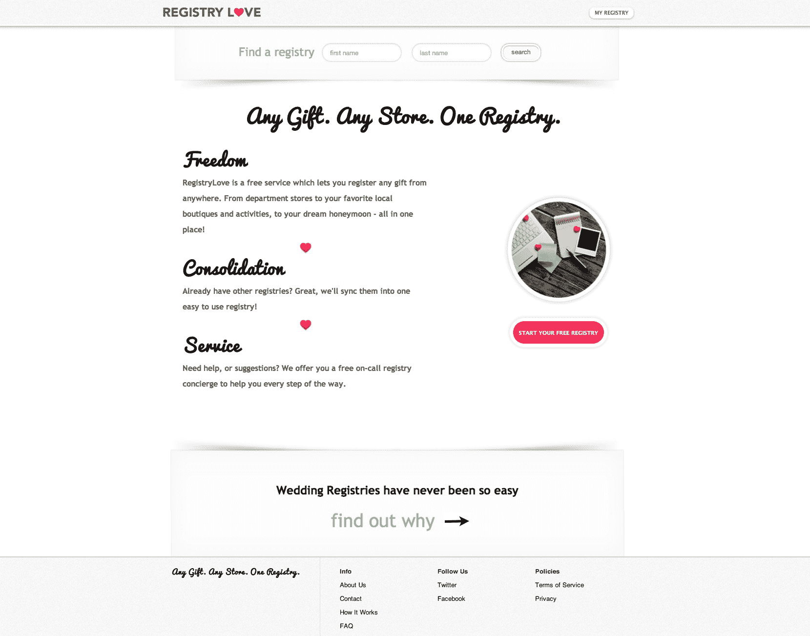
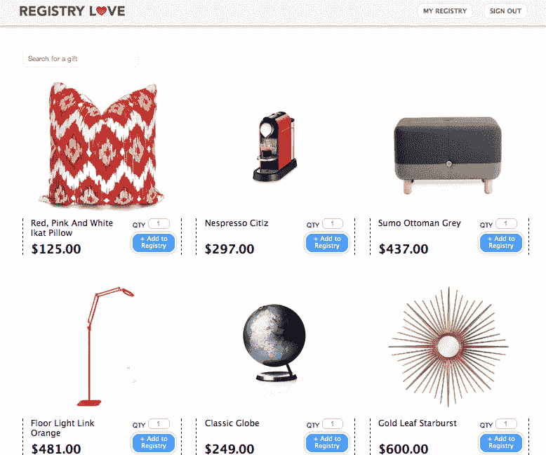

# YC 支持的婚礼创业公司 RegistryLove 允许新人登记任何事情

> 原文：<https://web.archive.org/web/https://techcrunch.com/2012/08/16/yc-backed-wedding-startup-registrylove-lets-couples-register-for-anything/>

Y Combinator 支持的 RegistryLove 今天正式推出其通用婚礼登记服务，已经有 3000 名准新娘注册使用。其中 750 个注册发生在网站建成之前。这说明了最近火热的“婚礼”垂直市场的需求和潜力，最近[攻击](https://web.archive.org/web/20230316161214/https://techcrunch.com/2012/07/23/weddinglovely-takes-on-theknot-with-stress-free-wedding-planning-service/) [来自](https://web.archive.org/web/20230316161214/https://techcrunch.com/2012/02/14/lover-ly-raises-500k-to-be-an-online-visual-inspiration-engine-for-weddings/)各方，从婚礼网站到照片分享应用。

使用 [RegistryLove](https://web.archive.org/web/20230316161214/http://registrylove.com/) ，想法很简单:任何商店，一个注册表。没有哪家商店拥有一对夫妇想要注册的所有东西，许多夫妇希望在他们的注册表中包括他们喜欢的来自较小商家甚至没有在线存在的当地商店的独特物品。

此外，许多现代夫妇对家居用品、盘子和亚麻制品的需求也减少了，他们在大喜之日之前已经合并了住所。他们更想要的是更非传统的礼物——一场戏的门票，蜜月时的一顿付费晚餐，或者可能是跳伞课。

[加入 RegistryLove](https://web.archive.org/web/20230316161214/http://registrylove.com/) 的新娘(或新郎，视情况而定)可以导入他们之前在大型零售商那里工作的在线注册表，或者他们可以选择与专门的婚礼礼宾进行一对一的咨询。礼宾员将根据个人喜好，通过电话或电子邮件进行联系，并询问一系列简单的问题，以更多地了解这对夫妇及其风格。然后，她会把一组建议汇总在一起，这对夫妇可以把这些建议添加到他们在网站上的官方注册表中。最初的注册表将从 20 或 30 个建议开始，以免这对夫妇不知所措，但最终结果可能会增长到数百个项目，甚至缩小到只有十几个项目。

这项服务通过代销商收入产生收入，并从商家(现在超过 100 家)或与该公司合作的批发商那里获得商品，批发商甚至包括一些全国性零售商。对于当地没有网站的商家，RegistryLove 也会去店里拍一张照片(目前仅限湾区)。

甚至还有一个选项，将慈善捐款作为生活舒适的夫妇的一个选项，哦，我不知道，只是觉得举办一场 1 万多美元的婚礼并要求客人用不锈钢器具和精美瓷器支付费用有点贪婪，而世界上有些人只需要干净的饮用水和功能性厕所。(抱歉，抱歉。*叹息*。这就是我私奔的原因。现在要求捐款还来得及吗？下周是我的周年纪念日。)

这项服务是由 Marika 和 Sofia Chen 姐妹以及 Jeremy Poteck 三人组成的。没有人知道如何编码，所以索菲亚自学了 [之后的](https://web.archive.org/web/20230316161214/https://techcrunch.com/2012/04/15/stop-looking-for-a-technical-co-founder/)[一点 TechCrunch 的灵感](https://web.archive.org/web/20230316161214/https://techcrunch.com/2012/06/03/for-the-single-founder-who-cant-code/)。“起初，我们试图雇用一些人，但我们很快意识到，编码大师对婚礼市场不感兴趣，”Markia 说，“我们就像，嗯，我们可以永远坐在这里，或者我们就这样做。”

所以他们就这么做了。[这里是](https://web.archive.org/web/20230316161214/http://registrylove.com/)。