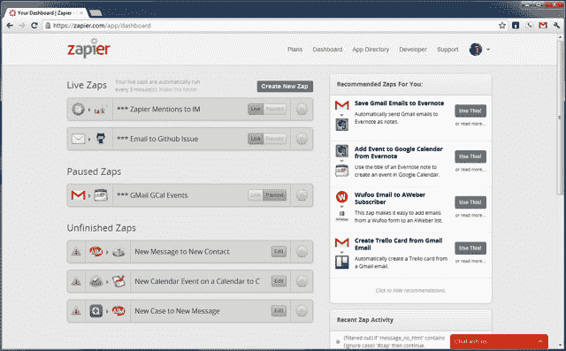

# YC 支持的 Zapier，面向商业用户的 IFTTT，推出开发者平台 TechCrunch

> 原文：<https://web.archive.org/web/https://techcrunch.com/2012/08/01/yc-backed-zapier-the-ifttt-for-business-users-launches-developer-platform/>

# YC 支持的 Zapier，面向商业用户的 IFTTT，推出开发者平台

Y Combinator 支持的服务 za pier T1 允许你自动完成网络上的常见任务，并在网络应用程序之间同步数据，[刚刚宣布了第三方开发者平台 T5 的发布。有了 Zapier，即使非技术用户也可以轻松地在该服务目前支持的 60 多个应用程序之间建立联系。这意味着，例如，每当你在 Eventbrite 上卖出一张票时，你就可以向你的 Basecamp 帐户发送通知，或者每当有人注册你的 Campaign Monitor 或 AWeber 电子邮件营销活动时，你就会收到短信提醒。](https://web.archive.org/web/20221205123903/https://zapier.com/blog/2012/08/01/announcing-zapier-developer-platform-join-hubspot-podio-and-12-others/)

这家总部位于山景城的公司表示，凭借其新的开发平台，开发者将能够轻松地将他们自己的应用添加到服务中，而不必等待 Zapier 团队本身来支持他们。Zapier 目前支持超过 60 种服务，包括 Asana、Dropbox、Campfire、MailChimp、Salesforce、Stripe、Shopify 和 Zendesk 等流行工具。开发人员将能够连接到所有这些应用程序，以及 Zapier 自己在未来添加的任何新应用程序。Zapier 的联合创始人 Wade Foster 表示，这将为“应用程序开发人员节省几周到几个月的时间来构建集成，并让应用程序开发人员有更多时间专注于自己的应用程序。”

Zapier 正在与 12 个合作伙伴推出其开发平台。其中包括营销平台 [HubSpot](https://web.archive.org/web/20221205123903/https://zapier.com/zapbook/hubspot/) ，协同工作平台 [Podio](https://web.archive.org/web/20221205123903/https://zapier.com/zapbook/podio/) 以及发票和时间跟踪服务 [Ronin](https://web.archive.org/web/20221205123903/https://zapier.com/zapbook/ronin/) 。

Zapier 的核心功能集和使命与流行的 IFTTT 类似，但尽管 Zapier 也支持 Twitter 和脸书，但该公司的重点是商业和企业工具，如 Campaign Monitor、Basecamp、Asana 和 Stripe。正如福斯特今天早些时候告诉我们的，该服务目前每月处理超过 1000 万个事件。Zapier 有一个稍微有限的免费版本。高级账户起价[$ 15/月](https://web.archive.org/web/20221205123903/https://zapier.com/app/signup)。

