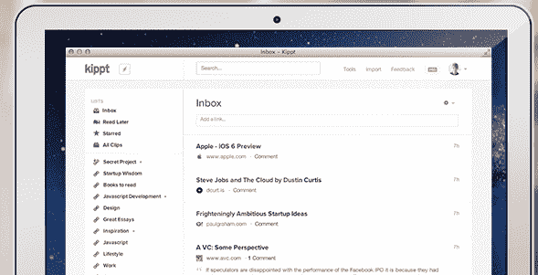
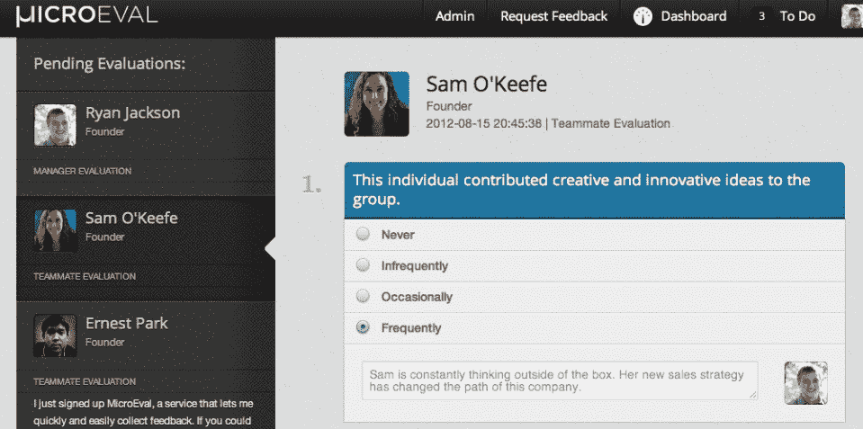
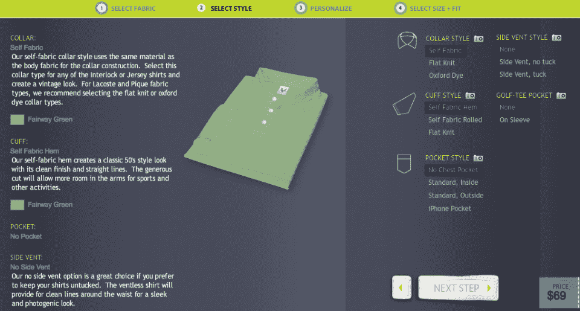
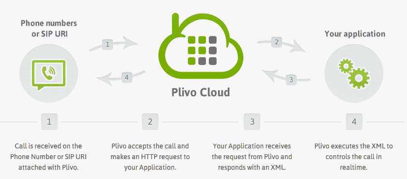
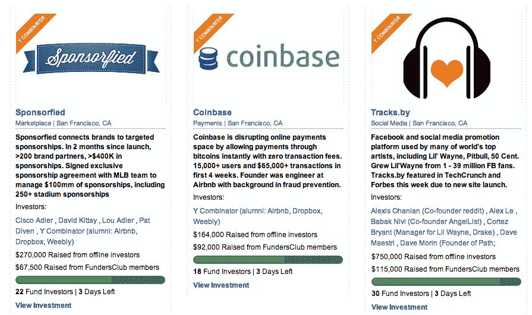
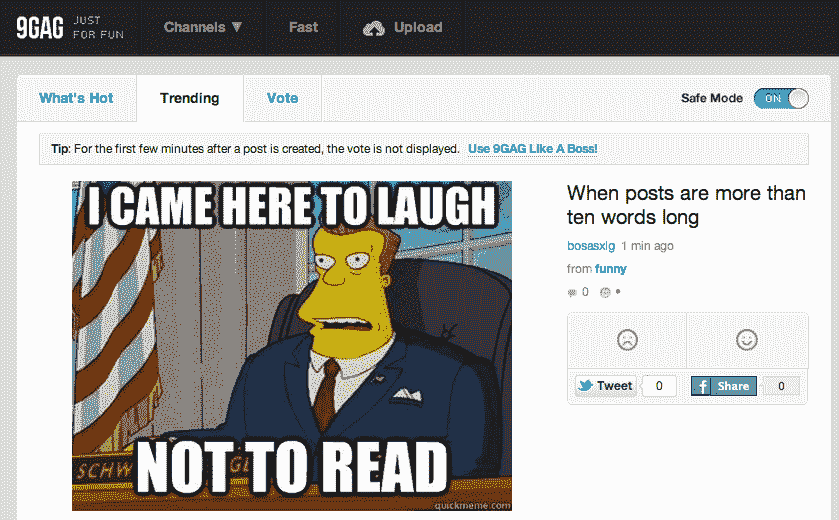

# Y Combinator S12 演示日第一批:Meet 9GAG、Double Robotics、Hubchilla、SmartAsset 等

> 原文：<https://web.archive.org/web/https://techcrunch.com/2012/08/21/yc-demo-day-s12/>

保罗·格拉厄姆启动了他的加速器 Y Combinator 的第 15 个演示日，他说尽管今天会有 75 家创业公司出席，但 2012 年夏季班的申请者比例是“我们所接受的最小的”很明显，YC 让创始人出现在顶级投资者面前的恶名越来越大，如果没有 Y Combinator、500 Startups 和 TechStars 等加速器的支持，初创公司越来越难获得成功。

在这里，我们会给你一个预览，展示他们的东西给风险投资公司，天使和媒体的前 17 家公司，加上给我们的分析，哪些有[改变世界的最大潜力](https://web.archive.org/web/20230316161057/https://techcrunch.com/2012/03/27/best-of-y-combinator-demo-day/)，或者至少赚了很多钱。

格雷厄姆强调，最热门的融资轮可能会在今天满员，因此投资者不应该拖延。虽然我们很想写每一个创业演示，但有几个伟大的想法是不公开的，只有在这里的人才能听到。

你可以查看来自[第二批](https://web.archive.org/web/20230316161057/https://techcrunch.com/2012/08/21/y-combinator-second-batch/)、[第三批](https://web.archive.org/web/20230316161057/https://techcrunch.com/2012/08/21/y-combinator-s12-demo-day-batch-three-getgoing-bigcalc-tracksby-and-more/)和[第四批](https://web.archive.org/web/20230316161057/https://techcrunch.com/2012/08/21/y-combinator-s12-batch-4/)的综述，以及我们对[Y 组合器间距如何变化的报道](https://web.archive.org/web/20230316161057/https://techcrunch.com/2012/08/21/yc-funding-slide-demos-summer-2012/)。但是现在，来看看 YC 演示日 S12 第一批:

#### [**buffer box**](https://web.archive.org/web/20230316161057/http://www.bufferbox.com/)——未来你将如何接收包裹

BufferBox 正在建立一个巨大的绿色锁箱网络，分散在城市和交通网络中，比如火车线路，在那里你可以安全地获得包裹。这意味着你不必坐在家里为你的货物称重，运输公司也不会浪费钱在多次送货尝试上，或者以不满意的客户告终。

[BufferBox](https://web.archive.org/web/20230316161057/http://www.crunchbase.com/company/bufferbox) 的总部设在滑铁卢，所以它首先在多伦多的联合车站推出。它计划到今年年底在 100 个地方安装缓冲箱。今天，这家初创公司宣布，除了沃尔玛之外，谷歌也已签署协议，允许电子商务客户将包裹送到箱子里。[阅读更多关于 BufferBox](https://web.archive.org/web/20230316161057/https://techcrunch.com/2012/08/16/sorry-we-missed-you-yc-backed-bufferbox-solves-the-problem-of-missing-packages/) 的信息。

#### Kippt–Pinterest for work

Kippt 是一个用于专业网络的协作书签系统。它让员工在一个专用平台上相互教学和分享。而且增长很快。创始人宣布他们的每周活跃用户数以每周 22%的速度增长。上周，用户分享了 30 万个链接，用户非常喜欢这项服务，他们在该团队发布的 API 上为它开发了自己的 iOS、Android 和 Windows Phone 7 应用程序。

Kippt 将为自己提供一个专业版，包括一些高级功能，如索引用户导入的剪辑，以方便搜索，费用为每年 25 美元。[阅读更多关于 Kippt 的信息](https://web.archive.org/web/20230316161057/https://techcrunch.com/2012/06/14/yc-backed-kippt-goes-collaborative/)。

#### [**Airbrite**](https://web.archive.org/web/20230316161057/http://airbritelabs.com/about)——平板电脑电子商务软件

70%的电子商务商店无法实现移动化，因为传统软件不够灵活。这就是 Airbrite 的用武之地。它攻击的是中间市场，那里有最多的痛苦和最过时的软件。创始人表示，3000 个品牌每年仅安装和维护费用就要花费 50 万美元，这是一个 30 亿美元的市场。

Airbrite 现在有珍妮弗·洛佩兹的商店和 15 个品牌在试点，还有 30 个正在进行中。它被设计成与蓬勃发展的 API 世界一起工作。它已经得到了 SV 天使的支持，并正在寻求结束一轮融资。

#### [**微评估**](https://web.archive.org/web/20230316161057/http://www.microeval.com/)–现代化绩效评估

MicroEval 表示，它开发的软件将员工绩效评估过程带入了以网络为中心的时代。“每个人都讨厌绩效评估，但每个公司都这样做，每年都在绩效评估上花费大量的金钱和时间，”联合创始人萨曼莎·奥基夫在她的演讲中说(至少在科技领域，这是真的。)

每个公司都可以定制 MicroEval 的软件，根据自己的条件评估员工的表现。MicroEval 的目标是 42 亿美元的市场，并已经与包括 Square 和 Zappos 在内的公司进行了试验。[阅读更多关于 MicroEval 的信息](https://web.archive.org/web/20230316161057/https://techcrunch.com/2012/08/16/microeval-launch/)。

#### [Vastrm](https://web.archive.org/web/20230316161057/http://vastrm.com/)——衬衫的沃比·帕克

[Vastrm](https://web.archive.org/web/20230316161057/http://vastrm.com/) 有一个非常简单的目标:[给你买一件最合身的衬衫](https://web.archive.org/web/20230316161057/https://techcrunch.com/2012/08/09/y-combinators-vastrm-promises-the-perfect-fitting-polo/)。创始人乔纳森·唐(Jonathan Tang，应该提到的是，他在给投资者做演示时可以令人信服地穿上一条粉红色的裤子)的血统相当不错:他的家族多年来一直从事面料生意，他说现在美国人穿的每六件 t 恤中就有一件是他们制作的。据唐说，服装行业的圣杯是找到合适的合身衣服。

Vastrm 旨在通过提供一套独特的 t 恤尺寸来解决这一问题，让顾客在家试穿几件，直到找到一件合适的为止，从而找到适合自己的尺寸。Vastrm 还与整个服装行业供应链建立了联系，这将有助于提高公司的利润率。唐说，这里的潜在市场比 Warby Parker 更大，因为“不是每个人都戴眼镜，但每个人都穿衬衫。”阅读更多关于 [Vastrm](https://web.archive.org/web/20230316161057/https://techcrunch.com/2012/08/09/y-combinators-vastrm-promises-the-perfect-fitting-polo/) 的信息。

#### [VoiceGem](https://web.archive.org/web/20230316161057/http://www.voicegem.com/) —简单、异步的语音邮件消息

[VoiceGem](https://web.archive.org/web/20230316161057/http://www.voicegem.com/) 为网络和 iPhone 开发了一个简单的应用程序，让你[向任何人发送语音信息](https://web.archive.org/web/20230316161057/https://techcrunch.com/2012/08/02/voicegem/)，发送者或接收者无需安装任何特殊软件或拥有电话或数据计划。它基本上允许任何人发送异步消息，如电子邮件或文本，但使用他们的声音而不是书面文字。

使用它的人似乎很喜欢它:自推出以来，VoiceGem 处理的消息分钟数每天增长 11%，平均 93%的使用 VoiceGem 的人会再次发送更多消息。创始人说，这对于给远方的朋友和家人发信息特别有用。[阅读更多关于 VoiceGem](https://web.archive.org/web/20230316161057/https://techcrunch.com/2012/08/02/voicegem/) 的信息。

#### **[img fave](https://web.archive.org/web/20230316161057/http://imgfave.com/)–分享和发现令人惊叹的图像**

imgfave 将自己标榜为 Imgur 和 Reddit 的混合体，希望成为*探索有趣图片并在线分享的*地方[。imgfave 称，通过在一个地方收集网上最受欢迎、最具迷因味道的图片，它已经成为“网上最令人上瘾的图片分享体验”](https://web.archive.org/web/20230316161057/https://techcrunch.com/2012/08/01/can-a-yc-mobile-rookie-founder-crack-the-photo-sharing-space-with-imgfave/)

到目前为止，imgfave 创始人加布·拉格兰(Gabe Ragland)表示，该网站已经获得了一些可观的访问量——每月 3000 万次页面浏览量，访问者平均每次浏览超过 12 分钟。此外，该公司已经开始盈利，两周前，它发布了一款 iPhone 原生应用。[阅读更多关于 imgfave](https://web.archive.org/web/20230316161057/https://techcrunch.com/2012/08/01/can-a-yc-mobile-rookie-founder-crack-the-photo-sharing-space-with-imgfave/) 的信息。

#### 非盈利志愿者招募

去年，非营利组织通过低效的电话和邮件筹集了 600 亿美元。但是[朋友推荐朋友](https://web.archive.org/web/20230316161057/https://techcrunch.com/2012/07/30/amicus-campaigns-volunteers-facebook/)是成功的公式，Amicus 将这一模式引入非营利筹款。它允许非营利组织和大学将他们的支持者转变为福音传道者和志愿者。

Amicus 已经实现盈利，每月经常性收入为 60，000 美元，在过去四个月中每月增长 80%。最后一句“我们是朋友”引起了 YC 观众的大笑。我们在做社会公益，我们会在这个过程中赚很多钱。[阅读更多关于法庭之友的信息](https://web.archive.org/web/20230316161057/https://techcrunch.com/2012/07/30/amicus-campaigns-volunteers-facebook/)。

#### **[普利沃](https://web.archive.org/web/20230316161057/http://www.plivo.com/) —一个特维里欧的另类**

你总是听说 Twilio，但 Plivo 的创始人说，这只是因为它是一个增长速度惊人的市场中的第一家。然而，他们认为 Twilio 的平台有几个弱点，即它是建立在亚马逊云上的 Asterisk 之上。这可能意味着 Twilio 将难以扩展，其通话质量将受到影响，特别是当它转向语音时。[更新:Twilio 说事实并非如此]

[Plivo 提供了自己的互联网电话平台](https://web.archive.org/web/20230316161057/https://techcrunch.com/2012/07/09/yc-backed-plivo-launches-its-scalable-api-platform-for-voice-sms-apps/)，构建了一个在“裸机”服务器上运行的定制堆栈，并承诺更好的规模和更高的通话质量。该公司表示，其平台已经托管了 2500 万分钟的语音，每月带来 52，000 美元的收入。哦，而且已经盈利了。

看起来 Twilio 在这个市场上有着不可逾越的领先优势，但 Plivo 在收盘时发布了一张图表，表明 Plivo 对 Twilio 来说就像谷歌一样令人兴奋。换句话说，“你不需要成为第一名，你只需要成为最后一名。”[阅读更多关于 Plivo 的信息。](https://web.archive.org/web/20230316161057/https://techcrunch.com/2012/07/09/yc-backed-plivo-launches-its-scalable-api-platform-for-voice-sms-apps/)

超过 90%的创业价值创造发生在私人市场，这意味着许多投资者被边缘化。认真的投资者，尤其是那些硅谷以外的投资者，可能无法接触到他们相信的初创企业。因此，FundersClub】创建了一个私人市场，在这里，只要 1000 美元的合格投资者就可以通过一个在线平台为私人公司和创业公司提供资金。

LendingClub 和 Kickstarter 证明了汇集资本支持创新是可能的。FundersClub 也找到了动力，当它最初的目标是 25 万美元时，它为自己筹集了 52 万美元，并在推出后不到一个月的时间里看到 130 万美元通过该系统涌入。FundersClub 可以通过让创始人获得众筹资金来增加最好的风投和天使投资人，这将让他们在不增加吵闹的大牌投资者的情况下完成融资，这些投资者可能不会增加他们资金以外的价值。[阅读更多关于基金俱乐部](https://web.archive.org/web/20230316161057/https://techcrunch.com/2012/08/20/ipo-vc-angel-fundersclub/)的信息。

#### **[9 gag](https://web.archive.org/web/20230316161057/http://9gag.com/)——网上搞笑模因的一站式商店** 

9GAG 聚合了网络上的迷因和笑话——很像 [Reddit](https://web.archive.org/web/20230316161057/http://reddit.com/) ，但纯粹专注于有趣的东西(GAG，明白吗？)该网站已经非常受欢迎:其创始人表示，7 月份，9GAG 的独立访问者超过 6500 万，而 Reddit 的独立访问者为 3970 万(第二个数字是由 9GAG 提供的，所以不能全信。)它的其他指标同样令人瞠目结舌:脸书上有 380 万粉丝，Twitter 上有 92 万粉丝，用户平均每次访问该网站的时间超过 17 分钟。该公司三周前推出了第一款手机应用，目前已经有 75 万次下载。

用户生成的内容总是一个碰运气的游戏，但 9GAG 的人说，总的来说，由于互联网的即时性，该网站可以生产出很多很棒的东西。9GAG 的创始人之一在公司的演示中说:“洛杉矶没有一家工作室能如此及时地创造这种有趣的内容。”。

#### [hubcchilla](https://web.archive.org/web/20230316161057/http://www.hubchilla.com/)——现代的笔友

Hubchilla 将自己定位为“短信广播时间”，根据兴趣、性别和位置将用户配对，相互发送短信。其他服务如 [Airtime](https://web.archive.org/web/20230316161057/http://www.airtime.com/) 和 ChatRoulette 要求两个人同时在线并准备通话，而短信允许异步通信。

据 Hubchilla 的人说，它在校园里大受欢迎——80%的用户群是大学生。Hubchilla 也是超级病毒，该服务在 24 小时内就传播到了一所大学的 90%(这听起来很疯狂，但谁知道现在有没有孩子。)以免你认为大学市场不值钱，Hubchilla 的人愿意指出，那是马克·扎克伯格开始他的帝国的地方。

#### [daily . me](https://web.archive.org/web/20230316161057/http://www.everyday.me/)——你生活的私人在线记录

Everday.me 允许用户创建自己活动的私人时间表。它可以插入脸书、推特和 Instagram，让你追踪所有的社交数据，作为你的个人记录和记忆。你也可以通过应用程序、网站或电子邮件添加帖子，还可以用标签组织帖子。

“我们不仅仅是写日记，我们还建立了一个记录你关键生活时刻的个人时间线，”该团队说。

自从两周前推出[以来，daily . me 表示用户已经创建了 250 万个条目，每天还会增加 10 万个。该公司还表示，用户日增长率为 14%。至于赚钱，daily . me 计划提供额外的功能，如额外的存储空间和打印版本的时间表。](https://web.archive.org/web/20230316161057/https://techcrunch.com/2012/08/09/y-combinator-backed-noodle-labs-launches-everyday-me-an-evernote-for-your-life/)[准备好更多关于 daily . me 的信息](https://web.archive.org/web/20230316161057/https://techcrunch.com/2012/08/09/y-combinator-backed-noodle-labs-launches-everyday-me-an-evernote-for-your-life/)。

#### **[可提交](https://web.archive.org/web/20230316161057/http://www.submittable.com/) —轻松提交管理**

Submittable 让任何公司都可以轻松地[管理他们的提交流程并收取提交费用](https://web.archive.org/web/20230316161057/https://techcrunch.com/2012/06/18/submittable/)。客户已经包括维珍，哈佛和花花公子。那些公司有什么共同点？没有，这就是为什么创始人认为这可能是一个巨大的市场:“如果他们可以使用它，任何人都可以使用它。”

这些提交可以采取任何形式，从简历到博客帖子到工作申请。Submittable 允许公司不仅接受提交的内容，还可以围绕它们创建任务和工作流，例如在不同的编辑之间移交审核过程。至于费用，该公司表示，它已经处理了 150 万美元的付款，其收入每月增长 16%。[阅读更多关于 Submittable 的信息。](https://web.archive.org/web/20230316161057/https://techcrunch.com/2012/06/18/submittable/)

#### **[双机器人](https://web.archive.org/web/20230316161057/http://www.doublerobotics.com/)——一个用 iPad 做脸的电话会议机器人**

“忘掉你所知道的关于远程呈现机器人的一切。”Double Robotics 已经[创造了一种叫做 Double](https://web.archive.org/web/20230316161057/https://techcrunch.com/2012/08/13/meet-the-double-a-teleconferencing-robot-with-an-ipad-for-a-face/) 的机器，它本质上是一个可驾驶的 iPad 机器人支架——你只需安装一个 iPad 应用程序就可以开始电话会议。通过这种方法，Double Robotics 可以提供更实惠的远程呈现机器人，每双收费 1999 美元。

测试者包括强生公司和可口可乐公司。第一批双倍应该会在今年晚些时候发出，尽管网站上说第一批已经卖完了。Double Robotics 表示，它已经看到超过 50 万美元的预订，订单来自 7 家财富 500 强公司。[阅读更多关于双机器人的信息。](https://web.archive.org/web/20230316161057/http://www.doublerobotics.com/)

#### **[SmartAsset](https://web.archive.org/web/20230316161057/http://www.smartasset.com/) —更好的财务决策工具**

帮助购买房屋等决策的在线金融计算器并不缺乏，但 SmartAsset 高管认为它们是“20 世纪 90 年代的遗留物”例如，SmartAsset 展示了一张来自 Bankrate.com 的截图，上面写着你可以用 10 美元的首付买一套 70 万美元的房子。另一方面，SmartAsset 提供最新的、包含本地数据的交互式金融工具。

这家公司[以瞄准购房者](https://web.archive.org/web/20230316161057/https://techcrunch.com/2012/07/24/smartasset/)起家，现在它回答诸如“我能借多少钱？”以及“我能放下多少？”它最终计划回答 24 个不同主题的 250 个问题。自推出以来，该公司已经吸引了 17，000 名用户和 200，000 次页面浏览。这些数字可能看起来并不惊人，但该公司指出，“我们的用户都在写他们人生中最大的支票……
这些确实是最有价值的在线页面浏览量。”SmartAsset 通过创造潜在客户来赚钱，它已经为筹集了 90 万美元的资金。[阅读更多关于 SmartAsset 的信息。](https://web.archive.org/web/20230316161057/https://techcrunch.com/2012/07/24/smartasset/)

#### **[SpinPunch](https://web.archive.org/web/20230316161057/http://www.spinpunch.com/) —用于更快、更漂亮游戏的 HTML5 平台**

SpinPunch 希望建立“新一代游戏的基础设施和发行”还有其他 HTML5 游戏平台，但 [SpinPunch 的目标是让游戏](https://web.archive.org/web/20230316161057/https://techcrunch.com/2012/08/17/yc-backed-spinpunch-aims-to-build-faster-prettier-html5-games/)能够真正与图形密集型的原生游戏竞争。

作为概念的证明，该公司推出了自己的游戏，名为《火星边界》,这是脸书上的一款实时战略游戏。自 1 月份推出测试版以来，这款游戏的月活跃用户已经增长到 140，000 人，这些玩家每天的支出为 1，700 美元。SpinPunch 表示，现在有希望获得该平台许可的大型游戏工作室正在与它接洽。[阅读更多关于 SpinPunch 的信息。](https://web.archive.org/web/20230316161057/https://techcrunch.com/2012/08/17/yc-backed-spinpunch-aims-to-build-faster-prettier-html5-games/)

现在，请阅读 TechCrunch 从 YC 演示日中挑选的十大作品，并从其他作品中选出你自己最喜欢的:

*   [第二批](https://web.archive.org/web/20230316161057/https://techcrunch.com/2012/08/21/y-combinator-second-batch/) : Flightfox、Mth Sense、Scoutzie、Instacart、Profig、Zapier、Coco Controller、Collections、Keychain Logistics、Parallel Universe、Survata、Sponsorfied、Filepicker.io、Referly、Rentio
*   [第三批](https://web.archive.org/web/20230316161057/https://techcrunch.com/2012/08/21/y-combinator-s12-demo-day-batch-three-getgoing-bigcalc-tracksby-and-more/) : GetGoing、Canopy Labs、Dreamforge、BigCalc、Easel、Kamcord、ReelSurfer、LeanMarket、TomoGuides、DataNitro、Eligible、Grid、HD Trade Services、TapIn、Tracks.by
*   [第四批](https://web.archive.org/web/20230316161057/https://techcrunch.com/2012/08/21/y-combinator-s12-batch-4/) : Study Edge、Statwing、Hiptype、RegistryLove、Virool、Circular、Viacycle、QuicklyChat、Knowmia、比特币基地、Markupwand、Healthy Labs、Vayable、Tastemaker、Light Table、Clever

*【安东尼·哈和科琳·泰勒补充报道】*