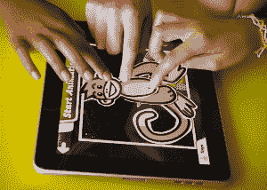

# YC 资助的 Launchpad Toys 计划打造下一代早期学习玩具 

> 原文：<https://web.archive.org/web/http://techcrunch.com/2011/08/29/yc-funded-launchpad-toys-looks-to-create-the-next-generation-of-early-learning-toys/>

假设很少是安全的。但我相信，当我大胆地说，总的来说，孩子们喜欢玩具时，你们大多数人都会同意。没错。他们也喜欢卡通。自从这两种产品问世以来，这一点一直都是正确的，然而，最近世界上的小公司开始流行一种新的口味:对 iPad 的喜爱。有人甚至说它是 2010 年的年度玩具。

来自 Y Combinator 的 63 家公司的一家新创业公司[今天成立，名为](https://web.archive.org/web/20230204205822/https://techcrunch.com/2011/08/23/y-combinator-demo-day-the-ultimate-roundup/) [Launchpad Toys](https://web.archive.org/web/20230204205822/http://launchpadtoys.com/) ，它承认平板电脑在孩子们中很受欢迎——而且它们恰好是一种非常有效的教育工具。

简而言之，Launchpad 希望将玩具带入数字时代。这家初创公司正在为 iPad 开发一套应用程序，允许儿童通过游戏来创造、学习和分享他们的想法——努力成为“数字游戏的乐高”。这家初创公司旨在通过其应用程序将 Play-Doh、Crayola 和 Erector Sets 等经典玩具(和玩具制造商)带到 iPad 上，但其教育背景是标准化的，符合国家教育要求。

Launchpad 套件中的第一款游戏是 [Toontastic](https://web.archive.org/web/20230204205822/http://itunes.apple.com/us/app/toontastic/id404693282?mt=8) ，这是一款于 1 月份推出的游戏，它使孩子们能够创建和串联自己的卡通(从一系列不同的角色和背景中选择)，甚至可以通过触摸和录制音频在屏幕上移动他们的角色，为他们提供声音。目的是帮助孩子们学习讲故事的艺术，同时让他们在与朋友和家人分享之前，享受制作自己的卡通动画的乐趣，甚至获奖。

 Toontastic 自上线以来已经被苹果公司推荐了四次，最近被加入了应用商店名人堂，这反过来又使该应用吸引了超过 40，000 次付费下载，并使其用户创造了超过 170，000 个卡通人物。[点击](https://web.archive.org/web/20230204205822/http://youtu.be/e8mP9li8S-s)查看孩子们对该应用的反应；毫不奇怪，他们喜欢它。(显然，他们的父母也是如此，因为卡通片最近获得了父母选择奖。)

这可能是因为应用程序中的主题符合最新的初级创意写作标准，这让父母在 iPad 上观看他们的孩子时有一种幸福感——更不用说 iPad 的多点触摸功能让应用程序具有协作性，鼓励父母加入到与他们的孩子一起玩。Touchpad 还为其应用程序创建了家长/教师指南；点击这里查看指南[解释卡通的一些教育复杂性以及它如何符合国家创造性写作标准](https://web.archive.org/web/20230204205822/http://launchpadtoys.com/site-items/pdf/Toontastic-ParentTeacherGuide-LaunchpadToys.pdf)。

更重要的是，Launchpad 不仅仅希望用户体验局限于独立的应用程序，因此该团队创建了全球讲故事网络 [ToonTube](https://web.archive.org/web/20230204205822/http://toontube.launchpadtoys.com/) ，允许孩子们与家人和来自 100 多个国家的其他孩子分享他们在 Toontastic 上创作的故事。用户可以在应用程序中浏览网络，为他们最喜欢的卡通片投票，并与其他孩子互动。如果一部漫画吸引了超过 8 个“喜欢”，那么该漫画的创作者将获得一个徽章，而每个收集到的徽章将解锁可用于故事的新角色。

Launchpad 团队由联合创始人安迪·拉塞尔(Andy Russell)和图尚·阿马拉西瑞沃德纳(Thushan Amarasiriwardena)领导(他们分别来自孩之宝(Hasbro)和波士顿环球报(Boston Globe ))的前世)，他们表示，他们试图选择一个特定的教育主题——就卡通而言，是创意写作和讲故事——并将其与一种游戏形式(在这种情况下是木偶)相匹配，以提供一种将非迂腐的教育材料与游戏乐趣相融合的体验。

拉塞尔还告诉我，Launchpad 在美国各地的教师中引起了很大的反响，尽管这家初创公司将其应用程序设计为面向消费者(而不是仅供课堂使用)，但他表示，触摸设备为教育和游戏开发商提供了一个为学校和儿童设计的机会，这在以前很难做到，因为集成游戏控制台等涉及到准入门槛。进教室。Launchpad 的应用程序套件将继续首先以家庭为中心进行设计，但他说，关键是要定制体验，以便为两者优化。

就 Launchpad 的未来路线图而言:创始人表示，他们希望继续开发将学习目标与游戏模式相结合的应用程序，利用这一公式扩展到其他垂直领域。他们还计划很快创建一个玩具店，实现应用内购买，比如新的角色和背景。

这家初创公司利用 iPad 的保存、分享和协作功能作为启动平台，正在打造新一代早期学习玩具。到目前为止，他们有了一个很好的开始。

[想了解更多关于 Launchpad 玩具的信息，请点击这里](https://web.archive.org/web/20230204205822/http://launchpadtoys.com/toontastic/)。让我们知道你的想法。

http://vimeo.com/thushan/toontastic