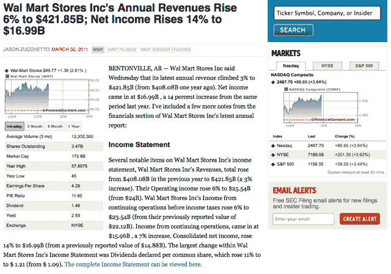

# YC 资助的 MarketBrief 让迟钝的 SEC 文件变得人性化

> 原文：<https://web.archive.org/web/https://techcrunch.com/2011/08/15/yc-funded-marketbrief-makes-obtuse-sec-documents-human-friendly/>

# YC 资助的 MarketBrief 使迟钝的 SEC 文件更人性化

如果你曾经试图艰难地通过 SEC 文件(或大多数财务文件，就此而言)，你知道这可能是一个乏味的，有时令人困惑的过程，受到过度合法化和不必要的小字体的阻碍。如今，Y Combinator 支持的公司 MarketBrief 有了一个解决方案:它为你浏览这些 SEC 文件，然后筛选关键数据，自动生成一个简单英语(嗯，几乎简单)版本，听起来更像是一篇报纸文章，而不是法律文件。

如果你处理大量 SEC 文件，你可能已经熟悉这家初创公司——该公司最初在 2009 年以 SECWatch 的名义成立，当时它的功能相当简单:它将监控 SEC 的公开文件，以获取新的更新，并使这些文件易于访问。

这个新版本更加深入。它仍然可以让您快速找到任何最近添加的 SEC 文档，但 MarketBrief 将根据重要数据自动生成一篇更容易理解的文章，而不是简单地以原始形式呈现给您。这些报告在上传到 SEC 后的几秒钟内就会生成，尽管 MarketBrief 有时会让人检查这些报告以确保准确性(估计这种需求会随着时间的推移而减少)。MarketBrief 允许用户免费获取 10 篇文章，然后每月收费 9 美元。

这也不仅仅是为业余爱好者提供的服务——联合创始人 Jason Zucchetto、Chris Auer 和 Michael Shafrir 指出，一些[专业人士](https://web.archive.org/web/20230131030007/http://www.cnbc.com/id/43268434)不得不应对同样令人头疼的问题。

目前，该公司支持 SEC 500 多种申报类型中约一半的自动生成文章，并继续支持其余类型。除此之外，该公司希望最终扩展到其他申请领域，如来自 FCC、FDA 和其他政府机构的申请。从长远来看，该公司还计划与美联社达成协议，提供额外的内容，以便最终能够更直接地与《华尔街日报》和 CNNMoney 等网站竞争。

因为该网站已经以一种更基本的形式存在了一段时间，它已经吸引了一些流量——它在 8 月份有超过 110，000 名访客，月环比增长 20%。它有很强的搜索引擎优化能力，自动生成的文章有时在相关公司的谷歌搜索结果中排名很高(MarketBrief 说，他们有几家公司实际上抱怨他们不想那么容易访问的公共文件；他们没有把它们拿下来)。

