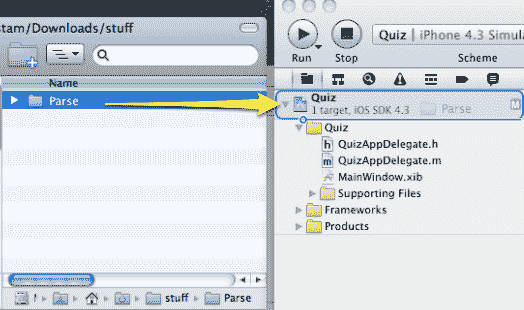
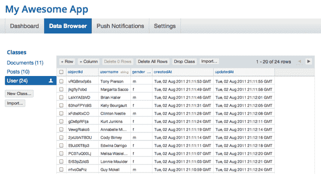

# YC 资助的 Parse:移动应用的英雄 

> 原文：<https://web.archive.org/web/https://techcrunch.com/2011/08/04/yc-funded-parse-a-heroku-for-mobile-apps/>

如果您是一名为 iOS 或 Android 设计应用程序的移动开发人员，您可能非常熟悉 Objective C 和/或 Java。但是您很有可能对后端服务器代码不太熟悉，这些代码是实现数据同步或认证等功能所必需的。现在 [Parse](https://web.archive.org/web/20230130174349/http://www.parse.com/) ，一家 YC 投资的公司今天推出了私人测试版，它有一个解决方案:它会处理所有那些服务器端的功能，让你专注于使移动客户端更好。第一批 200 名用“techcrunch”代码在这里注册[的读者将会进入。是的——他们拥有 Parse.com 的](https://web.archive.org/web/20230130174349/https://www.parse.com/users/new?code=techcrunch)。

三个月前还是 Scribd 的联合创始人和首席运营官的联合创始人 Tikhon Bernstam 解释说，许多移动应用程序开发人员并不十分熟悉管理数据库、用户验证、通知和其他常见功能所需的服务器端代码。当然，他们通常可以解决这些问题，但是学习和实现这些特性所花费的时间是非常重要的。

这就是 Parse 的用武之地。将 Parse SDK 拖放到您的 IDE 中后，您可以使用几行代码访问移动数据存储、推送通知和用户管理等功能(您可以在这里看到当前功能的概要)。伯恩斯坦说，这项服务的一个常见用例是集成同步，这样用户就可以在多个设备上访问相同的内容。您可以选择使用 Parse integrated 从头构建您的应用程序，或者您可以导入现有应用程序并使用它在现有功能的基础上添加新功能。

Parse 才刚刚开始。Bernstam 承认 Parse 不能构建出所有开发者都需要的服务器端特性，但是他认为他们有 90%的能力做到。另一个需要注意的重要事情是:虽然 Parse 会为您处理所有的服务器端数据，但是如果您想离开该服务，它还可以让您导出这些数据。

Parse 团队有四个共同创始人，他们都曾参与(或共同创立)YC 公司。该团队包括:Tikhon Bernstam (Scribd 联合创始人)、James Yu(Scribd 的第二工程师)、Ilya Sukhar(之前在 Etacts)、Kevin Lacker (Gamador 创始人)。到目前为止，该公司已经筹集了 110 万美元，投资者包括 YC、Start Fund、谷歌风投、门罗风投、SV Angel、尤里·米尔纳、亚伦·伊巴(Appjet 创始人)、雷·汤辛(Ray Tonsing)、加里·谭(Garry Tan)、克里斯·法尼尼(Chris Fanini)和肖恩·纳普(Sean Knapp)。

到目前为止，这项服务已经集成到流行的应用程序中，包括 Hipmunk、Scribd 的 Float 和 Socialcam。

但 Parse 并不是唯一一家寻求帮助移动开发者解决这些问题的初创公司。事实上，我们刚刚[写了](https://web.archive.org/web/20230130174349/https://techcrunch.com/2011/08/04/kinvey-closes-2m-seed-round-for-its-backend-as-a-service-product/)关于[金维](https://web.archive.org/web/20230130174349/http://www.kinvey.com/)，一家刚刚筹集了 200 万美元的 TechStars 公司，与 Parse 处于同一领域。

