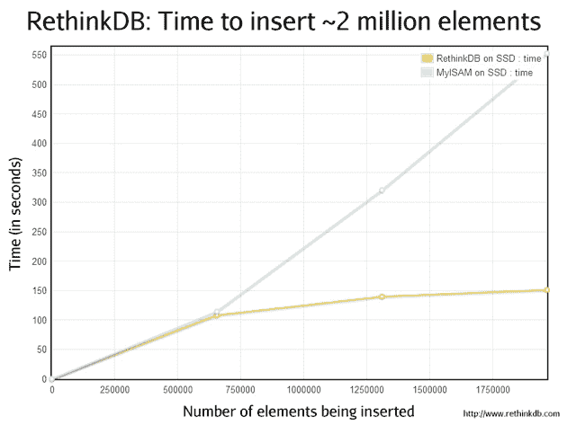

# 由 YC 资助的 RethinkDB:一个完全为固态硬盘打造的 MySQL 存储引擎 

> 原文：<https://web.archive.org/web/https://techcrunch.com/2009/07/28/yc-funded-rethinkdb-a-mysql-storage-engine-built-from-the-ground-up-for-ssds/>

# 由 YC 资助的 RethinkDB:一个完全为固态硬盘构建的 MySQL 存储引擎

 已经过去了很长时间，但计算机行业终于在从老式的基于盘片的硬盘向 iPhones 和许多其他电子产品中的固态硬盘(SSD)的转变中取得了进展。好处是显而易见的:与基于盘片的同类产品不同，固态硬盘没有移动部件，对于许多任务来说，它们的速度也明显更快。不幸的是，大多数软件，无论是服务器端的还是其他的，都已经针对较旧的驱动器及其物理限制进行了优化。 [RethinkDB](https://web.archive.org/web/20230214153632/http://www.rethinkdb.com/) 是一家新成立的公司，它希望利用这一问题，为 mySQL 数据库构建一个存储引擎，该引擎针对 SSD 驱动器进行了全面优化，带来了大幅速度提升和一些肯定会吸引许多开发人员眼球的功能。

该公司是最新一批由 Y Combinator 资助的创业公司的一部分，处于相当早期的阶段(两个月前才开始开发该产品)，但它已经在所能提供的功能方面取得了一些实质性进展。其中包括实时模式更改，它允许开发人员对其数据库结构进行重大修改，而不必经历复杂的同步和备份过程。它还提供了无锁并发，这意味着即使其他用户正在向数据库写入数据，用户也能够从数据库中读取数据。它是一个只附加的数据库，这意味着开发人员可以在系统出现故障时快速恢复。

RethinkDB 还采用了一种相对新颖的开发方法，至少在数据库存储方面是这样。它遵循“早发布，常发布”的口号，它以发布早期[开发者 pre-alpha](https://web.archive.org/web/20230214153632/http://www.rethinkdb.com/wiki/) 开始，你可以免费下载和试用(该公司表示，由于 MySQL 处理存储引擎的方式，实现该软件非常容易)。然而，鉴于您将使用它来管理您的数据，将它仅用于测试目的是绝对重要的——确保您将任何关键数据存储在其他地方。该公司希望在接下来的几个月里利用开发者的意见来改进产品，直到产品发布。

RethinkDB 计划在未来六个月内推出其商业产品，采用企业级定价结构，按每个 CPU 收费(包括支持)。