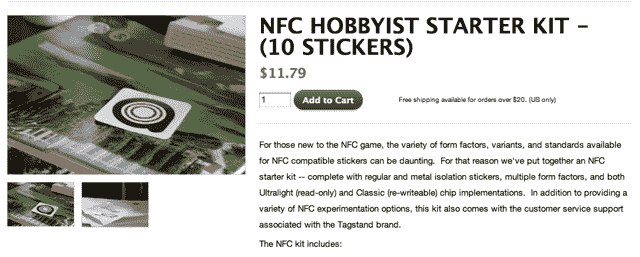

# YC 资助的 Tagstand 推动了 NFC 的发展 

> 原文：<https://web.archive.org/web/https://techcrunch.com/2011/08/19/yc-funded-tagstand-greases-the-wheels-of-nfc-development/>

即将出现的更令人兴奋的技术之一是 NFC，它是近场通信的缩写。你可能已经对这项技术有所耳闻了:它可以让你简单地用手机点击特殊的传感器来支付东西，而且它已经被集成到 Nexus S 中——一系列配备 NFC 的 Android 设备正在路上(iPhone 支持已经传闻很久了，但它可能不会包含在 iPhone 5 中)。

诚然，NFC 已经“出现”了很长一段时间，但在实现任何主流采用之前，它还有很长的路要走。但潜力是存在的，许多开发商都渴望在市场上抢占先机。只有一个问题:希望获得 NFC 贴纸的小开发商和品牌往往需要长时间等待，特别是当他们小批量订购时。

现在，一家由 Y Combinator 资助的名为 [Tagstand](https://web.archive.org/web/20230203043450/http://www.tagstand.com/) 的初创公司希望成为他们的新朋友，提供不到 24 小时内发货的定制 NFC 贴纸(加上发货所需的时间)。他们还让标签变得“智能”,提供了一个有点像 URL 的短服务，让你可以跟踪每个标签的使用时间。每张贴纸大约 1 美元，似乎和其他网站对小批量的收费差不多(旁注:Tagstand 已经是谷歌“购买 NFC 贴纸”的顶级搜索结果之一)。

如果你感兴趣，Tagstand 还为 TC 读者推出了一项特别优惠:前往[此链接](https://web.archive.org/web/20230203043450/http://www.tagstand.com/collections/all-stickers/products/techcrunch-sample-pack)，输入折扣代码“techcrunch4nfc”，你就可以订购一个免费的 nfc 样品包(你仍然需要支付运费)。

短 URL 功能非常简单:当你下订单时，Tagstand 会将每个标签与一个唯一的 URL 相关联。然后，一旦你收到你的贴纸，你可以登录到该网站的仪表板，并配置你希望这些短网址指向哪里(其结果是，你可以改变网址，甚至一旦贴纸部署在外地)。该网站还提供了这些贴纸的使用频率分析。

从长远来看，Tagstand 团队表示，他们不认为自己是一家 NFC 贴纸公司，至少不完全是。相反，他们希望尽可能方便开发者利用 NFC 这也包括构建软件。他们目前正在开发库，帮助程序员更容易地将 NFC 集成到他们自己的应用程序中。

但目前他们的重点是销售定制贴纸，这有一个很好的副作用:在分发这些贴纸的过程中，Tagstand 与许多对 NFC 感兴趣的开发商和品牌建立了联系，这让他们了解了人们将如何使用这项技术。这反过来将帮助他们塑造未来的产品。

