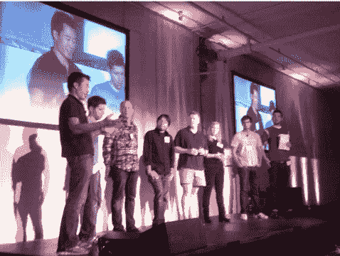

# YC 纽约:保罗·格拉厄姆分享创业毒药的解毒剂 TechCrunch

> 原文：<https://web.archive.org/web/http://techcrunch.com/2011/09/26/yc-nyc-paul-graham-shares-the-antidote-to-startup-poison/>

虽然花了他们几年时间，但 Y Combinator 终于席卷了曼哈顿。尽管——让一些读到这篇文章的人很懊恼——只有一个晚上。

不，尽管今晚的 [YC 纽约](https://web.archive.org/web/20230205042022/http://www.ycnyc.com/)活动周围流传着一些谣言，Y Combinator 不会在纽约开分店。但 YC 的与会人员，包括几乎所有公司的合作伙伴和十几名 YC 校友，确实与 800 多名来自纽约的企业家、准企业家和其他一系列对创业世界感兴趣的人分享了大量轶事和建议。

当晚的主题演讲由 Y Combinator 联合创始人保罗·格拉厄姆主讲，他探讨了纽约市与硅谷之争中普遍存在的一个问题:培育一个创业社区需要哪些关键要素，纽约市具备这些要素吗？

他的演讲有一个普遍的主题:“另一方面…”

格雷厄姆在演讲中多次提到这句话，部分是开玩笑，部分是因为在决定纽约市是否是创业的好地方时，有太多不确定因素在起作用。

格雷厄姆以试图确定什么样的基本因素使创业中心如此适合创建一家公司开始了他的演讲。他说，“创业失败是不可避免的”，这就是为什么在创业中心之外的任何地方创业都会有如此惨淡的结果。但出于某种原因，某些地区(即硅谷)有一种可以降低这种内在失败可能性的解药。

但是解药是什么？

简而言之，这就是肖恩·帕克(格拉汉姆指的是脸书创始人马克·扎克伯格偶然在人行道上遇到肖恩·帕克的事件——帕克后来成为脸书的创始总裁，并在建立公司的股权结构方面发挥了关键作用)。更一般地说，解药是高度集中对创业和技术感兴趣的聪明、有动力的人，这样你遇到能帮助你的人的可能性就会大大增加。

格雷厄姆接着讨论了纽约市的优势。从积极的一面来看，格雷厄姆表示，纽约市民比美国任何其他城市的市民都更渴望赚钱——甚至比硅谷的同行更渴望赚钱。

但是有一些不利的因素。格雷厄姆说，硅谷是一种不可动摇的力量——它已经遥遥领先，纽约市能够赶上它的唯一方式是硅谷通过开始失败来帮助它。这种情况并没有发生——格雷厄姆说，硅谷比以往任何时候都更像是一个创业中心。与美国的大多数地方不同，在硅谷创业其实很酷(湾区以外的许多人倾向于将创业者视为失业人员)。格雷厄姆说，在硅谷，“他们已经学会不默认怀疑态度”。

格雷厄姆还谈到了这两个地区似乎正在兴起的科技公司类型。他说，硅谷似乎是“平台”公司的温床——像谷歌和脸书这样的服务价值数千亿美元。格雷厄姆并不认为纽约市是这种规模公司的跳板，至少现在还不是。但他补充称，对于那些不需要重型技术支持的公司来说，纽约或许是一个繁荣发展的地方(金融和时尚等领域的公司可能更适合纽约)。

格雷厄姆的结论是:纽约市不会很快超过硅谷，很大程度上是因为那里有完善的金融部门——但他仍然认为纽约市是一个创业的好地方。他回忆起罗恩·康韦去年在 YC 晚宴上的一次演讲，当时康威透露他 20%的投资在纽约(这个数字过去要小得多)。格雷厄姆说，在纽约创办一家成功公司的关键是确保你与硅谷有联系。一个好办法是让罗恩·康韦成为投资者，但当然还有其他途径。

如今，Y Combinator 仍然坚持让所有参与该项目的公司搬到山景城三个月。项目结束后，当一位创始人说他们要搬回一个并不完全以创业闻名的城市——比如明尼阿波利斯——时，格雷厄姆会尽最大努力说服他们不要这么做。但是那些说他们要回纽约的人呢？他没有试图阻止他们。

