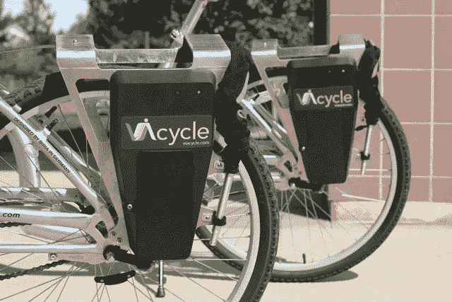

# YC 支持的 viaCycle 是一款自行车 Zipcar，即将登陆旧金山

> 原文：<https://web.archive.org/web/https://techcrunch.com/2012/08/15/yc-viacycle-bikesharing/>

由 Y Combinator 支持的初创公司 ViaCycle 希望成为共享单车的公司，就像 T2 的 Zipcar T3 一样。虽然世界上有许多城市的自行车共享已经成为日常生活的一部分，但目前只有美国的几个城市提供类似的计划，而且现有的计划往往运营成本高昂。viaCycle 团队已经在其平台上工作了三年，使用了一种与大多数竞争对手非常不同的方法。例如，与其他系统不同，viaCycle 不需要专门的自行车停靠站。该团队开发了自己的硬件，集成到自行车中，通过电话、短信或公司的移动应用程序来锁定和解锁自行车。这意味着 viaCycle 自行车可以在任何地方锁定到标准自行车架上，并且入门成本明显低于类似系统。

该系统目前正在佐治亚理工学院亚特兰大校区的 [40 辆自行车上进行测试](https://web.archive.org/web/20230316161301/https://gt.viacycle.com/)，它也将于秋季来到乔治梅森大学。ViaCycle 还将在未来几周内在旧金山推出其首个试点项目，首先在 SOMA 的 [HUB 联合工作空间](https://web.archive.org/web/20230316161301/http://bayarea.the-hub.net/space)之外的一个地点开始。

这是这个系统如何为用户工作的:在你成为注册用户后，你只需使用 viaCycle 应用程序或发送一条带有自行车号码和你的 PIN 码的文本来解锁自行车。让这个系统工作的大部分技术都位于自行车的后部。一个小电池组装有锁定装置(使用坚固的链条锁)和 GPS 系统来跟踪自行车。正如该公司的联合创始人兼首席执行官凯尔·阿泽维多本周早些时候告诉我的那样，电池组可以通过小型太阳能电池或发电机供电。所有后端系统都托管在 viaCycles 服务器上，该服务器还可以向决定提供 viaCycles 服务的公司和市政当局提供详细的分析数据。

当然，所有这些都不是免费的。例如，旧金山的试点项目可能需要用户支付大约 5 美元的一日通票费，会员费大约为 20 美元/月或 80 美元/年。然而，让 viaCycle 如此有趣的是，它实际上是一个平台，并且主要将日常业务活动留给其他人。例如，在佐治亚理工学院的校园里，学生可以免费使用自行车长达 30 分钟。之后，用户支付标准使用费。然而，通过每月 5.95 美元的高级订阅，用户只有在使用自行车超过 2 小时后才开始付费。

正如阿泽维多告诉我的那样，公司、大学和其他想要将 viaCycle 引入校园和城市的人通常每月为该系统支付约 20 美元。此外，每辆自行车的前期成本约为 1000 至 1500 美元。虽然一个城市可能会决定向用户收取费用来支付成本，但一家拥有大型校园的大公司可能会决定向用户免费提供该系统。这听起来可能很贵，但这个系统比它的竞争对手便宜得多。正如阿泽维多告诉我的，“城市为他们(目前的)自行车系统支付这么多钱，实际上是一种犯罪。”

viaCycle 团队目前由四名联合创始人和他们的第一名(兼职)员工组成，他们在佐治亚理工学院相遇，并一直在研究该系统(特别是如何让自行车在不消耗太多电力的情况下与服务器对话)几年了。自那以后，该公司赢得了许多荣誉。例如，ViaCycle 在 2010 年赢得了麻省理工学院交通类别的清洁能源奖，获得了福特公司 5 万美元的资助，并赢得了 2012 年亚特兰大 StartupRiot。该团队目前是 Y Combinator 年夏季班的一部分，并已开始考虑如何将其技术应用于自行车共享以外的其他市场。

[维梅奥·http://www.vimeo.com/47535030 w = 640 & h = 360]