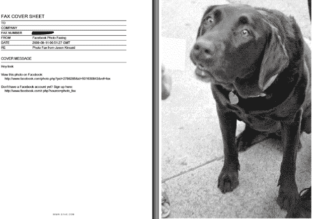

# 好吧，脸书耍了我们

> 原文：<https://web.archive.org/web/https://techcrunch.com/2009/09/10/yeah-ok-so-facebook-punkd-us/>

所以这些年来我们和脸书玩得很开心([为什么我们起诉脸书要求 2500 万美元的法定损害赔偿](https://web.archive.org/web/20230223035101/https://techcrunch.com/2008/03/31/why-were-suing-facebook-for-25-million-in-statutory-damages/)，[共和党公关总监称脸书的兰迪·扎克伯格“完全充满 sh * t”](https://web.archive.org/web/20230223035101/https://techcrunch.com/2009/05/31/republican-pr-director-calls-facebooks-randi-zuckerberg-totally-full-of-sht/)，[兰迪威胁酒吧保镖](https://web.archive.org/web/20230223035101/https://techcrunch.com/2009/05/08/joking-or-not-official-or-not-facebook-needs-to-grow-up/))。但总的来说，这些东西应该是单向流动的——我们搞乱它们，它们优雅地接受。

今天，这种情况发生了变化。他们耍我们，我们上当了。很难。

今天早些时候，TechCrunch 作家杰森·金凯注意到了脸书的一些新情况。当查看任何照片时，它会在屏幕右下方显示一个“传真此照片”链接。可笑？是的。但是 TechCrunch 网的人都看到了。他在下午 5 点 05 分给脸书发了一封电子邮件。当他们没有回应时，他在 5:29 发布了:[脸书现在允许你传真照片。我不知道为什么有人想做这个](https://web.archive.org/web/20230223035101/https://techcrunch.com/2009/09/10/facebook-now-lets-you-fax-your-photos-i-have-no-idea-why-anyone-would-want-to-do-this/)。

从那以后，事情开始走下坡路。

5 点 47 分，脸书公关发来邮件说:“我们已经给你传真了一份声明？？？你没明白吗？”

然后他们在 5:51 再次发邮件说:

> 嘿杰森，
> 
> 自 1992 年以来，我们一直在测试这款产品，我们认为我们将在 TechCrunch 50 上推出这一“创新”功能。
> 
> 你怎么想呢?？？

啊哦。我们的鼻毛开始抽动。

然后我们问了一堆我们网络之外的人。没有一个人说他们看到了传真照片的功能。

绝对不是好兆头。

杰森然后打电话给脸书公关。詹姆·斯普林接了电话，显然，笑了五分钟都没停下来。她屏住呼吸，笑着说这是一个笑话，除了我们没有人能看到它，他们在办公室打赌多久我们会注意到它并张贴出来。还有一些关于教我们在发帖前联系他们的事情。

所以，底线是，不要期望看到这个功能真正推出。除非你来为 TechCrunch 工作，我猜。我们仍然看到它。

这一轮你赢了，脸书。享受你的胜利。

哦，对了，特写管用。下面是它的样子:

【http://www.hulu.com/embed/A5FY88XLjivc1P-2h2DEuw/1129/1187 号