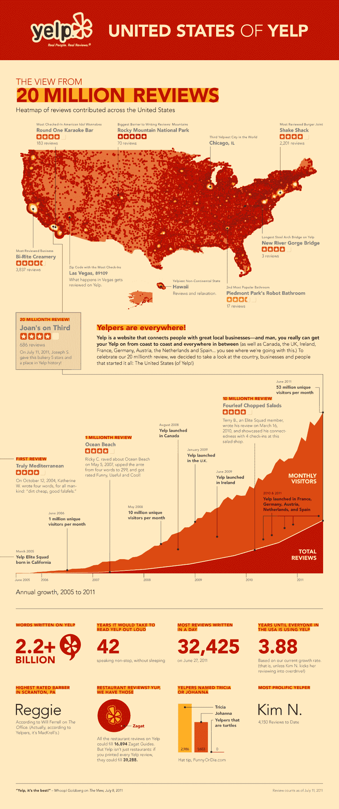

# Yelp 现在拥有 2000 万条评论 

> 原文：<https://web.archive.org/web/http://techcrunch.com/2011/07/15/yelp-20-million-reviews/>

# Yelp 现在拥有 2000 万条评论

如果你和 Yelp 首席执行官杰里米·斯托佩尔曼(Jeremy Stoppelman)交谈，他总是喜欢指出 Yelp 上有多少评论。这是一种自豪感和竞争优势。甚至从 Yelp 评论中大量借用的 Google Places 似乎也这么认为。

今天，Yelp 的评论超过了 2000 万条，比 2010 年 3 月的 1000 万条有所上升(去年 4 月[的 1700 万条](https://web.archive.org/web/20230203044838/https://techcrunch.com/2011/04/04/yelp-now-drawing-50-million-users-a-month-to-its-17-million-reviews/))。评论带来了访问者，访问者的增长与评论的增长密切相关。根据 Yelp 自己的统计，6 月份它的访问量达到了 5300 万。

Yelp 花了大约 6 年时间达到 2000 万次评论。Yelp 成立于 2004 年，花了两年半的时间才达到第一个百万评论(2007 年 5 月)。然后大约又花了三年时间达到 1000 万(2010 年 3 月)，然后在一年零四分之一的时间里增加了最后 1000 万。

Yelp 如此关注评论，并试图获得高质量的用户评论，因为其他一切都可以复制。随着如此多的地方数据库的出现，创建一个当地企业的目录比以往任何时候都更容易，但 Yelp 一直将用户评论作为一种排序机制，以找到附近最好的地方。

斯托佩尔曼对 Yelp 的评论非常保护，他仍然不允许移动用户从手机上传评论，因为他希望这些评论是经过深思熟虑的。(不过，您可以通过手机添加提示)。它们也比你从移动评论中得到的要长。总字数为 22 亿字，平均每篇评论 110 字。如果他放松这一限制，Yelp 很快就会有 5000 万条评论。

