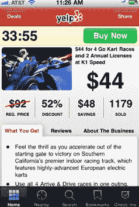

# Yelp 将本地交易带到移动领域，并让 Groupon Now 的资金有了着落

> 原文：<https://web.archive.org/web/http://techcrunch.com/2011/06/29/yelp-deals-mobile-groupon/>

本地交易的下一个增长阶段将是移动领域。Groupon 知道这一点，Yelp 也知道，今天 Yelp 正在向其 [iPhone](https://web.archive.org/web/20230326022912/http://itunes.apple.com/us/app/yelp/id284910350?mt=8) 和 [Android](https://web.archive.org/web/20230326022912/https://market.android.com/details?id=com.yelp.android) 应用推出 Yelp 交易。其移动应用程序的更新将于今天推出，将为该应用程序添加一个新的交易图标。当你点击它，你可以看到附近的餐馆，水疗中心和其他企业的折扣 Yelp 交易列表。(这些是对已经出现在手机上的 [Yelp 特别优惠](https://web.archive.org/web/20230326022912/https://techcrunch.com/2009/08/12/yelp-iphone-v3-hits-the-appstore-find-local-deals/)和签到优惠的补充)。

大约一年前，Yelp [开始在当地商家提供](https://web.archive.org/web/20230326022912/https://techcrunch.com/2010/08/26/yelp-local-deals/)每日交易，现在它在十几个大都市地区都有交易，包括旧金山、纽约、芝加哥、波士顿、洛杉矶、凤凰城、西雅图和圣地亚哥。你目前必须注册这些交易，当有新的交易时，你会收到一封电子邮件，就像 Groupon 或 LivingSocial 一样。

有了手机版 Yelp Deals，当你四处走动时，你可以搜索附近的交易，它们可以立即兑现。你得到一个兑换码，你可以通过手机向商家展示。这类似于 Groupon 试图用其 [Groupon Now](https://web.archive.org/web/20230326022912/http://www.groupon.com/now/about) 移动应用程序做的事情，该应用程序仅在少数城市可用(比 Yelp Mobile 推出的更少)。

Yelp 在这方面比 Groupon 有一大优势。它的移动应用已经非常受欢迎。每月有 450 万人使用它们。与此同时，Groupon 正试图通过与 Loopt 等其他移动应用达成协议来推广 Groupon Now。Yelp 也有庞大的本地销售队伍，就像 Groupon 一样，这是让本地商家签约这些交易的关键。

关键是获得等式两边的流动性:用户和交易。Yelp 已经拥有了手机用户。但要达成交易，需要更慢的铺开速度和大量的电话。这就是为什么 Yelp 交易只在十几个大都市地区可用，而且要花一年时间才能到达那里。这些交易每周出现一两次，而不是每天。在移动领域，还有一个额外的挑战，就是在密集的地理区域获得足够多的交易，这样当你启动应用程序时，看到附近交易的可能性就很高。

你只需要比目前的电子邮件营销模式多得多的交易，这让人们有更多的时间来计划他们的 tris，以便他们可以利用交易。移动模式更加冲动，但它也需要更大的交易密度才能发挥作用。

这将是一场漫长的比赛。Yelp 和 Groupon 是最先起跑的。