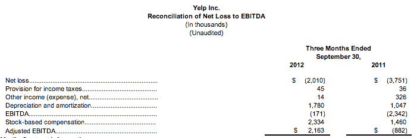

# Yelp 支付 5000 万美元收购其欧洲大竞争对手 Qype，以加强其推荐和上市业务 

> 原文：<https://web.archive.org/web/https://techcrunch.com/2012/10/24/yelp-pays-50m-to-acquire-its-big-european-rival-qype/>

最新消息:在线推荐和列表网站 [Yelp](https://web.archive.org/web/20221205110007/http://www.yelp.com/) 正在加速其国际扩张，[收购了其在欧洲最大的竞争对手](https://web.archive.org/web/20221205110007/http://www.prnewswire.com/news-releases/yelp-acquires-qype-provides-preliminary-third-quarter-2012-financial-results-175545601.html) [Qype](https://web.archive.org/web/20221205110007/http://www.qype.com/) 。它将向€支付 1860 万美元购买 Qype 的所有股份，并增加 97 万股 Yelp 的 A 类普通股，总购买价格约为 5000 万美元。Qype 总部位于德国，业务遍及欧洲。Yelp 的首席执行官 Jeremy Stoppelman 在一篇博客文章中指出，两家公司合并后的服务将覆盖约 9300 万每月独立访客和 3200 万评论。这应该有助于 Yelp 更好地与谷歌等公司竞争，谷歌将其搜索、列表、用户反馈和地图整合为一个强大的产品，可以与 Yelp 的产品相媲美。

与此同时，Yelp 对其第三季度的业绩提供了一些更新的指导。看起来它仍然会比它最初说的做得更好，收入超过了它在 8 月份做出的预测。它表示，营收将为 3640 万美元，尽管仍将出现净亏损——Yelp 表示，预计将为 200 万美元——但与去年同期 380 万美元的净亏损相比，已经下降了不少。该公司将于 11 月 1 日发布第三季度业绩。

“我很高兴欢迎 Qype 的员工和用户加入 Yelp。我们已经在欧洲建立了坚实的基础，此次收购将显著提高我们的国际影响力。Yelp 联合创始人兼首席执行官杰里米·斯托佩尔曼(Jeremy Stoppelman)在一份声明中表示:“凭借其在德国和英国等关键市场的强大本地内容，我们相信 Qype 将有助于 Yelp 成为这些市场中本地搜索的事实上的选择。”。“Qype 已建立的欧洲销售队伍也将把更多的当地企业主带入 Yelp 生态系统，这反过来将支持我们的使命，将人们与世界各地伟大的当地企业联系起来。”

“成熟的欧洲销售队伍”可能有点轻描淡写:Qype 长期以来一直是 Yelp 的竞争对手。今年 5 月，Qype [在欧洲的上市量正式超过 Yelp](https://web.archive.org/web/20221205110007/https://beta.techcrunch.com/2012/05/11/qype-the-yelp-of-europe-reaches-860000-places-reviewed-and-expands-its-daily-deals-service/) ，在其数据库中声称有 860，000 个被审查的位置。这个数字现在更大了:在 13 个国家，每月有 200 万条评论和 1500 万独立访客。

Qype 也一直在寻找使其模式多样化的方法，通过以 [QypeDeals](https://web.archive.org/web/20221205110007/http://www.qypedeals.co.uk/) 的形式引入(是的)每日交易。Qype 首席执行官 Ian Brotherson 在五月份告诉我，[网站上的广告自去年以来增长了 500%。](https://web.archive.org/web/20221205110007/https://beta.techcrunch.com/2012/05/11/qype-the-yelp-of-europe-reaches-860000-places-reviewed-and-expands-its-daily-deals-service/)

手机也越来越发挥作用。今年 5 月，Brotherson 表示，手机贡献了四分之一的收入，其应用程序在欧洲的安装数量是 Yelp 的六倍(今年 5 月，Qype 的安装数量为 400 万)。大约 30%的评论是从移动设备上写的。

Yelp 虽然明确投资于其欧洲增长，但却未能跟上步伐，在某些情况下，进入 Qype 已经开拓的市场太晚了。与此同时，Qype 的服务还没有超出其所在地区太远，因此它作为一家独立公司的增长前景将是有限的。

最后，这可能是 Yelp 不得不取消 Qype 的主要原因。对于 Groupon 和 Yelp 这样的公司来说，他们依赖于大规模接受他们的服务，以便按照他们被建造来工作的方式工作，如果他们不能很早就进入这个领域，无机增长(即通过收购)通常是他们唯一的选择。

在此次收购之前，Qype 已经从包括 Advent Venture Partners、Wellington Partners 和 Partech International 在内的投资者那里筹集了约 2250 万美元。

下面发布。更多即将到来。刷新以获取更新。

> **Yelp 收购 Qype 提供 2012 年第三季度初步财务结果
> 增加 Qype 加速国际扩张，增加内容和流量
> 公司报告强劲 2012 年第三季度初步财务结果
> 美通社** 
> 旧金山，2012 年 10 月 24 日
> 
> 旧金山 2012 年 10 月 24 日电/美通社/ — Yelp Inc .(纽约证券交易所代码:Yelp)，一家将消费者与当地优秀企业联系起来的公司，今天宣布收购欧洲最大的本地评论网站 Qype。收购 Qype 是为了加速 Yelp 的国际扩张，每月在 13 个国家带来超过 200 万条评论和 1500 万独立访客。
> 
> “我很高兴欢迎 Qype 的员工和用户加入 Yelp。我们已经在欧洲建立了坚实的基础，此次收购将显著提高我们的国际影响力。Yelp 联合创始人兼首席执行官 Jeremy Stoppelman 表示:“凭借其在德国和英国等关键市场的强大本地内容，我们相信 Qype 将有助于 Yelp 成为这些市场中本地搜索的事实上的选择。“Qype 已建立的欧洲销售队伍也将把更多的当地企业主带入 Yelp 生态系统，这反过来将支持我们的使命，将人们与世界各地伟大的当地企业联系起来。”
> 
> Qype 首席执行官 Ian Brotherston 表示:“我们很高兴能与本地搜索领域的顶级品牌 Yelp 联手。“像 Yelp 一样，Qype 致力于在本地搜索中提供丰富、真实的内容。此次收购使我们的用户能够为一个更大的平台做出贡献，为当地企业带来更大的价值。”
> 
> **强劲的第三季度初步财务结果**
> 
> Yelp 还提供了截至 2012 年 9 月 30 日的第三季度的初步财务结果。2012 年第三季度的收入和调整后的 EBITDA 超过了 Yelp 在 2012 年 8 月 1 日提供的先前指导。2012 年第三季度的收入预计约为 3640 万美元，2012 年第三季度的净亏损预计约为 200 万美元，调整后的 EBITDA 预计约为 220 万美元。Yelp 计划于 2012 年 11 月 1 日(星期四)发布第三季度额外财务结果的新闻稿，届时将提供 2012 年第四季度指导和更新的全年指导。
> 
> **收购详情**
> 
> 根据收购协议的条款，Yelp 收购了 Qype 的所有股份，约为€1860 万股和 Yelp 的 97 万股 A 类普通股，总收购价格约为 5000 万美元。Qype 的总部设在德国，在英国也有业务。这项收购将记录在 Yelp 的第四季度和 2012 年年终财务报表中。
> 
> **电话会议信息**
> 
> Yelp 将于 2012 年 10 月 24 日美国东部时间上午 9 点/下午 12 点召开一次电话会议。要接听电话，请在开始时间前至少五分钟拨打(800) 706-7748，或在美国以外拨打(617) 614-3473，密码为 11414485。在[http://www.yelp-ir.com](https://web.archive.org/web/20221205110007/http://www.yelp-ir.com/)还将提供电话会议的音频网络广播和重播。从 2012 年 10 月 24 日到 2012 年 11 月 7 日，您可以通过拨打(888) 286-8010 或(617) 801-6888(重播密码为 49350488)获得今天电话会议的音频重播。
> 
> **关于 Yelp**
> 
> Yelp Inc .(纽约证券交易所代码:YELP)(【http://www.yelp.com】T4)将人们与当地伟大的企业联系起来。Yelp 于 2004 年 7 月在旧金山成立。从那以后，Yelp 社区已经在美国、加拿大、英国、爱尔兰、法国、德国、奥地利、荷兰、西班牙、意大利、瑞士、比利时、澳大利亚、瑞典、丹麦、挪威、芬兰、新加坡和波兰的主要大都市扎根。2012 年，Yelp 在 Q2 的月平均独立访问量约为 7800 万次*。截至同一季度末，Yelpers 已经撰写了超过 3000 万篇丰富的本地评论，使 Yelp 成为从精品店和机械厂到餐馆和牙医等一切领域真正口碑相传的领先本地指南。在 2012 年 Q2 奥运会期间，平均每月有 720 万台不同的移动设备使用 Yelp 的移动应用程序。
> *来源:谷歌分析
> 
> **非 GAAP 财务指标**
> 
> 该新闻稿包括与调整后的 EBITDA 相关的信息，证券交易委员会将其定义为“非 GAAP 财务指标”。调整后的 EBITDA 包含在本新闻稿中，因为它是公司管理层和董事会用来了解和评估核心经营业绩和趋势、编制和批准年度预算以及制定短期和长期运营计划的关键指标。本财务信息的列报并非根据任何一套全面的会计规则或原则编制，不应被视为孤立或替代根据公认会计原则编制和列报的财务信息。
> 
> 调整后的 EBITDA 作为一种分析工具有其局限性，您不应该孤立地考虑它，也不应该将其作为根据 GAAP 报告的 Yelp 结果分析的替代品。这些限制包括:
> 
> *   虽然折旧和摊销是非现金费用，但被折旧和摊销的资产可能必须在未来被替换，调整后的 EBITDA 不能反映此类替换的现金资本支出要求或新的资本支出要求；
> *   调整后的 EBITDA 没有反映 Yelp 营运资本需求的变化或现金需求；
> *   调整后的 EBITDA 没有考虑股票薪酬的潜在摊薄影响；
> *   调整后的 EBITDA 不反映可能代表我们可用现金减少的纳税额；和
> *   其他公司，包括 Yelp 行业中的公司，可能会以不同的方式计算调整后的 EBITDA，这降低了它作为比较指标的有用性。
> 
> 由于这些限制，你应该考虑调整后的 EBITDA 以及其他财务绩效指标，包括各种现金流指标、净收入(亏损)和 Yelp 的其他 GAAP 结果。对于历史非 GAAP 财务指标与最接近的可比 GAAP 指标的初步对账，请参见本新闻稿中的“调整后 EBITDA 净亏损对账”。
> 
> **前瞻性声明**
> 
> 本新闻稿包含前瞻性声明，其中涉及收购 Qype 可能对 Yelp 的业务和财务结果产生的影响，包括收入、费用、调整后的 EBITDA 和净亏损，以及 Yelp 及其合并子公司的未来表现，这些声明基于 Yelp 的当前预期、预测和假设，涉及风险和不确定性。这些声明包括但不限于关于第三季度初步财务结果的声明、公司收入的未来增长以及 Yelp 对其未来增长的持续投资。Yelp 的实际结果可能与预测或暗示的结果有很大不同，报告的结果不应被视为未来表现的指标。可能导致或促成这种差异的因素包括但不限于:Yelp 在一个不断发展的行业中的短暂运营历史；Yelp 产生足够收入以实现或保持盈利的能力，特别是考虑到其持续的大量销售和营销费用；Yelp 的网站依赖来自谷歌、必应和雅虎等搜索引擎的流量。；Yelp 从其用户那里生成和维护足够多的高质量内容的能力；维护强大的品牌并管理可能出现的负面宣传；Yelp 成功管理新业务、解决方案或技术收购的能力，包括 Qype 维护和扩大 Yelp 的广告客户基础；政治、商业和经济条件的变化，包括任何欧洲或整体经济衰退或危机以及任何影响电子商务增长的条件；外币汇率的波动；Yelp 应对竞争日益激烈的本地搜索环境的能力；Yelp 管理其他监管、税务和诉讼风险的需求和能力，因为其服务在更多司法管辖区提供，适用法律变得更加严格；Yelp 继续在地理上扩张和推出新产品，以及与互联网公司相关的新法律法规生效时的竞争和监管环境；以及 Yelp 及时升级和开发其系统、基础设施和客户服务能力的能力。本新闻稿中的前瞻性陈述不包括在此日期之后可能宣布和/或完成的任何收购或剥离的潜在影响。
> 
> 有关可能影响 Yelp 经营业绩的因素的更多信息，请参见 Yelp 最新季度报告 Form 10-Q 的标题“风险因素”和“管理层对财务状况和经营业绩的讨论和分析”，该报告位于 http://www.yelp-ir.com[或美国证券交易委员会网站](https://web.archive.org/web/20221205110007/http://www.yelp-ir.com/phoenix.zhtml?c=250809&p=irol-irhome)[www.sec.gov](https://web.archive.org/web/20221205110007/http://www.sec.gov/)。不应过度依赖本新闻稿中的前瞻性陈述，这些陈述基于 Yelp 在本文发布之日可获得的信息。Yelp 没有义务更新此类声明。我们在截至 2012 年 9 月 30 日的三个月的季度报告 10-Q 中报告的结果可能与我们在本新闻稿中宣布的初步结果不同。
> 
> 