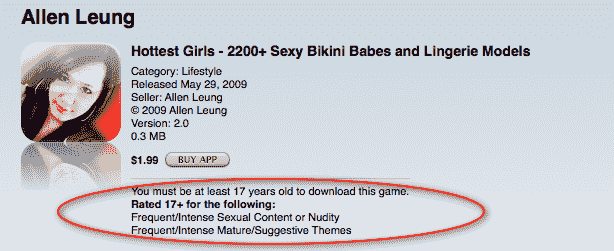

# 是的，iPorn 是来参加 iPhone TechCrunch 的

> 原文：<https://web.archive.org/web/https://techcrunch.com/2009/06/24/yep-iporn-is-here-for-the-iphone/>

正如我们几天前[在](https://web.archive.org/web/20230212211317/https://techcrunch.com/2009/06/23/iphone-in-app-purchases-already-leading-to-the-dreaded-two-words-bait-and-switch/)猜测的那样，苹果显然已经决定，随着 iPhone 3.0 SDK 内置了新的家长控制，裸露现在在 iPhone 应用程序中是可以接受的。第一个这样的应用程序，hot Girls，实际上已经存在了一段时间。但是今天的一次更新将比基尼和内衣女孩的照片“升级”为赤裸上身的女孩。

*“我们今天上传了裸照。这是第一个有裸体的应用，”*最火辣女孩的开发者梁展纶[告诉马森斯坦](https://web.archive.org/web/20230212211317/http://macenstein.com/default/archives/4693)。相当大的成就。

虽然有些人无疑会认为这是一件坏事，但我认为这实际上是一件好事。首先，允许像这样的成熟内容应该解放应用程序商店的审查者，使他们能够专注于发现实际上是恶意的或不符合标准的应用程序，而不是假正经的警察。

第二，众所周知，色情是一个很大的产业，只要孩子们看不到，成年人被允许在他们的 iPhones 上看就没什么不对。这应该会让开发商赚很多钱。这应该能让苹果公司赚到一大笔钱，因为它的 30%的提成。不过，如果我们很快就能在 App Store 里看到硬核色情，我会很惊讶，但是谁知道呢。

最后，这是应用程序商店再次开放一点。去年，当它开始让卡通暴力 NC-17 游戏进入时，它做了一点，这是下一步。一个更开放的商店，是一个更好的商店。是的，即使这意味着大量蹩脚的色情软件。选项不错，下载你想要的。尽管我仍然相信苹果公司的应用程序需要一个更好的分类和高亮机制。

有可能这是苹果让一个应用程序溜走的又一个例子，但鉴于开发者在应用程序页面上渲染裸体，我对此表示怀疑。看起来苹果有了一个新的分级副标题:对“频繁/激烈的性内容或裸体”的评分为 17+。

《最火辣的女孩》在 App Store 售价 1.99 美元。[找到这里](https://web.archive.org/web/20230212211317/http://itunes.apple.com/WebObjects/MZStore.woa/wa/viewSoftware?id=314312901&mt=8)。

**更新:** [显然 app 已经被拉了](https://web.archive.org/web/20230212211317/https://techcrunch.com/2009/06/25/noporn-apple-removes-hottest-girls-the-app-store/)。我不知道为什么你会有一个“裸体”的评级，如果你不允许，你知道，裸体。但无论如何，App Store 审批的怪异之处仍在继续。

**更新 2** :看来拉的不是苹果，[而是开发者](https://web.archive.org/web/20230212211317/https://techcrunch.com/2009/06/25/iphone-porn-app-not-pulled-by-apple-just-sold-out/)。其他色情应用程序仍在商店中。

**更新 3** :等一下，继续。现在苹果说没有色情应用。[这似乎与他们自己的评级](https://web.archive.org/web/20230212211317/https://techcrunch.com/2009/06/25/who-exactly-is-in-charge-of-the-app-store-anyone/)背道而驰。

