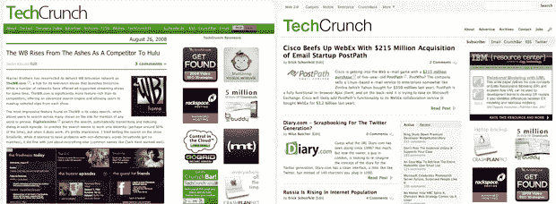

# 是的，我们重新设计了 

> 原文：<https://web.archive.org/web/https://techcrunch.com/2008/08/27/yep-we-redesigned/>

正如我们的许多读者已经注意到的那样，我们昨天晚上为 TechCrunch 推出了一个新的设计。

我们一直在关注 Twitter 和其他帖子的初步反馈。虽然我们仍在做许多小的改动，但我们想花点时间写一篇合适的帖子来解释我们的意图并征求您的反馈。

我们的首要目标是清理表面和内部的东西。TechCrunch 在很多方面都变得臃肿，主页加载时间太长，滚动条没完没了。

因此，第一步需要切换到“摘录”格式，这样读者可以在阅读全文之前先在主页上领略一下我们的帖子。通过减少主页上的内容数量，我们减少了加载时间，并使浏览您最关心的新闻和社论标题变得更加容易。

我们还采取了极简主义的设计方法，使用大量的空白，并优先考虑我们的主要内容，采用更宽的帖子宽度和更大的字体大小(在高分辨率显示器上不再眯眼)。

就特定功能而言，一个新的“特色文章”框位于主页上第二篇文章的旁边，以及每个文章页面的侧边栏中。它旨在突出你可能会忽略的一些内容，用一个标签显示最近的帖子，另一个标签显示过去几天获得最多评论的帖子。我们也已经开始更密切地测量我们个人帖子的流量，并将添加一个最受欢迎帖子的标签。

那么下一步是什么？我们计划在 TechCrunch 网络内的大多数其他博客(CrunchGear、MobileCrunch、TechCrunch UK 等)中推广这一设计，并进行少量定制。我们还将推出一个新的搜索工具，使用雅虎老板定制的，让你在我们整个博客网络中通过关键词进行搜索，再加上 CrunchBase。

但是在我们走得太远之前，让我们知道你在下面的评论中的想法。