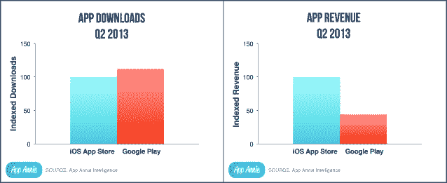
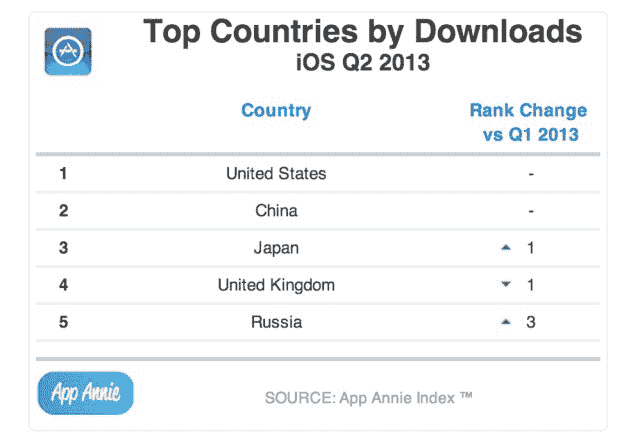
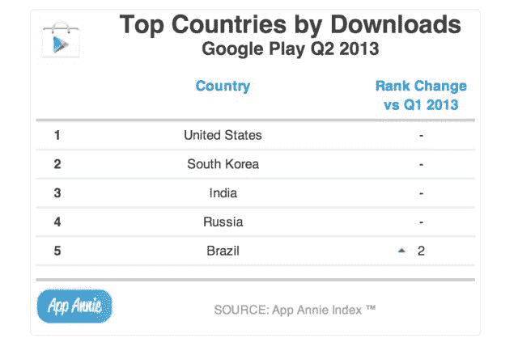
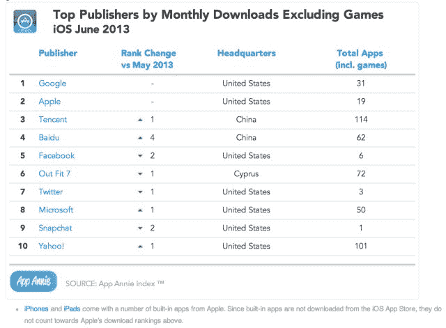
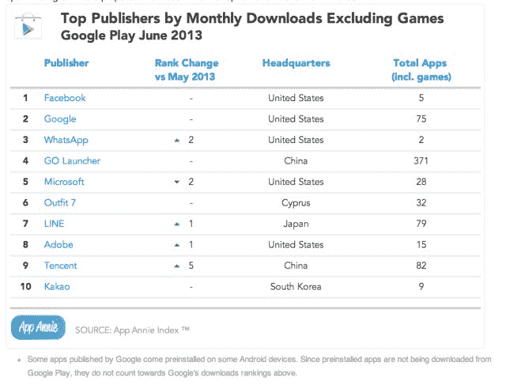
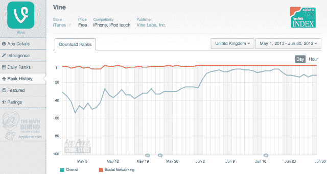
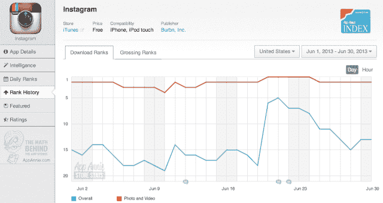

# 是的，iOS 应用商店仍然让开发者赚更多的钱 TechCrunch

> 原文：<https://web.archive.org/web/https://techcrunch.com/2013/07/31/yes-the-ios-app-store-still-makes-developers-more-money/>

如果 App Annie 今天发布的[报告](https://web.archive.org/web/20221025164505/http://blog.appannie.com/app-annie-index-market-q2-2013/)详细描述了 iOS 和 Android 上开发者的下载量和收入情况听起来很熟悉，那是因为确实如此。该公司[在 4 月](https://web.archive.org/web/20221025164505/https://beta.techcrunch.com/2013/04/17/apple-and-googles-app-stores-now-neck-and-neck-except-on-the-metric-that-matters-most-to-developers-revenue/)发现，尽管 Android 应用商店增长速度更快，但 iOS 应用商店在盈利方面领先——上一季度的应用收入比 Google Play 高出约 2.6 倍。今天的号码？2.3 倍。

换句话说，同样的*东西*，不同的日子。

这一消息是在 Android 应用下载量已经超过 iOS 应用下载量 10%的时候发布的。按市场份额计算，Android 现在是全球领先的智能手机平台，有趣的是，看看它还需要走多远才能在收入方面领先。

今天的报告还指出，过去一个季度，几个新兴市场表现突出——巴西、俄罗斯和印度。在 2013 年 Q2 Google Play 排名中，巴西上升了两位，与俄国和印度并列前五。

与此同时，2013 年俄罗斯在 Q2 的 iOS 应用商店上升了三个名次(比去年 Q2 上升了 6 个名次),成为除美国之外唯一一个在 iOS 应用商店(排名第五)和 Google Play(排名第四)下载量排名前五的国家。

美国和中国仍然是下载量最高的两个市场，占 2013 年 Q2 下载量的 40%左右。

【T2

中国对市场的影响在本季度也有所体现，中国最大的两家互联网公司腾讯和百度与苹果和谷歌一起，跻身 iOS 非游戏下载量前四名。腾讯于今年 5 月进入该榜单，百度于 6 月进入。

在 Android 上，排名前四的发行商是脸书、谷歌、Whatsapp 和 GO Launcher。事实上，这是 Whatsapp 今年的最高排名。该应用程序最近显示出了[强劲的势头](https://web.archive.org/web/20221025164505/https://beta.techcrunch.com/2013/06/13/whatsapp-messaging-momentum/)，其中包括[将其 iOS 商业模式](https://web.archive.org/web/20221025164505/https://beta.techcrunch.com/2013/07/16/whatsapp-free/)与安卓、黑莓和 Windows Phone 等其他平台上使用的基于订阅的模式更加一致。

当然，游戏仍然占两家商店收入的大部分份额——占 Google Play 收入的 80 %,占 iOS 应用商店收入的 75%。但一款非游戏应用 [Japan 的 LINE](https://web.archive.org/web/20221025164505/https://beta.techcrunch.com/2013/06/21/line-free-coin/) 也表现强劲，另外两款 LINE 应用(一款漫画应用和一款算命应用)在 6 月进入前十。

视频应用在 6 月份也变得越来越受欢迎，Vine 上升了三个位置，在 iOS 应用商店的下载量中排名第一。YouTube 当时排名第二，Snapchat 排名第三，Instagram 最近增加了视频支持，排名第五。今年 6 月，Vine 在英国的表现尤其出色(见下文)。

