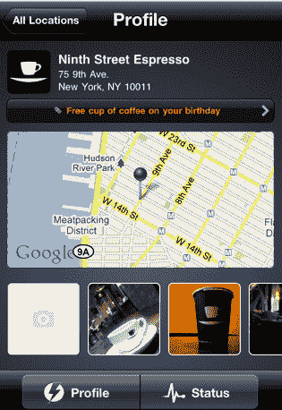

# Yext 筹集了 1000 万美元，为当地企业在电力线方面加倍努力 TechCrunch

> 原文：<https://web.archive.org/web/http://techcrunch.com/2011/07/28/yext-10-million-powerlistings/>

管理网上的本地列表对小企业来说是一场噩梦，对本地广告初创公司来说则是一个巨大的机会。这家纽约市的公司刚刚完成了 1000 万美元的 D 轮融资，由迈克尔·沃尔拉斯通过他的 WGI 集团投资工具领投。其他现有投资者 IVP、罗恩·康韦的 SV Angel 和 Sutter Hill Ventures 也参与其中。沃尔拉斯是 Right Media 的创始人(该公司以 8 . 5 亿美元的价格被雅虎卖给了 T2)，而 T4 在去年三月成为了 Yext 的董事长。

这在很大程度上是一轮内部融资，但估值高于两年前的 2500 万美元的 C 轮融资(当时称之为 B 轮融资，但严格来说是 C 轮融资)。Yext 的主要业务是为当地企业提供按通话付费的广告。这是一个相当规模的业务，带来了两位数百万的收入，该公司甚至接受了一些收购要约。首席执行官霍华德·勒曼说:“我们考虑过是否出售或做一些可能大 100 倍的东西，我们选择了后者。”

Yext 没有出售，而是决定走一个不同的方向，花了 1000 万美元为当地企业开发了一个全新的产品，名为 PowerListings，它正在快速增长，最终将超过按通话付费业务。最初名为 Tags，PowerListings 为本地企业提供了一个单一的仪表板，他们可以在其中管理几十个网站的列表，如 Yelp，SuperPages，Citysearch，Yellowbook，Local.com，Yahoo Local 等。PowerListings 让商家可以修复网上不准确的商品列表，并从一个中心位置一次性更新所有信息。在过去的 100 天里，企业注册了 4500 个位置，增长速度正在加快(见图表)。

勒曼估计，在 Yext 关注的垂直行业中，只有大约 20 万家本地企业可以使用其按通话付费服务(该公司将继续运营)。但是，美国有 2000 万家企业需要一种管理本地网上列表的方法，所以为什么不卖掉按通话付费业务，用这笔钱来建立超级列表业务呢？勒曼说，他希望保持相同的团队和技术，并利用 Yext 与当地企业上市网站的现有关系。

有了这笔新资金，他希望整合 100 多个本地网站和应用程序，让 Yext 成为本地企业管理在线房源信息所需的一个仪表盘。“无论哪里有人寻找本地企业，我们都希望在那里，帮助同步企业列表，”勒曼说。Yext 还在为当地企业开发一款移动应用，让他们可以通过 iPhones 管理自己的房源，甚至上传自己所在地的新照片。只需点击一下，他们就可以在 Yelp、Citysearch、Yahoo Local 以及他们的列表出现在网上的任何地方更改他们企业的照片。

对于大多数本地企业来说，他们的列表是他们在网上的主要存在，他们并不总是能够控制这些列表对他们位置的描述。Yext 想把控制权还给他们。