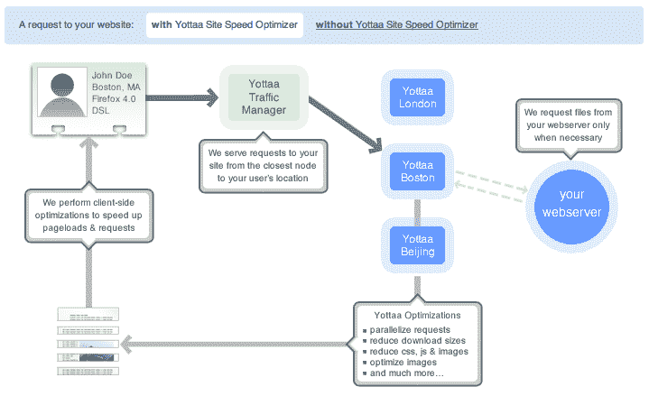

# Yottaa 为中小型企业提供了一种经济实惠的方式，让他们的网站获得谷歌式的加载速度 

> 原文：<https://web.archive.org/web/https://techcrunch.com/2011/10/14/yottaa-gives-smbs-an-affordable-way-to-bring-google-esque-load-speeds-to-their-websites/>

本周在纽约市举行的 Web 2.0 博览会上，专注于提供基于云的网络性能监控和分析服务的初创公司 [Yottaa](https://web.archive.org/web/20230203155957/http://www.yottaa.com/) 宣布，它现在也正式扩展到速度优化领域，为网站提供一种快速简单的方法来加速网站。Yottaa 正在将其所谓的“网站速度优化器”推出测试版，以便为中小企业的网站带来相对低成本的一氧化二氮。

这家初创公司由 Nexaweb 董事长魏共同创立，于 2010 年 9 月推出“网站监控”，旨在帮助中小企业评估、基准测试和监控其网站的性能。此后不久， [Yottaa 从 General Catalyst 和 Stata Venture Partners 获得了 400 万美元的首轮融资](https://web.archive.org/web/20230203155957/https://techcrunch.com/2010/08/30/yottaa-raises-4-million-for-web-performance-and-analytics-platform/)。从那时起，这家初创公司已经吸引了超过 60，000 家企业使用其免费产品(如网站监视器)。

但是，要成为初创公司和小企业的全方位服务网络优化工具，提供速度增强技术是初创公司与快速增长的竞争对手竞争的必要条件，如令人敬畏的 TC Disrupt 决赛选手 CloudFlare 。再考虑一下，亚马逊计算出网站速度损失 100 毫秒会损失 1%的总收入，而谷歌发现 500 毫秒的延迟会导致 20%的流量下降。考虑到 400 毫秒大约是眨眼的速度，这些看似很小的数字却能产生很大的作用。

由于站点加载时间的 90%以上来自于简单地显示站点的代码，换句话说就是它的前端，简化站点显示其 HTML、JavaScript 和层叠样式表(CSS)代码的方式变得极其重要——尤其是在毫秒级的时候。虽然消除那些对于将面向用户的内容快速交付给浏览器来说不可或缺的东西是速度优化的核心，但今天只有企业和大公司才能负担得起实现这一目标所需的工作。

像谷歌这样的网站可能会应用数百种技术来减少对浏览器的调用，以使其前端加载更快，但中小型企业通常负担不起这种优化所需的庞大的工程师团队。

Yottaa 希望通过其网站速度优化器，提供一种基于云的服务，利用遍布世界各地的服务器作为源网站的代理，实时进行优化，从而实现这一目标。速度增强技术不仅致力于缓存内容，还致力于提高实际内容本身的显示速率。因此，除了压缩网站代码的交付时间，Yottaa 还使用针对用户个人浏览器、浏览器版本和设备的技术来帮助加快内容在用户特定浏览器中的呈现速度。([喜欢为 Chrome 用户使用 SPDY，比如](https://web.archive.org/web/20230203155957/http://www.chromium.org/spdy)。)浏览器优化:是小事成就大事。

正如 Garnter [的研究副总裁 Lydia Leong 在一份声明](https://web.archive.org/web/20230203155957/http://www.marketwatch.com/story/yottaa-brings-big-site-speeds-to-every-website-2011-10-11)中所说，结合内容优化、边缘缓存和网络优化对于提高网站的速度和性能至关重要。*“下一代内容交付网络已经开始将所有三种类型的优化结合到单一服务中”*，她说。*“基于云的服务交付方式可以让以前无力购买 CDN 或认为 CDN 不经济的企业获得这些服务”*。

因此，对于中小型企业来说，能够利用 Yottaa 的弹性多云网络(和正在申请专利的云路由技术)，使用 100 多种方法(如谷歌)实时优化网页是非常不错的，特别是当初创公司的“网站速度优化器”可以免费试用或以每月 29 美元起的服务费方式使用时。

更多信息，[点击这里](https://web.archive.org/web/20230203155957/http://www.yottaa.com/web-performance-optimization)查看 Yottaa 的网站速度优化器。