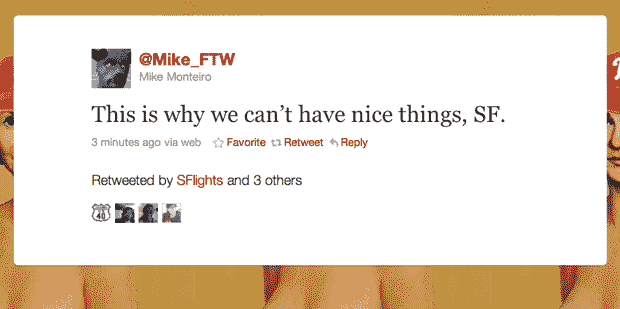

# 你现在可以在 Twitter、Ustream 和 four square TechCrunch 上关注世界职业棒球大赛#SFRiot

> 原文：<https://web.archive.org/web/https://techcrunch.com/2010/11/01/you-can-now-follow-the-world-series-sfriot-on-twitter/>

# 你现在可以在 Twitter、Ustream 和 Foursquare 上关注世界职业棒球大赛#SFRiot

今晚早些时候，旧金山巨人队赢得了世界职业棒球大赛，当然旧金山的庆祝活动此时已经演变成了多起骚乱，你现在可以在推特上通过标签 [#SFRiot](https://web.archive.org/web/20221006220408/http://search.twitter.com/search?q=%23sfriot) 和 [#SFScanner](https://web.archive.org/web/20221006220408/http://search.twitter.com/search?q=%23sfscanner) 关注这些骚乱。大约有 100 人在 Foursquare 登记了这场(没有市长的)暴乱，地点是[“波克街巨人暴乱”](https://web.archive.org/web/20221006220408/http://foursquare.com/venue/11946711)和[其他各种各样的人。](https://web.archive.org/web/20221006220408/http://foursquare.com/search?q=riot&x=0&y=0)

在严重卷入骚乱的社交网站名单中，脸书明显缺席。

根据推特消息，数千人已经占领了第五街和教会街，目前在第三街和国王街有多起火灾。我看到有人向警察投掷啤酒瓶，并点燃了一辆市政公共汽车。有人说在第四街和国王街的骚乱中有人持刀行凶，显然警方已经控制了局面。

你也可以在 [Ustream](https://web.archive.org/web/20221006220408/http://ustream.com/) (上图)和[旧金山警方扫描仪](https://web.archive.org/web/20221006220408/http://somafm.com/sfscanner.pls)上关注活动，这可能是你听过的最恐怖的事情。

关于在推特上关注骚乱，有一个警告？你肯定会拦截到更多的[标签。](https://web.archive.org/web/20221006220408/http://search.twitter.com/search?q=%23sfriots)

感谢:[Sacca](https://web.archive.org/web/20221006220408/http://twitter.com/sacca)