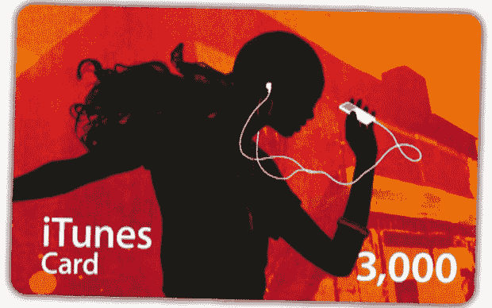

# 你说在 iTunes 上买不到日本音乐？

> 原文：<https://web.archive.org/web/https://techcrunch.com/2010/02/02/you-cant-buy-japanese-music-on-itunes-you-say/>

# 你说在 iTunes 上买不到日本音乐？

对于任何听了凯斯·厄本的建议并实际购买音乐的人来说，你可能已经注意到大多数日本艺术家不在 iTunes 上。原因很无聊也很复杂，但是只要知道我们在 [J-List](https://web.archive.org/web/20230121164528/http://www.jlist.com/) 的朋友们有一个为任何真正想要每一部动漫原声音乐的人准备的工作。

从本质上讲，日本唱片公司和苹果公司在价格上无法达成一致，所以日本音乐留在了日本。或者在苹果的小部分互联网上。

通常，你需要一个与日本信用卡和地址关联的 iTunes 账户才能享受 J-Pop。但是这些预付的 iTunes 卡让你建立一个虚拟账户，享受 1500 或 3000 日元的价值。购买后，您将通过电子邮件收到您的卡的扫描件，以获得即时听觉满足。他们会收你 24.50 或 42.50 美元。