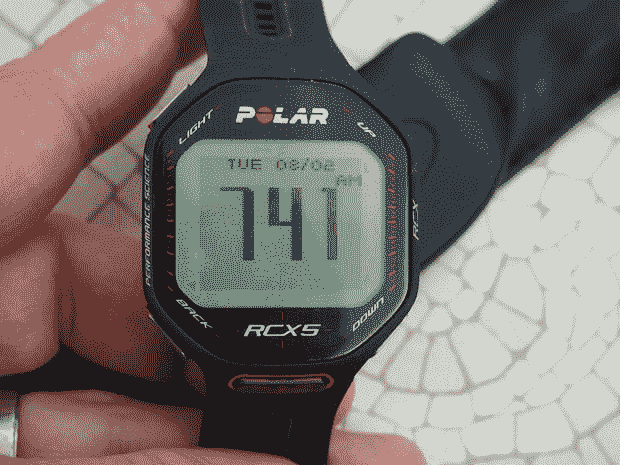
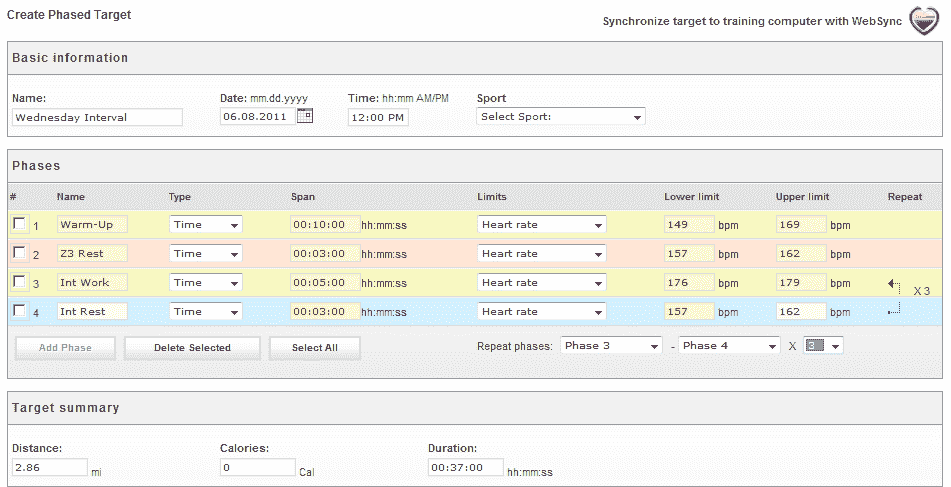

# 你知道，铁人三项:Polar RCX5 心率手表评论 

> 原文：<https://web.archive.org/web/http://techcrunch.com/2011/08/05/you-know-for-triathlons-polar-rcx5-heart-rate-watch-review/>

我一天中用过不少心率监测手表。我已经和很多名人和名人一起玩过很多次了。但是 RCX5 的与众不同之处在于它的简洁。设计用于游泳、跑步或骑自行车时佩戴，所有的智能实际上都在可选的传感器中，使手表本身像 20 美元的 Timex 一样简单，只是袖子上有一些小把戏。

基本套件——即手表、心率带和电池——价格为 349 美元。虽然手表和传感器表面上兼容 OS X 和 Windows，但你在 Windows 上使用软件会更舒服。我在 Mac sync 上遇到了一些问题，它对我使用 MacBook Air 根本不起作用。它在我家的 Mac Pro 上确实有效。

额外的装备需要额外的费用，尽管不同的套餐——跑步、自行车、多种——在高端价格上增加了 100 多美元。要明确的是，这款手表是一项重大投资。该手表支持 Polar 自行车节奏和速度传感器、跑步计步器和 GPS 单元。心率监测器和手表都是防水的，因此您可以在各种情况下佩戴。

电池可以持续正常使用大约六到八个月，这可以归因于手表对无线电通信的依赖。然而，这比大多数可充电型号要好得多。

对我来说，这个单元最突出的是大小、紧凑的形状和简单性。这款手表不是用“幽灵跑步伙伴”和“锻炼时间”提醒来装饰用户界面——尽管这些在某些情况下很有用——而是一本正经。目标是戴上它，进行你的训练，无论是骑自行车、跑步还是游泳，然后看看结果。这是一块真正的运动手表，因为它不想帮你减肥，也不想和朋友在公园里慢跑。它想把你变成一台机器。

要使用它，你只需将所有东西绑在身上或自行车上，按下红色的“go”按钮选择一项运动，然后再按一次开始记录。您也可以运行您在软件中定义的预设健身程序。有多个活动读数，包括显示当前心率水平(与理想值相比)以及速度、节奏和距离的屏幕。您还可以设置一个特殊的“手势”:将手表拿到心率监测器前，手表会立即切换到一个不同的屏幕，这个屏幕您可以预先设置。例如，你可以设置它来显示你当前的时间或距离，然后下降到一个关注心率的读数。

[DC Rainmaker](https://web.archive.org/web/20230203110251/http://www.dcrainmaker.com/2011/06/polar-rcx5-in-depth-review.html) 有个视频:
【YouTube = http://www . YouTube . com/watch？v=mbKUrqFp4mQ]

然而，一旦你有了手表，你就需要[配件](https://web.archive.org/web/20230203110251/http://www.polarusa.com/us-en/products/accessories?product=35352)。这种促销可能会惹恼一些习惯于一体式解决方案的手表所有者，尽管我敢保证，这种解决方案与 Garmin 提供的任何巨型 GPS 手表搭配起来都更好看。因为这只手表的好坏取决于它的配套传感器，所以我们将逐一解决这些问题。

踏频传感器(自行车)——我在我的自行车上测试了 30 美元的 CS 速度传感器 W.I.N.D .和配套的 30 美元踏频传感器，得到了强有力的一致读数。安装很容易——你只需将传感器放在自行车的一部分，另一部分放一个小磁铁(位置不同)。传感器足够小，不引人注目，并且防水。

GPS——我还测试了小型的 G5 GPS 传感器，这是一个相当于 iPod Nano 大小的设备，可以充当 GPS 天线。它在纽约接收到了一个很强的信号，令人惊讶的是，经过大约 30 分钟的搜索，它在波兰也接收到了一个很好的信号。这个小传感器配有一个腕带，可以通过 USB 充电。精确度很高——一旦设备实现了卫星锁定——但移动到一个新的位置需要另一个漫长的搜索过程。

foot pod——我尝试了价值 113 美元的 s3+步幅传感器，它可以连接到你的鞋子上，感应当前的步幅和脚步。我发现这比 GPS 要方便得多，尽管精度稍差。

心率监测器——标准型号舒适、不显眼且防水。它在任何情况下都很好用，我经常忘记我戴着它。

在这次旅行中，我离开了我的主电脑，无法将手表与 Mac 同步，但这里有一个来自健身程序设计器的屏幕，这是一个用于创建具有设定速度和心率的特殊间歇健身程序的系统。您还可以将现成的锻炼数据上传至手表，例如，根据您的具体目标进行一系列间歇锻炼。

如果你正在寻找耐力的具体功能，RCX5 有他们在黑桃。需要澄清的是，我是一个大博客，所以我不能说明这些工具的实际效用，所以我将它们一字不差地粘贴在这里供您阅读。也就是说，我可以说这款手表与众不同，它提供的数据绝对比我见过的标准“跑步者”手表多得多。会激励我去做铁人吗？可能不会，但是一个男孩可以做梦。

> 运动档案:对于多项运动和铁人三项运动来说是必不可少的，这一功能使用户能够在训练中快速切换运动。只需按几下按钮，该功能就能根据当前运动快速调整设置。它会自动检测所需的任何传感器，因此在游泳、骑行或跑步之间不会丢失时间或训练数据。RCX5 预装了四种运动模式，还可以根据用户的喜好添加更多模式。ZoneOptimizer:知道训练的强度可能是一个挑战，它取决于许多因素，包括身体和精神状态、压力、睡眠和以前的训练。全新的 ZoneOptimizer 功能可根据用户当前的生理状况调整个人心率区域，从而消除猜测。它指导训练的正确强度，使每次训练更有效。
> Race Pace:调节速度和比赛策略的完美功能，Race Pace 允许用户为一定距离设定目标时间，然后显示当前的配速/速度，以及用户距离目标有多远。
> 训练负荷:polarpersonaltrainer.com 的这一功能显示用户累积训练负荷的彩色编码图，通知用户他或她何时恢复到足以进行下一次训练，并准确预测训练发展以防止过度训练。该数据还提供了必要时修改训练课程的智能。
> polarpersonaltrainer.com:免费在线培训日志中包含了多项升级，以支持 RCX5 用户。用户现在可以为跑步和骑自行车创建完整的耐力训练计划，包括热身、工作和放松时段。通过数据链路数据传输单元，训练程序可以很容易地与 RCX5 同步。每次训练后，很容易在网上追踪进度。

我显然是从一个业余爱好者的角度来看这个问题的，所以我建议你也看看 DC Rainmaker 的这篇[详尽的评论。然而，对于普通的周末跑步者来说，我认为这款手表可能有点太强大了，也有点太贵了。虽然我不会向城市居民推荐 Nike+ GPS 手表，但它很好用，Garmin 的](https://web.archive.org/web/20230203110251/http://www.dcrainmaker.com/2011/06/polar-rcx5-in-depth-review.html)[独立心率/GPS 手表](https://web.archive.org/web/20230203110251/https://buy.garmin.com/shop/shop.do?cID=142&pID=84374)一直让我很满意。

这是周末勇士的手表吗？大概不会。它价格昂贵，复杂，而且经常是矫枉过正。然而，这是一个对数字有着极客般热爱的严肃铁人三项练习生的手表吗？绝对的。

# 产品集

> RCX5 自行车(建议零售价 389.95 美元):
> 
> RCX5 训练计算机
> WearLink +混合发射器
> CS 速度传感器 W.I.N.D.
> 数据链数据传输单元
> 入门指南
> 
> RCX5 运行(建议零售价 419.95 美元):
> 
> RCX5 训练计算机
> WearLink +混合发射器
> s3+步幅传感器
> 数据链数据传输单元
> 入门指南
> 
> RCX5 多台(建议零售价 469.95 美元)
> 
> RCX5 训练计算机
> WearLink +混合发射器
> G5 GPS 传感器
> 数据链数据传输单元
> 入门指南
> 
> RCX5 基本套装(建议零售价 349.95 美元)(2011 年 7 月上市):
> 
> RCX5 训练计算机
> WearLink +混合发射器
> 数据链数据传输单元
> 入门指南

[产品页面](https://web.archive.org/web/20230203110251/http://www.polarusa.com/us-en/products/maximize_performance/running_multisport/RCX5)