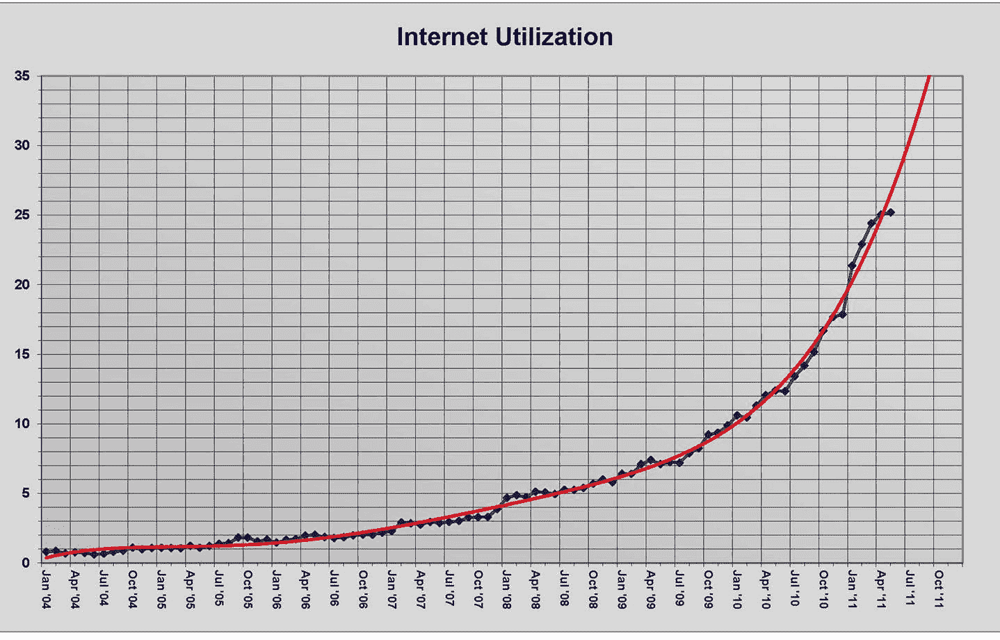

# 你的 ISP 在欺骗你:随着你的服务成本上升，他们的主干网成本下降 

> 原文：<https://web.archive.org/web/http://techcrunch.com/2011/07/29/your-isp-is-screwing-you-as-your-service-costs-go-up-their-backbone-costs-go-down/>

# 你的 ISP 在欺骗你:随着你的服务成本上升，他们的主干网成本下降

在日本，一个几兆的互联网连接只需要几分钱。在布鲁克林，我为 50 Mbps 的流量支付 99 美元(这实际上是大约 1 mbps(不下雨的时候)。但是为什么，你会问？好吧，听有线电视公司(和运营商)说，把所有数据送到你家门口要花一大笔钱。提供商必须从主干网租用连接，因此，他们被迫增加上限，以防止美国用户吸取过多的数据并使他们破产。但是[克林利先生](https://web.archive.org/web/20230203071154/http://www.cringely.com/2011/07/bandwidth-caps-are-rate-hikes/)在对美国真实带宽成本的出色研究中，证明他们错了。

首先，看一看这个[。这是来自互联网服务提供商的内部消息，所以不要全信。这显示了带宽使用的飞速增长。](https://web.archive.org/web/20230203071154/http://www.multichannel.com/blog/BIT_RATE/32537-Think_Bandwidth_Caps_Are_Unnecessary_Check_Out_This_Graph.php)

> 但是增加容量以满足不间断的视频流是有实际成本的。网飞认为，提供一个增量千兆字节的成本“不到 1 美分，而且还在下降。”然而，总的来说，这是一个不同的等式。将网络容量从 100 Gbps 提高到每秒 1tb 不仅仅是几个便士的事情。

基本上，互联网服务提供商声称我们的数据使用量正在上升，他们必须做出反应。事实上，他们的成本正在下降，这是一种逃避，一种让我们为从第一天起就定价过高的服务支付更多费用的努力。

基本上，他们在悄悄地提高我们的税率，同时假装防止公地悲剧。

这一切都归结于供应。现在，提供商向我们收取无限连接费用，而他们实际上提供的线路要少得多。假设您使用的带宽将远远少于您声称的，因此他们可以为每个用户购买更少的带宽，并假设平均而言，您将永远不会超过该数量。谷歌几年前在全国各地开设数据中心时就这么做了。他们知道 ISP 会向他们收取 95%的使用费，而不是在很长一段时间内传输兆兆字节的信息。因此，他们疯狂地传输了一个晚上——万亿字节的数据——然后立即关闭了线路。我们做不到，但在很多骨干套利方案中，运营商可以。

我们每月支付相同的费用，但他们每个用户的费用只是其中的一小部分。现在他们想把我们限制在 250GB，理由是提供视频和音乐的成本增加了。绝大多数互联网用户永远不会碰到他们的人造天花板，而且在很大程度上，这是可行的。然而，某些游戏玩家、下载者和有创造力的人需要那种带宽，他们会付双倍的钱来得到另一种剂量。带宽的固定成本正在下降，但如果需要的话，ISP 可以翻倍或三倍，迫使习惯于“无限制”快速互联网的人们要么减慢速度，要么支付更多的费用。

克林格利写道:

> 每月 250 千兆字节相当于每秒 1 兆字节，这在纽约花费 8 美元。因此，你的美国 ISP，每月花费 0.40 美元购买他们以 30 美元卖给你的带宽，想要将他们每个用户的最大主干成本限制在 8 美元。
> 
> 这不是关于限制 ISP 的损失，而是关于增加 ISP 的利润。上限是一种内在的收入增长，将在 2-3 年后生效，绕过任何现有的监管结构来设定税率。监管者只是还没有意识到。等到他们这么做的时候，可能已经太晚了。

他们会对这些概念进行各种各样的粉饰，但最终，互联网服务提供商可能会如愿以偿。我们可以用脚投票，但我们能去哪里呢？独立互联网服务提供商淘汰了 Well 和 Mondo 2000，而我们却被困在大公司把线路接入我们的家庭，然后为他们低于标准的服务支付额外费用。

ISP 一直是一个笑话，但现在它变得越来越严重。