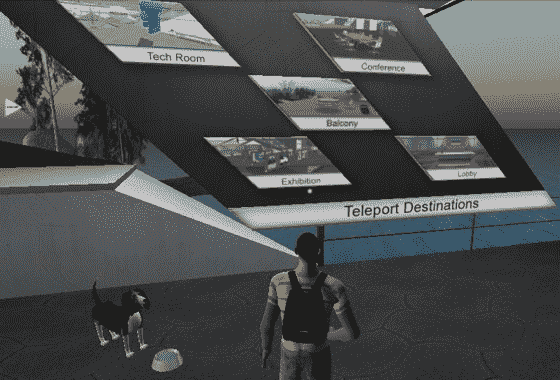
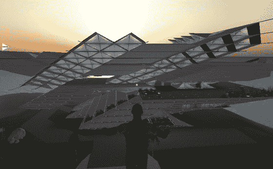
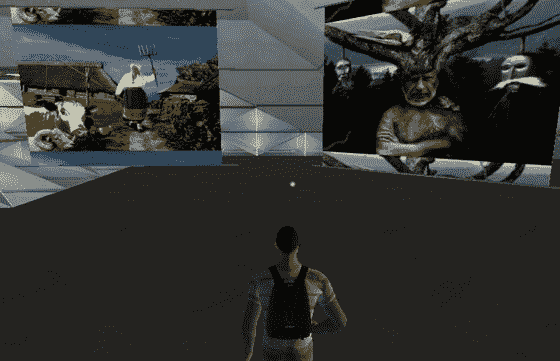

# 你已经不在苏联了:爱沙尼亚在第二人生开设大使馆

> 原文：<https://web.archive.org/web/http://techcrunch.com/2007/12/05/youre-not-in-the-ussr-any-more-estonia-opens-an-embassy-in-second-life/>

# 你已经不在苏联了:爱沙尼亚在第二人生开设大使馆

东欧国家爱沙尼亚在“第二人生”T2 开设了官方大使馆。

对于那些不了解这个国家的人来说，爱沙尼亚是一个前苏联共和国，今年正在庆祝其最初独立 90 周年，在 1940 年被苏联入侵和占领之前。它东部与俄罗斯接壤，南部与拉脱维亚接壤，并于 2004 年成为欧盟成员，同年通过加入北约成为美国的盟友。

爱沙尼亚在第二人生的基础上建立了大使馆，因为第二人生和它自己的社会一样进步。大使馆的目标是通过与不能去爱沙尼亚旅行的人举办讨论和讲座，在专业人士的小团体中宣传爱沙尼亚，或许更有趣的是，充当向爱沙尼亚没有代表的国家(实际上是一个虚拟大使馆)传递信息的渠道。

大使馆本身是一个有趣的建筑，很难用语言来描述。后现代主义建筑承载了各种层次，包括艺术作品和会议空间。在大使馆期间，我印象深刻地注意到，大使馆由一名“爱沙尼亚共和国”代表管理。我没有要求签证或爱沙尼亚的具体信息，但我相信我可以。

可以在这里参观大使馆[(思乐尔)。](https://web.archive.org/web/20230325184521/http://slurl.com/secondlife/Virtual%20Estonia/202/134/29)

在相关新闻中，那些热衷于环境的人可以参加虚拟的巴厘岛会议，目前正在举行的主要会议讨论后京都环境条约。该空间由自然出版集团主办，演讲者包括伦敦帝国学院的塔拉·拉福斯、格兰瑟姆气候变化研究所的西蒙·巴克尔以及英国环保主义者、顶级装备杰瑞米·克拉克森的敌人乔治·蒙比奥。有兴趣的人可以直接到达 NPG 岛[这里](https://web.archive.org/web/20230325184521/http://slurl.com/secondlife/SecondNature/218/213/28) (SLURL)

新闻区，一只传统的爱沙尼亚“狗”欢迎你来到大使馆

架构难置

爱沙尼亚艺术品
