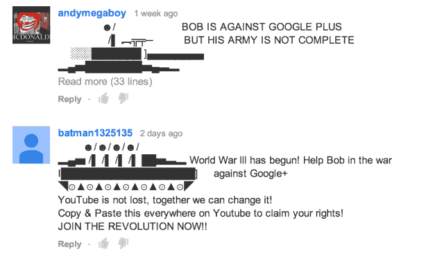
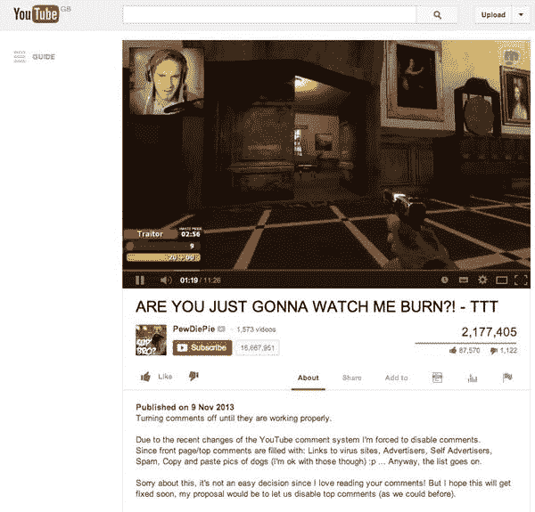

# 在备受指责的 Google+评论系统 TechCrunch 推出后，YouTube 解决了大量垃圾邮件问题

> 原文：<https://web.archive.org/web/https://techcrunch.com/2013/11/26/youtube-addresses-massive-spam-problem-following-rollout-of-much-maligned-google-commenting-system/>

谷歌表示，它正在采取措施解决 YouTube 评论垃圾邮件增加的问题，这是由于最近转向由 Google+支持的新评论系统。YouTube 用户已经对新系统相当[不满](https://web.archive.org/web/20221208055345/https://beta.techcrunch.com/2013/11/08/fck-you-google-plus-song/)，原因涉及隐私、混乱和匿名评论的能力，他们已经在[宣布这些变化的视频帖子](https://web.archive.org/web/20221208055345/https://www.youtube.com/watch?v=bVGp8Z8Yb28)上留下了超过 31，000 条自己的评论，许多是负面的。此外，请求谷歌重新考虑回到旧系统的最受欢迎的[请愿书](https://web.archive.org/web/20221208055345/https://www.change.org/petitions/google-change-the-youtube-comment-section-back-to-its-original-form)今天有超过 215，000 个签名。

Google+既是一个目的地网站，也是一个社交层，旨在延伸到谷歌所有的资产，已经渗透到谷歌推出的一切，包括搜索、Gmail、日历、驱动器、博客等等。它还将 Picasa 和 Places(分别是 Google+ Photos 和 Google+ business pages)等内容吸收到了 Google+身份机器中。

但谷歌已经成功盈利的社交网站 YouTube 则是另一回事。在这里，用户早已建立了某种身份——他们不一定希望与自己的真实姓名联系在一起的身份，以及他们多年来与其他 YouTube 用户联系和发送信息的身份。

在详细介绍 Google+评论变化的 YouTube 视频上，有一段叠加文字:*“感谢您的反馈。我们知道新系统中存在垃圾邮件和滥用问题，我们正在努力解决这些问题。单击此处了解更多信息。”该链接将观众引向了 YouTube Creators 官方博客上的一篇 11 月 6 日的帖子，该帖子于 11 月中旬更新，进一步承认了垃圾邮件和滥用问题，并承诺正在进行修复。*

就在谷歌承认其在 YouTube 上实施 Google+评论的失败时，它已经接近了。很明显，该公司没有考虑到允许 Google+用户在他们的 YouTube 评论中包含链接或其他随机文本的系统的后果。

例如，一些评论者现在使用 ASCII 文本来留下图片评论，这与其说是滥用，不如说是破坏性的——这可能不是谷歌在做出这一改变时考虑的“高质量”反馈。

正如安全研究员 Graham Cluley [今天向](https://web.archive.org/web/20221208055345/http://grahamcluley.com/2013/11/youtube-comment-spam-rise)解释的那样，YouTube 可能是“宇宙中一些最令人不快、最纯粹和最愚蠢的评论”的家园，但它以前从未有过链接垃圾的问题，因为旧的评论系统阻止用户留下包含可点击链接的消息。但当 Google+评论出现时，情况发生了变化。

谷歌将这一变化定位为能给出版商带来更好的反馈，因为它消除了支持匿名评论时不可避免的负面影响。(Google+用户必须使用他们的“真实姓名”建立账户，这应该可以减少滥用。)但事实证明，更好的评论并不是结果。

谷歌很快意识到，该系统对那些利用链接发布功能达到不正当目的的人防范不够严密。垃圾邮件发送者、骗子和那些以链接格式发布恶意软件的人利用了这个新系统。在他的帖子中，Cluley 指出，有太多的滥用，以至于一些 YouTube 出版商，包括视频游戏评论员 PewDiePie，在视频评论区的首页充满了病毒和垃圾邮件的链接后，完全禁用了 Google+评论。

滥用的部分问题在于 Google+偏爱那些评论得到最多回复的人。由于网络上的许多人不知道古老的网络谚语“[不要喂巨魔](https://web.archive.org/web/20221208055345/http://en.wikipedia.org/wiki/Troll_(Internet))”，随着其他愤怒的评论者做出回应，垃圾邮件和辱骂性的评论会上升到顶部。

周一，谷歌[终于发布了一份进度报告](https://web.archive.org/web/20221208055345/http://youtubecreator.blogspot.co.uk/2013/11/an-update-on-youtube-comments.html)，报告了谷歌在解决垃圾邮件和滥用方面所做的努力。在 YouTube Creators 博客上，该公司再次宣布，该视频网站现在已经做出了一些改变，以应对垃圾评论的增加。其中包括:“be 更好地识别不良链接和假冒企图”；” 改进的 ASCII 艺术检测”；帖子解释道，“改变评论显示的时长”。

署名为“YouTube 评论团队”的帖子写道:“我们知道垃圾邮件问题一开始让我们很难使用新系统，我们很高兴看到随着我们解决问题，更多的人参与进来。”

该公司还承诺其他变化也在进行中，如线索化对话、格式化评论和广受欢迎的批量审核选项。评论团队还补充说，他们仍在努力“提高评论排名”，这将继续是必要的，因为骗子试图找到新系统的变通办法，让他们的评论再次上升到顶部。

*【图片来源:YouTube、GrahamCluley/PewDiePie】*