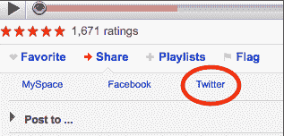
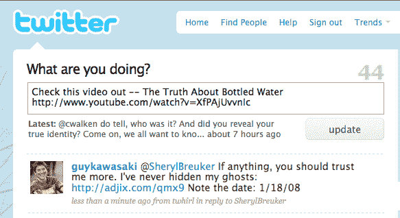

# YouTube 增加了一个 Twitter 按钮

> 原文：<https://web.archive.org/web/https://techcrunch.com/2009/03/26/youtube-adds-a-twitter-button/>

# YouTube 增加了一个 Twitter 按钮

每个人都在做。就连 YouTube 也屈服于 Twitter 狂热。在每个视频下面，如果你点击“分享”链接，你会发现三个选项:MySpace，脸书，现在是 Twitter。你可以扩展更多的分享选项，但这是主要的三个，Twitter 是最近才添加的。

点击 Twitter 按钮会打开一个弹出窗口，将你带到你的 Twitter 帐户，并填写一条推文，告诉你的追随者“检查这个视频”，以及标题和 URL。网址没有缩短，但 YouTube 正在努力。(反正 Youtube 网址都很短，所以这不是什么大问题)。将 Twitter 作为主要的分享选项之一是显而易见的。现在，如果他们真的能像脸书和 MySpace 那样把视频嵌入到 Twitter 流中，那将会很了不起。

YouTube 今天也宣布了一些其他的[调整](https://web.archive.org/web/20230304065059/http://www.youtube.com/blog?entry=z-3cdIbKOqY)。u [pload status ba](https://web.archive.org/web/20230304065059/https://techcrunch.com/2009/03/13/is-youtube-finally-getting-an-upload-status-bar/) r 现已全面铺开。你可以在 Y [YouTube EDU](https://web.archive.org/web/20230304065059/https://techcrunch.com/2009/03/26/youtube-edu-launches/) 上观看讲座和教育视频，它更新了其[移动登录页面](https://web.archive.org/web/20230304065059/http://www.youtube.com/mobile)，并简化了从手机上传视频到 YouTube 的过程。

