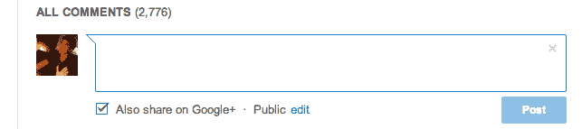
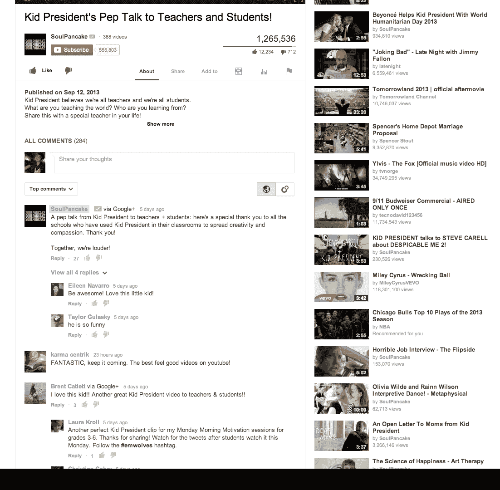
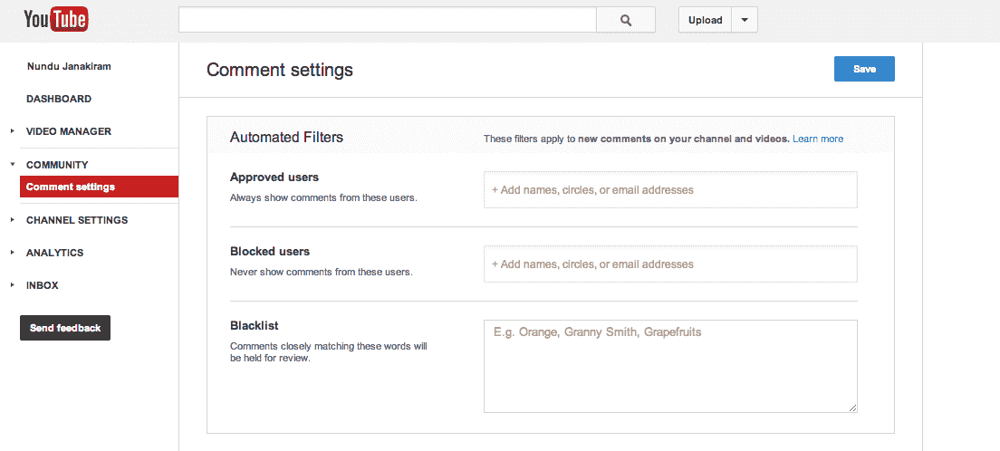

# YouTube 宣布了一个新的评论系统，由 Google+提供支持，带有线程、排名和私人对话

> 原文：<https://web.archive.org/web/https://techcrunch.com/2013/09/24/youtube-announces-a-new-google-powered-commenting-system/>

[YouTube](https://web.archive.org/web/20230304172624/http://youtube.com/) 今天[宣布](https://web.archive.org/web/20230304172624/http://youtube-global.blogspot.com/2013/09/youtube-new-comments.html)一个由 Google+驱动的新评论系统。该系统将于本周在[频道讨论标签](https://web.archive.org/web/20230304172624/http://www.youtube.com/user/techcrunch/discussion)上发布，然后在未来几周和几个月内推广到所有视频，它将自动对评论进行排名，并以线索化和私人对话为特色。

现在，YouTube 评论是垃圾邮件和白痴行为的温床，谷歌痛苦地意识到了这一点。新系统旨在通过对每个用户的评论进行个性化和排名来解决这一问题。

去年，YouTube 开始要求其用户连接他们的 YouTube 和 Google+账户，以便更多的用户在网站上使用他们的真实姓名。今天的整合更加深入。新系统将脱离当前的基于最近的系统，取而代之的是根据广泛的因素对评论进行排名。

正如参与这个项目的 YouTube 产品经理 Nundu Janakiram 本周早些时候告诉我的那样，视频制作人的评论将被高度评价，并且会更经常地出现。该系统还将把 YouTube 上的名人和你的谷歌+圈子里的人的评论推上评论链的更高位置，以及对视频的高度参与式讨论。就像以前一样，您也可以对评论进行向上或向下的投票，这些投票也会影响排名。

想回到旧体验的用户总是可以切换回基于最近的视图(尽管除非你是一个巨魔，我不知道你为什么想这么做)。新系统还允许你只看到你的谷歌+圈子里的人的评论。

正如 Janakiram 告诉我的那样，团队意识到目前的系统是有缺陷的。但与此同时，YouTube 也意识到这些评论是 YouTube 体验中充满活力的一部分。尽管存在缺陷，但该团队对评论的总体概念持积极态度——只是不是现在的形式。

作为 Google+整合的一部分，YouTube 现在也将聚集来自 Google+的关于视频的公众评论，并在 YouTube 上显示它们。当然，私人信息仍然是私人的。由于 Google+的整合，YouTube 上的用户现在也可以在网站上进行私人对话，只留下只能被他们 Google+圈子里的人或个人用户看到的评论。

一旦 YouTube 切换到新的系统，所有旧的评论仍将在系统中，并与新的排名和线索评论混杂在一起。

鉴于新系统进一步整合了 Google+，用户几乎有义务在评论时披露他们的真实身份，这应该会提高 YouTube 上讨论的质量。然而，值得注意的是，他们仍然可以为任何名字、假名或现有的 YouTube 频道创建一个 Google+页面，并将其用作他们在 YouTube 上的身份。

#### 管理评论的新工具

对于频道所有者来说，YouTube 也引入了许多新工具来管理他们视频上的评论。

就像以前一样，他们仍然可以打开他们的视频，接受所有的评论，适度地保留它们，并手动批准或完全禁止它们。然而，现在他们也可以创建一个允许用户的列表，这些用户可以根据他们的 Google+圈子对视频发表评论。这些用户将能够发表评论，即使其他 YouTube 用户必须经过审核过程。举例来说，如果你是一个名人，你可以利用这个功能在 Google+上永远允许来自你的“最大粉丝”圈子的评论，就像 Janakiram 告诉我的那样。

此外，YouTube 还允许视频所有者创建一个带有文字的黑名单，自动将评论推入审查，就像以前一样，他们也可以阻止用户。至于屏蔽用户，YouTube 现在正在做一个小但重要的改变:它将停止告诉用户他们已经被屏蔽，并将继续在他们登录时显示他们自己的评论。该团队希望，这将愚弄他们，让他们相信他们的评论已经发布，并阻止他们在被阻止后创建新帐户。

