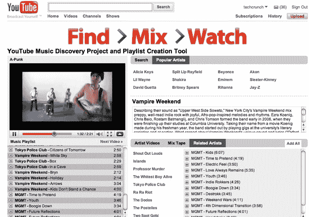

# YouTube 与实验音乐探索项目 TechCrunch 一起跳迪斯科

> 原文：<https://web.archive.org/web/https://techcrunch.com/2010/01/20/youtube-disco-music-discovery-project/>

# YouTube 与实验音乐发现项目一起跳迪斯科

基于 YouTube 音乐视频的音乐搜索引擎如此之多(想到了歌曲《T2》)，YouTube 创建自己的音乐播放列表制作工具只是时间问题。YouTube 音乐发现项目刚刚在[试管](https://web.archive.org/web/20221231224555/http://www.youtube.com/testtube) (YouTube 的实验室)中悄然启动。该页面是一个搜索框，顶部写着“查找> Mix >手表”，一旦你输入一个名字，你就点击“迪斯科”按钮来查找音乐。

你可以输入任何音乐组合或艺术家，然后会弹出一个播放列表，还有一个视频缩略图和乐队描述。您可以找到相关的艺术家，创建混音带，并保存播放列表。当您在听音乐和看视频时，添加和删除歌曲很容易。

YouTube 正在利用音乐发现项目中大量官方认可的 Vevo 音乐视频。播放列表保存在您的 YouTube 播放列表页面上，您可以通过电子邮件分享它们。例如，这是我创建的一个播放列表，名为[“对学校来说太酷了。”](https://web.archive.org/web/20221231224555/http://www.youtube.com/view_play_list?p=90E966C26EF825AF)奇怪的是，除了视频中偶尔出现的 iTunes 广告之外，似乎没有人可以购买音乐。但这是一个实验产品

(向[罗恩·伊兰](https://web.archive.org/web/20221231224555/http://www.ronilan.com/)脱帽致敬)。