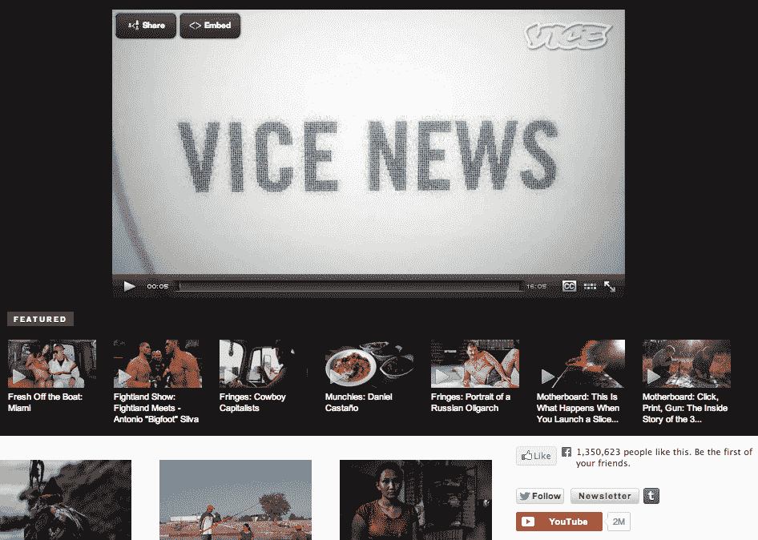

# YouTube 推出可嵌入的场外订阅按钮，推动频道订阅 

> 原文：<https://web.archive.org/web/https://techcrunch.com/2013/07/23/youtube-launches-embeddable-off-site-subscribe-buttons-to-boost-channel-subscriptions/>

# YouTube 推出可嵌入的异地订阅按钮，以增加频道订阅

在过去的几年里，YouTube 慢慢开始更加重视频道——尤其是频道订阅——但直到现在，订阅频道的唯一方式是在 YouTube 上。然而今天，YouTube 正在改变这一点，推出了一套嵌入式订阅按钮，视频制作者可以将它们放在自己的网站上。这些按钮现在可用于免费和付费的 YouTube 频道。

YouTube 显然希望这些按钮能够让更多用户订阅频道。很有可能，该公司也希望这将提高付费频道的订阅率，付费频道在 T2 起步缓慢。

制作一个这样的按钮只需要几秒钟。你所要做的就是在这里插入你的频道名称，复制并粘贴代码到你的网站上，你就可以开始了。您可以选择非常简单的按钮，也可以选择带有您的频道名称和徽标(白色或深色背景)的按钮。

这是我们在 YouTube 上的 [TechCrunch 频道](https://web.archive.org/web/20230129215254/http://www.youtube.com/user/techcrunch)的大按钮的样子(请随意订阅):

不过，YouTube 确实为如何使用这些按钮设置了一些规则。例如，你不能“提供或推广任何形式的奖品或奖励，以换取点击 YouTube 的订阅按钮”。正如谷歌告诉我的，这是为了阻止频道所有者人为夸大他们在 YouTube 上的数字。

此外，YouTube 规定，按钮必须完全清晰可见，你不能使用它们来“跟踪与用户的行动或浏览活动相关的任何用户数据。”

