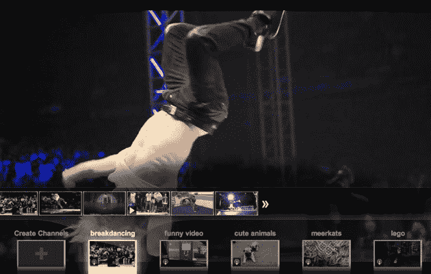

# YouTube Leanback 为您的电视带来个性化频道 TechCrunch

> 原文：<https://web.archive.org/web/https://techcrunch.com/2010/12/01/youtube-leanback-brings-personalized-channels-to-your-tv/>

在 YouTube 总部，有一个统计数据，管理层喜欢四处炫耀，以表明该公司没有固步自封。不，这不是事实，该网站是世界第二大搜索引擎或其用户每分钟上传 35 小时的内容。那就是平均每个用户每天花 15 分钟在 YouTube 上。对于其他任何事情来说，这都是一个令人印象深刻的参与量，但与人们坐在电视机前看有线电视的五个小时相比就相形见绌了(是的，说真的)。毫无疑问:YouTube 想把这些时间留给自己。

今天，该网站朝着这个目标迈出了重要的一步，它用一个关键的新功能改进了其 [Leanback](https://web.archive.org/web/20221225080128/http://www.youtube.com/leanback) 产品:个性化频道。LeanBack 是[在 7 月推出的](https://web.archive.org/web/20221225080128/https://techcrunch.com/2010/07/07/youtube-leanback-tv/)，它被集成到谷歌电视中，让用户点击“播放”,然后坐下来观看源源不断的 YouTube 内容，不需要任何输入。简而言之，就是 YouTube 电视。现在是个性化的电视——这是任何有线电视网都无法比拟的。

【YouTube = http://www . YouTube . com/watch？v = 2i3x8mpc 874 & HL = en _ US & feature = player _ embedded & version = 3]

在此之前，Leanback 已经有了频道的概念，但这些主要是围绕你朋友的社交活动和 YouTube 策划的视频建立的。现在，该网站将尝试了解你喜欢什么，并相应地生成新的个性化频道。这些频道将显示与你告诉 YouTube 的你喜欢的事情相关的内容，以及 YouTube *认为*你会喜欢的主题(例如，如果你围绕有趣的猫视频建立一个频道，它可能会开始将一些没有猫的有趣视频加入其中)。

这个功能有点像视频的潘多拉。它根据你的显性动作(比如按下“竖起大拇指”按钮)和隐性信号(比如你看过哪些视频以及看了多长时间)来了解你的偏好。您也可以手动添加新主题和关键词，以调整 YouTube 将显示的内容种类。

这听起来很棒，但我怀疑 YouTube 让人们真正习惯这个想法将是一个漫长而缓慢的过程。第一个问题:YouTube Leanback 应该让人们坐下来观看源源不断的相关内容；如果他们这样做了，我怀疑他们会想要点击“拇指向上”或“向下”按钮，除非这很容易(在这一点上，没有谷歌电视遥控器有一个专用的按钮)。因此，YouTube 目前可能主要依赖隐含信号。

但更重要的是，Leanback 向用户介绍了一种与 YouTube 截然不同的体验。是的，YouTube 长期以来一直提供推荐视频，并有无数的内容渠道，但这种靠在椅背上观看的观念需要一些时间来适应。也就是说，YouTube 报告称，Leanback 用户一次花费 30 分钟——是他们使用普通网站的两倍——所以很明显它对一些人有效。

用不了多久，就会有更多的人靠在椅背上。YouTube 已经集成到谷歌电视中，它在其他 HTPCs 上也有应用程序。该公司还开始寻找一名[产品经理](https://web.archive.org/web/20221225080128/http://www.google.com/intl/hr/jobs/uslocations/san-bruno/product/product-manager-youtube-on-tv-youtube-san-bruno/index.html)来领导其“电视上的 YouTube”项目，其职责包括管理与内容和硬件合作伙伴的关系。换句话说，YouTube Leanback(或相关产品)将在未来几年在很多地方出现。一旦它确定了个性化视频内容的概念，就很难再回到普通的老式电视了。
