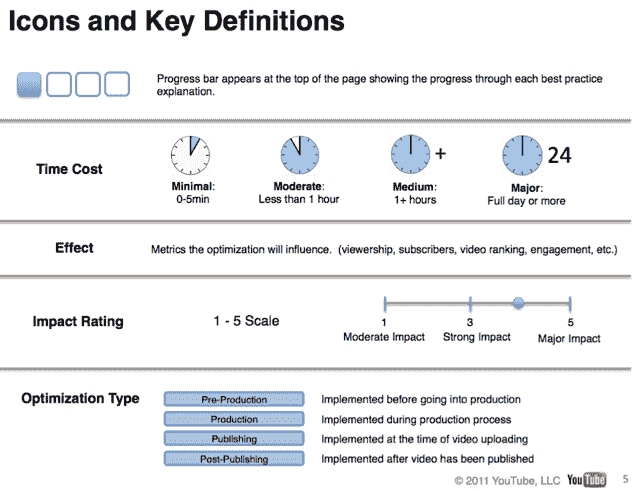

# YouTube 的创造者剧本:你的网络成名指南

> 原文：<https://web.archive.org/web/https://techcrunch.com/2011/07/31/youtubes-creator-playbook-your-guide-to-achieving-internet-fame/>

# YouTube 的创造者剧本:你的网络成名指南*

想把自己(或你的节目)变成 YouTube 明星，但不知道从哪里开始？YouTube 正在寻求帮助——该视频门户网站发布了一份全面的指南，概述了内容制作者应该如何使用该平台，以及他们可以利用哪些功能。这本 70 页的指南有一个恰当的标题:创造者剧本。

今天，T2 在洛杉矶的视频会议上讨论了这份新文件，它是 YouTube 帮助创作者制作高质量内容的更广泛目标的一部分(YouTube 最近对 T4 的收购是这一使命背后的驱动力)。

当然，YouTube 很快澄清，虽然这应该是一个有用的指南，但没有任何保证。这实际上只是一套经过深思熟虑的最佳实践——如果你的内容不好，优化视频的前五秒不会有太大帮助。从第一页开始:

> 创作者剧本不是规则的集合，也不是保证获得更多观看的“技巧”。相反，它介绍了最佳实践、优化技巧和在 YouTube 上建立观众和参与度的建议策略。"

这份文件长达 70 页，但并不像你想象的那样令人望而生畏。YouTube 将其每个迷你指南分为三个部分:编程和制作、发布和优化、社区和社交媒体。一节中的每个技巧都提供了一个概览，概述了实现它需要多长时间(简单的是五分钟，困难的是一天或更长时间)，技巧将影响哪些指标，以及内容创建者应该预期的效果。

有些话题对 TechCrunch 的读者来说是显而易见的(经常使用脸书和 Twitter！)但是你不太可能已经知道了里面的一切。概述视频元数据如何影响你的搜索结果排名的部分特别有用——最后有一个清单，你每次上传视频时都可以浏览。

请注意，虽然有一整个部分致力于缩略图优化，但没有任何关于使用女人的乳沟作为缩略图照片的内容，这似乎是该网站上一个奇怪的流行策略。

