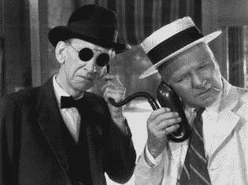

# 你有 fmail TechCrunch

> 原文：<https://web.archive.org/web/https://techcrunch.com/2010/11/13/youve-got-fmail/>

 周一的消息似乎是脸书将彻底改造电子邮件。TechCrunch 称这是期待已久的 Gmail 杀手。也有人说，这是 Gmail 发明者保罗·布赫海特在收购 FriendFeed 时来到脸书后的项目。保罗说他还没有开发那个，而是开发了一个巨大的 Zip 文件应用程序，我们可以在那里下载我们所有的脸书片段。总之，他去了 Y Combinator 继续他的天使投资。我走了——从电子邮件中。已经有一段时间了。

我仍然一直使用电子邮件。或者说，它利用了我。我看着工作中的同事(Salesforce.com)在 Outlook 和 Gmail 之间来回切换，选择、阅读、浏览，哦，对了，删除、删除、删除。你必须在 Outlook 中做到这一点，以确保邮箱中的邮件已满。Gmail，不太会，但是很难改掉老习惯。最近，我不得不开始为这一特权付费，因为谷歌停止提高限制，将我转为云用户。

但这基本上是一个美沙酮项目，维持不吸毒。我为一个叫电子邮件的人工作。对我没用。搜索已经取代了电子邮件，成为按需获取信息的最快途径，越来越多最有价值的存储库是信息流。搜索加流是跟踪，电子邮件通知是当前的交付机制。电子邮件已经被来自信息流的事件通知所取代。脸书评论，FourSquare 和 PlanCast 紧随其后，YouTube 订阅，Twitter 直接消息，如此多的东西把垃圾邮件变成了一些奇怪的历史马和错误的数据类型。

现在发生的是这些流对象被事务属性照亮。代码基于传入的事件运行，在我们看到它之前将它从拥挤的收件箱中取出，并转换成由我们的推理引擎和工作流规则预先确定的动作。"如果转发等于策略组的成员，添加到上午直接消息队列."如果 Silverlight 新闻发布会文字记录源包含来自 Mary Jo Foley 的问题，则路由到带有卸载标志的代理队列。诸如此类。

这不是人工智能或智能计算；它在实时经济的背景下收集社会信号。这就是电视网多年来赚钱的方式，被每个企业和商人推出。观看柯南如何驾驭社交浪潮，通过围绕交易型微消息流上瘾者的高度可取的数据类型重新定义评级，飙升至评级榜首。(这件事发生在周一。)上 TBS，没少。泰德·特纳的老旗舰，由 CBS 重播和一个 80 多岁的小样建成，现在吸引了可可人群。你们这些孩子，离开我的草坪。

如果脸书通过让电子邮件淹没在主流中来重新发明电子邮件，他们将有事情要宣布。与此同时，谷歌继续蚕食其不可避免的概念——恐慌奖金和数百万美元的留用奖金，以及数据扣留策略。从来没有人想到我们给谷歌的数据是有价值的，直到他们开始囤积这些数据。我们一直都知道，脸书一直在锁定它，直到他们有如此大的势头，这无关紧要，现在谷歌大声宣布，阻止他们已经太晚了。

当小工具接管时，谷歌真的有麻烦了。我喜欢我的 Gmail 屏幕，当 Twitter 曲目和 FriendFeed 对话流进来时，它的 GTalk/AIM IM 状态灯变成绿色，聊天流变成橙色。但是，我的 iPhone 和 iPad 上的聊天工具、Skype 和脸书烤面包机弹出窗口和推送通知正在缓慢但肯定地将电子邮件越来越排在后面。RockMelt 正从边缘悄悄潜入，Gmail 正被如此多的木工蚁生吞活剥。

Gmail 似乎突然成了谷歌的致命弱点。它打破了微软不可战胜的光环，预示着云时代的开始。“你不能这么做,”辛诺夫斯基的人喊道，然后他们就这么做了。按需电子邮件，你知道的，Office 365。但是谷歌犯了一个经典的错误，在驶过博格人时没有检查后视镜。波，巴斯，我，随便。忘记必应，忘记 10%的加薪，忘记下载社交图并克隆它。如果 Google Classic 遭到破坏，那么接下来会发生什么都不重要。如果脸书抛弃了电子邮件，Gmail 会突然变得像谷歌阅读器。