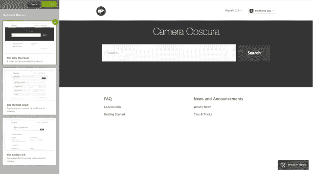

# Zendesk 推出了一个帮助中心，将自助服务与 Tumblr TechCrunch 的设计主题相结合

> 原文：<https://web.archive.org/web/https://techcrunch.com/2013/08/21/zendesk-launches-a-help-center-that-combines-self-service-with-design-themes-reminiscent-of-tumblr/>

# Zendesk 推出了一个帮助中心，将自助服务与 Tumblr 的设计主题相结合

Zendesk 发布了 Help Center，这是一款类似标准 WordPress 或 Tumblr 主题的商业应用，以类似 Quora 的格式作为知识库:随着人们添加评论，它变得更加精炼。

根据其 16，000 名客户的基准数据，Zendesk 客户使用自助服务系统的可能性是致电客户服务台的四倍。Zendesk 将这些数据作为帮助中心的起源。

客户基于网站创建和博客平台上常见的设计主题概念建立他们的帮助中心。通过应用主题，公司创建了他们自己的页面，客户可以使用这些页面来获得他们的答案。

【T2

产品营销副总裁阿曼达·克莱哈在一封电子邮件中写道，帮助中心是其平台的一个补充，旨在涵盖公司的客户服务环境。她说 Zendesk 使用 Ruby on Rails 和“大量”JavaScript 从头开始构建帮助中心。

知识库的概念已经存在很长时间了，但是直到最近才被证明是快速获得问题答案的更好的方法。为了使它们真正强大，像 [MindTouch](https://web.archive.org/web/20221206131229/http://mindtouch.com/) 这样的公司正在[建立服务](https://web.archive.org/web/20221206131229/https://beta.techcrunch.com/2013/06/10/mindtouch-delivers-for-sap-and-salesforce-by-turning-the-faq-into-a-self-service-sales-tool/ "MindTouch Delivers For SAP And Salesforce By Turning The FAQ Into A Self-Service Sales Tool")，它们使用交互数据根据最有帮助的内容来衡量答案。反过来，这些答案可以帮助客户做出购买决策。