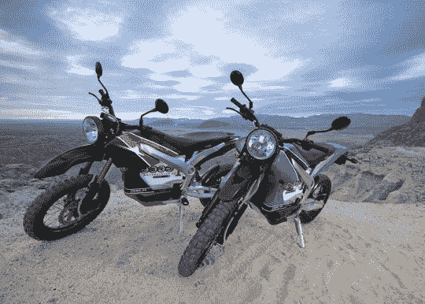

# 所有电动自行车制造商 Zero Motorcycles 再融资 240 万美元 

> 原文：<https://web.archive.org/web/http://techcrunch.com/2011/01/28/zero-motorcycles-raise-2million/>

# 所有电动自行车制造商 Zero Motorcycles 又筹集了 240 万美元

根据美国证券交易委员会的一份[新文件，总部位于圣克鲁斯的电动摩托车制造商 Zero Motorcycles 在私募股权中又筹集了 240 万美元。](https://web.archive.org/web/20230203003929/http://sec.gov/Archives/edgar/data/1414496/000141449611000003/xslFormDX01/primary_doc.xml)

本月早些时候，加州斯科茨谷警察局开始在城市巡逻中使用该公司的 Zero DS 自行车。根据该公司的一份新闻声明，其 Zero DS 的续航里程可达 50 英里(80 公里)，是合法的公路，对于越野自行车道是安全的，并且由于其全电动传动系统，驾驶起来很安静，这使得它可能有利于城市执法。

2010 年末，Zero Motorcycles 将其全电动自行车的销售扩大到了澳大利亚。该公司目前在 32 个国家销售其产品，包括美国、瑞士、德国、意大利、英国和加拿大。

去年夏天，Zero Motorcycles 获得了一项电池互联系统的美国专利，该系统可以减少自行车电源组周围以热量形式浪费的能量。

Zero 的竞争对手包括美国的初创公司 Brammo 和 Mission Motors，以及像本田和宝马这样的大型自行车公司，它们也承诺推出全电动汽车。

2008 年，Zero Motorcycles 融资约 800 万美元，2010 年，该公司又融资 710 万美元，这似乎是几轮扩张，使该公司目前的总股本达到约 1750 万美元。

TechCrunch 要求了解 Zero Motorcycles 将如何运用其最新一轮 240 万美元融资的细节。该公司没有立即回复。