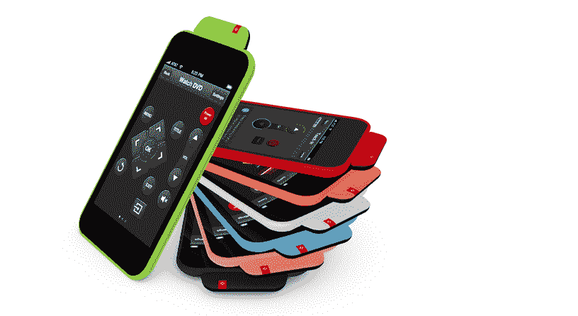
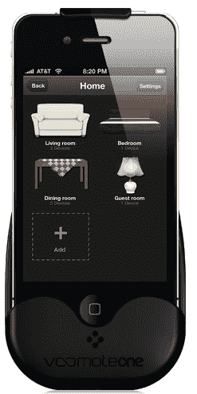

# Zero1.tv 推出 A 系列产品，将 iPhones 和 iPads 变成通用遥控器 

> 原文：<https://web.archive.org/web/https://techcrunch.com/2011/11/01/zero1-tv-raises-series-a-to-turn-iphones-and-ipads-into-universal-remotes/>

# Zero1.tv 推出 A 系列，将 iPhones 和 iPads 变成通用遥控器

用于 iOS 设备的 [VooMote](https://web.archive.org/web/20230205040529/http://www.voomote.tv/en/) 通用遥控器背后的公司 Zero1.tv 已经筹集了由 GoodVent、Signeo Ltd .和现有投资者 HTGF 牵头的首轮融资。该公司没有披露这轮融资的金额，只是说融资额在七位数左右。

凭借其 VooMote 产品，Zero1 正试图解决像 [Peel](https://web.archive.org/web/20230205040529/https://techcrunch.com/2011/03/07/peel-a-bridge-between-your-iphone-and-home-entertainment-system-video/) 这样的公司正在寻求解决的同样问题:我们许多人都有一个小范围的遥控器，每个遥控器在一个特定的电子设备上执行一个特定的功能。不一定要这样。

该公司的第一个小工具是 VooMoteOne，这是一个可以夹在你的 iPhone 上的黑色外壳，它基本上可以将 iPhone 或 iPod touch 变成一个通用遥控器，可以设置为在几乎所有的家用媒体电子设备上工作，并可以“学习”控制尚未在其数据库中的电子设备。他们还刚刚宣布了一款新的 [VooMote Zapper](https://web.archive.org/web/20230205040529/http://www.voomote.tv/zapper/en/) ，它基本上做了同样的事情，但在更时尚和丰富多彩的外形上也与 iPad 兼容(Zapper 看起来像 iPhone 或 iPad 外壳，但也配备了红外发射器)。

将这些设备中的一个插入你的 iPhone、iPod Touch 或 iPad，VooMote 将连接到苹果的应用商店，下载其相应的应用程序——这是你用来控制家庭娱乐系统的交互内容。

这款应用的一个主要卖点是设置和使用起来方便快捷。当今许多“通用遥控器”的主要问题是查找品牌、型号、类型、系列、年份等的痛苦。，每台电视、DVD 播放器、蓝光播放器、Roku box 等等，这些通常是设置遥控器所必需的。有了 VooMote，你只需要知道电子产品的品牌(例如，索尼)和类型(比如说，电视)，VooMote 就会在你的电视上测试各种频率，直到找到一个适用于你所有型号的频率。

VooMote 有很多竞争对手，包括 Power A、Ré、L5、Redeye、Unity Remote、IRB1、Fastmac 和 Harmony 系列，它们本质上都是插入苹果产品的设备，并与一个应用程序协同工作，以控制多个电子设备。它们中的大多数都是这样制作的，iPhone/iPod/iPad 的插入端成为遥控器的正面。我们已经提到过 Peel，它与 VooMote 的不同之处在于，它将来自 iPhone 的命令中继到位于组件前面的独立设备，并发射红外信号(即，红外发射器没有连接到你的手机)。

