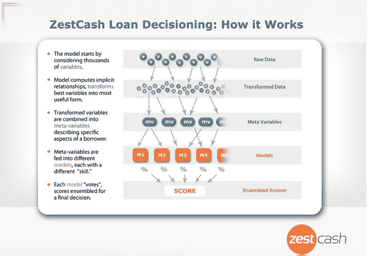
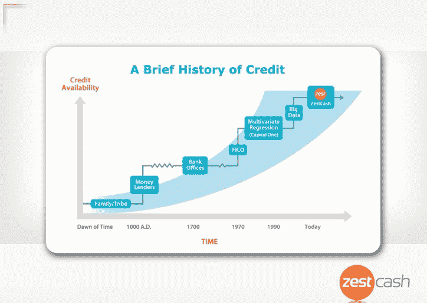

# ZestCash 首次推出新的大数据承保模型来确定消费者信贷风险 

> 原文：<https://web.archive.org/web/https://techcrunch.com/2012/04/26/zestcash-debuts-new-big-data-underwriting-models-to-determine-consumer-credit-risk/>

# ZestCash 首次推出新的大数据承保模型，以确定消费者信贷风险

由前谷歌首席信息官兼工程副总裁 [Douglas Merrill](https://web.archive.org/web/20230113202552/http://www.crunchbase.com/person/douglas-merrill) 创立的 zest cash 公司，旨在使发薪日贷款行业合法化，该公司宣布了一个新的正在申请专利的信贷决策模型，以更好地分析信贷风险。ZestCash 还推出了一套新的承销模式 Hollerith，允许该公司向 25%以上的美国人提供信贷，并将客户还款增加 20%。

ZestCash 通过结合谷歌式的机器学习技术和数据分析，以及传统的信用评分，采取了一种完全不同的核保方法。因此，该公司可以向许多在历史上被拒之门外的人提供信贷。该公司允许用户借入 300 至 800 美元的“分期贷款”，目前在威斯康星州、犹他州、爱达荷州、密苏里州和南达科他州五个州提供。

传统上，贷方使用单一回归模型来分析大约 15 个点的数据，以做出信贷决策。当 ZestCash 两年前推出时，它首次开始将大数据分析应用于承保。现在，ZestCash 决策基础设施可以并行运行几十个模型，在几秒钟内返回贷款决策结果，而不是只采用一个承销模型。

基本上，ZestCash 曾经运行一个大数据承保模型，该模型查看了多达 1000 个变量。这种新的基础设施允许它并行运行多个大数据模型，因此它可以查看更多的数据点，以更准确地确定一个人是否是信贷的良好候选人。

ZestCash 现在同时运行大约 10 种独特的承保模式，这些模式消耗成千上万的原始数据元素，包括第三方数据和从借款人那里收集的数据。然后，这些模型将这些数据转化为数万个有用的元变量，以评估关键的客户行为，如欺诈、短期和长期信贷风险，或者借款人可能偿还的金额。然后将这些模型“组合”在一起，以得出最终的承销决策，从而更准确地预测信贷风险。这些数据包括手机合同信用记录和租赁信息。

ZestCash 联合创始人兼首席运营官 Shawn Budde 补充说，新的模型帮助客户的净回报增加了 20%。

自一年前公司成立以来，ZestCash 已经帮助了超过 10，000 名客户，他们从该公司借了近 1，000 万美元。ZestCash 刚刚在一月份筹集了 7300 万美元的资金。

【T2