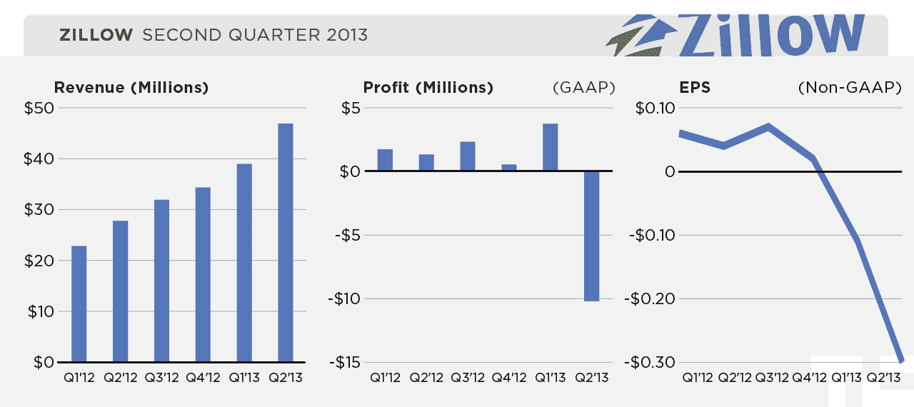

# Zillow 帖子创下 Q2 收入 4690 万美元的记录，但每股收益降至 0.30 美元亏损，流量同比增长 66% 

> 原文：<https://web.archive.org/web/https://techcrunch.com/2013/08/06/zillow-posts-record-q2-revenue-of-46-9m-but-eps-drops-to-0-30-loss/>

# Zillow 帖子创下 Q2 收入 4690 万美元的记录，但每股收益降至 0.30 美元亏损，流量同比增长 66%

在线房地产数据库 [Zillow](https://web.archive.org/web/20230126043719/http://zillow.com/) 已经[公布了其 2013 年第二财政季度的收益](https://web.archive.org/web/20230126043719/http://finance.yahoo.com/news/zillow-inc-reports-record-second-203000882.html)。该公司在过去几个月里目睹了其股票[的飙升](https://web.archive.org/web/20230126043719/http://finance.yahoo.com/q?s=Z)，报告了创纪录的 4690 万美元的收入，但与上一季度公布的 0.05 美元的亏损相比，每股亏损 0.30 美元。华尔街[估计](https://web.archive.org/web/20230126043719/http://finance.yahoo.com/q/ae?s=Z+Analyst+Estimates)Zillow 将公布约 4442 万美元的收入，GAAP 每股收益为-0.40 美元。

**更新**:*Zillow 发言人澄清说，根据 GAAP，华尔街估计为 0.40 美元，因此根据这一数据，该公司领先 0.10 美元。*

上个季度，Zillow [报告](https://web.archive.org/web/20230126043719/http://investors.zillow.com/releasedetail.cfm?ReleaseID=762807)收入 3900 万美元，每股收益 0.06 美元。在去年同期，该公司报告营收为 2780 万美元。

正如我们的 Alex Wilhelm 所指出的，Zillow 每股亏损的主要原因是其营销和销售支出的大幅增加(从三个月前的 1215.3 万美元增加到今年的 3292.4 万美元)。该公司在技术和开发上的支出几乎翻了一番。

该公司的受众 Zillow 的一个重要指标——在 2013 年 7 月增长到 6100 万移动和网络独立用户。同比增长了 66%。在移动设备上，每月唯一数在过去 12 个月翻了一番。

“第二季度对 Zillow 来说是一个巨大的季度，因为我们的关注和投资带来了创纪录的收入、流量和顶级代理商的增长，”Zillow 首席执行官斯潘塞·拉斯科夫在今天的一份声明中说。“我们正在执行长期战略，并在我们的战略重点方面取得巨大进展，以增加受众和市场份额，发展我们的首要代理业务，并发展我们的新兴市场。我们看到了受众的大幅增长，7 月份的流量再创纪录，移动和网络独立用户超过 6100 万，我们在本季度增加了创纪录数量的 Premier Agent 订户。此外，我们的新兴市场正在飞速发展，与去年相比，本季度抵押贷款收入增长了一倍多，我们开始在不断增长的租赁市场测试货币化。”

上周，Zillow 最接近的公开交易竞争对手 [Trulia](https://web.archive.org/web/20230126043719/http://trulia.com/) 公布了其上一个财政季度的创纪录收益[T6 】,因此许多分析师将把 Zillow 今天的数据作为在线房地产市场表现的指标。Trulia 公布其收益后，不少分析师认为 Zillow 也会让他们大吃一惊。](https://web.archive.org/web/20230126043719/http://www.fool.com/investing/general/2013/08/01/why-trulia-shares-soared.aspx)

以下是今天报告的重点:

> *   收入从 2012 年第二季度的 2780 万美元增长了 69%，达到创纪录的 4690 万美元。
> *   市场收入从 2012 年第二季度的 1960 万美元增长了 86%，达到创纪录的 3650 万美元。
> *   房地产收入从 2012 年第二季度的 1700 万美元增长了 80%，达到 3060 万美元。
> *   抵押贷款收入从 2012 年第二季度的 260 万美元增长了 126%，达到 580 万美元。
> *   显示器收入从 2012 年第二季度的 810 万美元增长了 29%，达到 1050 万美元。
> *   主要由于与之前的收购相关的 710 万美元的非经常性股票薪酬费用的增加以及之前宣布的营销和广告费用的增加，与 2012 年第二季度 130 万美元的 GAAP 净收入相比，2013 年第二季度 GAAP 净亏损为 1020 万美元。
> *   调整后的 EBITDA 为 530 万美元，占收入的 11%，而 2012 年第二季度为 530 万美元，占收入的 19%，这主要是由于显示器收入异常强劲的季度、好于预期的市场收入以及我们模型中的高运营杠杆。
> *   每股基本和摊薄亏损为 0.30 美元，去年同期基本和摊薄每股收益分别为 0.05 美元和 0.04 美元。