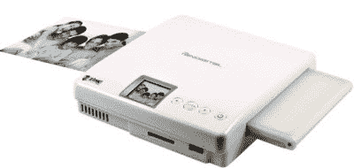

# Zink 2.0 无墨打印机开始出现 

> 原文：<https://web.archive.org/web/https://techcrunch.com/2009/12/14/zink-2-0-inkless-printers-beginning-to-trickle-out/>

# Zink 2.0 无墨打印机开始出现

[津克](https://web.archive.org/web/20221209133501/http://www.crunchgear.com/tag/zink/)代表“零墨水”这是一家公司的名字，它创造了一种新的印刷方式，是的，零墨水。这一切都在报纸上[，霍斯。](https://web.archive.org/web/20221209133501/http://www.zink.com/)

这种纸有三层青色、品红色和黄色晶体，它们相互层叠。你将纸张通过 Zink 打印机，然后打印机加热纸张的特定区域，创建图像。

Zink 技术的第一个版本步履蹒跚，因为纸张太大，只有 2×3 英寸。2.0 版本已经开始慢慢推出，但会在 2010 年第一季度更广泛地出现。纸张尺寸一直到 4×6 英寸，足够打印出你的照片(如果你还打印出照片的话！).

更多信息请见 CES，我们整天跑来跑去，同时与 100 万人交谈。