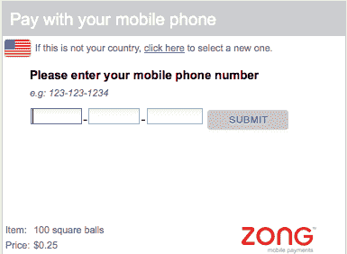
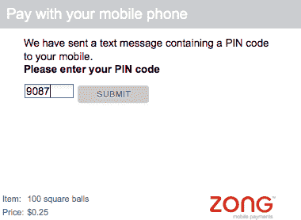

# Zong 让你把网络应用程序的账单发到你的手机上

> 原文：<https://web.archive.org/web/https://techcrunch.com/2008/09/08/zong-lets-you-bill-web-apps-to-your-phone/>

# 宗可以让你把网络应用程序的费用记到你的手机上

 移动支付初创公司[宗](https://web.archive.org/web/20230328094839/http://www.zong.com/)是我们在 TechCrunch50 上的演示参展商之一，它认为它已经找到了游戏、约会和分类广告等社交应用的微支付的答案。它用你的手机来支付诸如脸书应用程序中的虚拟商品之类的东西。

它的工作方式是，你输入你的手机号码在网上支付一些东西，可能是一顶虚拟的牛仔帽，价值 5 美分。然后你会在手机上收到一条带有密码的测试信息。如果你在网上的小工具中输入密码，费用将会反映在你的手机账单上。

用手机绕过微支付在网络上仍然存在的问题是明智之举。没有人愿意用信用卡购买几个便士或一角硬币，因为金融费用太高。是否有人愿意为一款脸书应用支付哪怕几便士，那就完全是另一回事了。

【YouTube http://www.youtube.com/watch?v=O2C3SQraAvQ&hl=en&fs=1]

