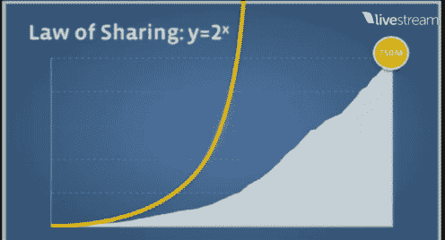
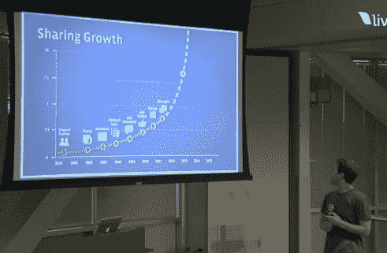

# 扎克伯格:在线分享正以指数速度增长(用户每天分享 40 亿件东西)

> 原文：<https://web.archive.org/web/http://techcrunch.com/2011/07/06/zuckerberg-online-sharing-is-growing-at-an-exponential-rate-and-users-are-sharing-4-billion-things-a-day/>

# 扎克伯格:在线分享正以指数速度增长(用户每天分享 40 亿件东西)

今天，在加州帕洛阿尔托总部的一场特别活动中，脸书首席执行官马克·扎克伯格上台发布了一些重要的新公告(你可以在这里找到我们的现场笔记和直播流[)。扎克伯格宣布的第一件事是:脸书观察到其用户的分享率正以指数速度增长。](https://web.archive.org/web/20230203035157/https://techcrunch.com/2011/07/06/liveblogging-the-facebook-awesome-event-video/)

他解释说，如果你观察任何一个脸书用户，平均来说，他们今天分享的量是一年前的两倍——一年后，他们分享的量可能会是现在的两倍。这是一个重要的趋势，扎克伯格说这可能适用于整个互联网，而不仅仅是脸书。但是很多事情都发生在社交网络上——用户现在每天在脸书上分享 40 亿个“东西”。

那么为什么这很重要呢？如果你看下面的图表，你会发现我们正处于增长曲线的拐点。换句话说，分享可能即将爆发。现在的问题是*T4 人会分享什么。你可以在下图中看到，脸书的产品发布有助于推动更多的分享，该社交网络预计来自其他公司的更多创新将有助于推动这种增长的爆炸式增长，这些公司涉及从音乐到通信的方方面面。*

